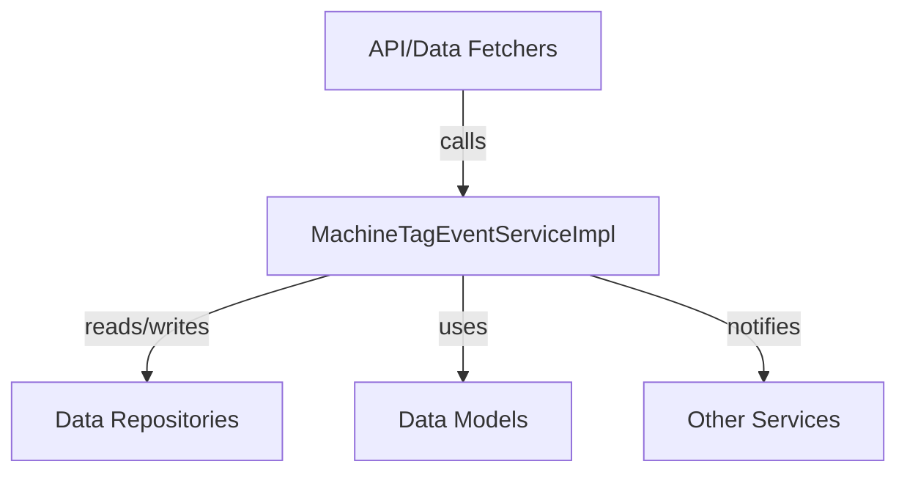
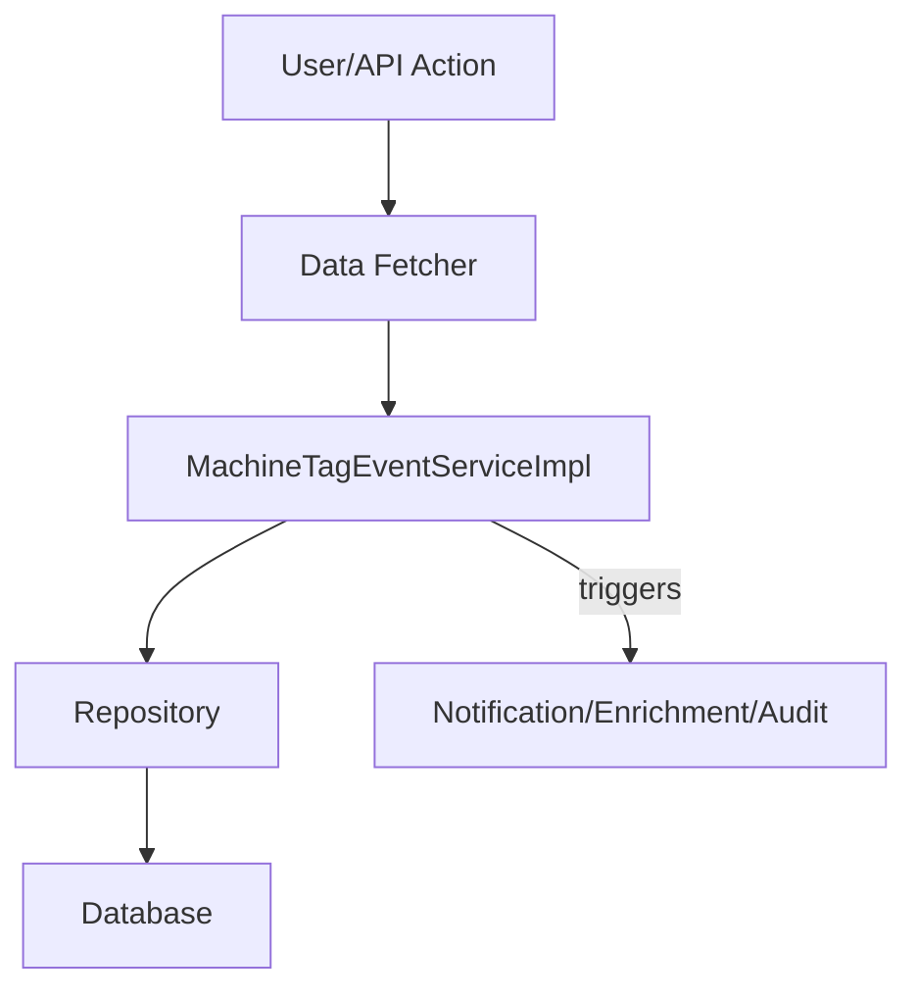
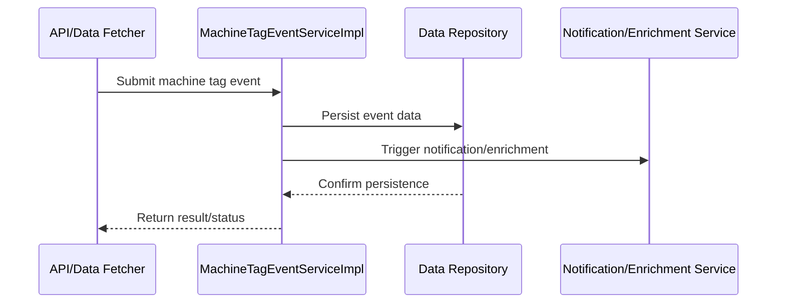

# data_service_impl Module Documentation

## Introduction

data_service_impl is a backend service implementation module responsible for providing concrete data service logic, particularly for handling machine tag events. It acts as a bridge between the data persistence layer (repositories, models) and higher-level business logic or API layers. The module is designed to encapsulate the core business logic for machine tag event processing, ensuring data consistency, event-driven updates, and integration with other system modules.

**Core Component:**
- `MachineTagEventServiceImpl`

## Purpose and Core Functionality

The primary responsibility of the data_service_impl module is to implement services related to machine tag events. This includes:
- Processing and managing machine tag events
- Interacting with data repositories and models for persistence
- Coordinating with other services and modules for event-driven workflows
- Ensuring data integrity and consistency across the system

## Architecture Overview

The data_service_impl module fits into the overall system as the concrete implementation of data services, especially for machine tag events. It interacts with:
- **Data Models:** (e.g., `MachinePinotMessage` from `data_kafka_model`, `Tag` from `data_mongo_document_tool`)
- **Repositories:** (e.g., Pinot and Mongo repositories for reading/writing event and tag data)
- **Other Services:** (e.g., notification, enrichment, or audit services)
- **API/Data Fetchers:** (e.g., `DeviceDataFetcher`, `EventDataFetcher` from `api_service_core_datafetcher`)

### High-Level Architecture Diagram

## Component Relationships

### MachineTagEventServiceImpl
- **Implements:** Business logic for machine tag event processing
- **Depends on:**
    - Data models (e.g., `MachinePinotMessage`, `Tag`)
    - Data repositories (e.g., Pinot, Mongo)
    - Possibly other services for notification, enrichment, or audit
- **Exposes:** Methods for creating, updating, and querying machine tag events

### Data Flow

## Integration with Other Modules

- **Data Models:** See [data_kafka_model.md], [data_mongo_document_tool.md]
- **Repositories:** See [data_repository_pinot.md], [data_mongo_repository_device.md], [data_mongo_repository_tool.md]
- **API/Data Fetchers:** See [api_service_core_datafetcher.md]
- **Notification/Enrichment:** See [stream_service_core_service.md]

## Process Flow Example: Handling a Machine Tag Event

## Summary

data_service_impl provides the concrete implementation for machine tag event services, acting as a critical link between the data layer and higher-level business logic. It ensures that machine tag events are processed reliably, persisted correctly, and integrated with other system services for a robust, event-driven architecture.

For details on data models, repositories, and related services, refer to the respective module documentation linked above.
