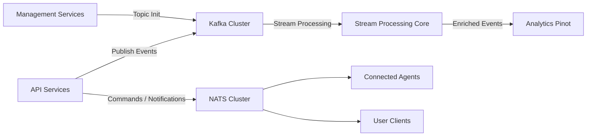
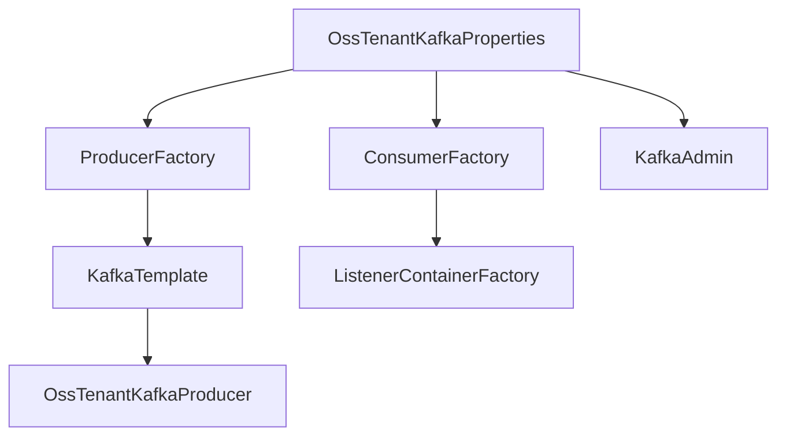
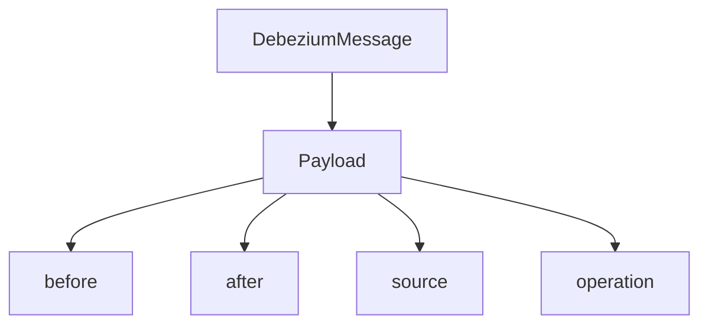
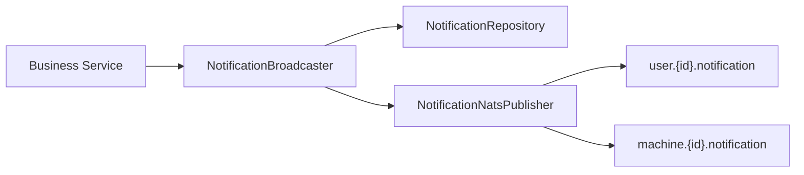

# Eventing And Messaging Kafka Nats

## Overview

The **Eventing And Messaging Kafka Nats** module provides the core messaging infrastructure for the OpenFrame platform. It standardizes how services publish and consume asynchronous events using:

- **Apache Kafka** for durable, high-throughput event streaming and data integration.
- **NATS** for low-latency, real-time messaging between backend services and connected agents or users.

This module acts as the foundational messaging layer that connects:

- Stream processing pipelines
- Analytics ingestion (e.g., Pinot)
- Agent command and control
- Real-time notifications
- Cross-service event propagation

It abstracts broker-specific configuration and exposes consistent models and publishers for upstream modules.

---

## High-Level Architecture



### Responsibilities

| Broker | Purpose | Characteristics |
|--------|----------|----------------|
| Kafka  | Durable event streaming | Partitioned, replayable, analytics-oriented |
| NATS   | Real-time messaging | Low latency, subject-based routing |

---

# Kafka Integration

Kafka in this module is designed for:

- Tenant-aware configuration
- Topic auto-provisioning
- Structured event models
- Debezium change-data-capture integration
- Controlled producer/consumer lifecycle

## Configuration Components

### OssKafkaConfig

Disables Spring Boot's default `KafkaAutoConfiguration` and enables manual configuration control via:

- `@EnableKafka`
- Explicit producer/consumer factories

This ensures strict separation between OSS tenant Kafka configuration and any default Spring Kafka behavior.

---

### OssTenantKafkaProperties

Configuration root bound to:

```text
spring.oss-tenant
```

Wraps `KafkaProperties` and enables:

- Bootstrap server configuration
- Producer/consumer tuning
- Listener concurrency and ack modes
- Template defaults

---

### KafkaTopicProperties

Bound to:

```text
openframe.oss-tenant.kafka.topics
```

Supports:

- Topic auto-creation
- Per-topic partitions
- Replication factor

Example structure:

```text
openframe:
  oss-tenant:
    kafka:
      topics:
        inbound:
          machine-events:
            name: machine-events
            partitions: 3
            replicationFactor: 2
```

---

## Auto-Configuration Flow

`OssTenantKafkaAutoConfiguration` creates:

- ProducerFactory
- KafkaTemplate
- ConsumerFactory
- ListenerContainerFactory
- KafkaAdmin
- Auto-created topics
- OssTenantKafkaProducer



### Key Features

- JSON serialization via `JsonSerializer`
- Record-level acknowledgment default
- Optional admin topic creation
- Concurrency tuning via listener properties

---

## Kafka Message Models

### MachinePinotMessage

Used to stream machine state updates toward analytics systems.

Fields include:

- `tenantId`
- `machineId`
- `organizationId`
- `deviceType`
- `status`
- `osType`
- `tags`
- `tagKeyValues`
- `ingestionTime`

This message is typically consumed by the Stream Processing Core and forwarded to Pinot.

---

### DebeziumMessage

Generic wrapper for CDC events.

Structure:



Supports:

- Database change events
- Operation codes (create/update/delete)
- Source metadata (schema, table, collection)

Used heavily in stream processing and data synchronization workflows.

---

## Kafka Headers

`KafkaHeader` defines:

```text
message-type
```

This enables polymorphic message handling by allowing consumers to inspect event type metadata without parsing payload content.

---

## Failure Handling

### KafkaRecoveryHandlerImpl

Handles producer-side failures by:

- Logging structured error summaries
- Capturing topic, key, payload
- Attaching stack traces

Current implementation logs and defers recovery to higher-level retry strategies.

---

# NATS Integration

NATS is used for real-time messaging between:

- Backend services
- OpenFrame agents
- User-facing clients

It is optimized for:

- Command execution
- Notification broadcasting
- Tool installation updates
- Connection lifecycle events

---

## Notification Flow



### NotificationCommand

Validates:

- Non-empty title
- Non-null severity
- Valid context type
- At least one audience (admins or machines)

Ensures consistency before persistence or publishing.

---

### NotificationBroadcaster

Responsibilities:

1. Feature flag check
2. Persist notification
3. Create read-state entries
4. Publish to NATS subjects
5. Safe failure handling and cleanup

If NATS publishing fails, clients reconcile state via GraphQL queries.

---

### NotificationNatsPublisher

Publishes to:

- `user.{userId}.notification`
- `machine.{machineId}.notification`

Ensures:

- Notification is persisted before publish
- Topic validation
- Exception safety

---

## Agent Command & Control

### CommandMessage

Sent to subject:

```text
machine.{machineId}.command-execution
```

Payload includes:

- `executionId`
- `code`
- `shell`
- `privilegeLevel`
- `timeout`

Used for remote script execution.

---

### CancelMessage

Sent to abort an in-flight execution.

Contains:

- `executionId`

---

## Tool Lifecycle Messages

- `ToolInstallationMessage`
- `ToolAgentUpdateMessage`
- `ToolConnectionMessage`
- `InstalledAgentMessage`
- `ClientConnectionEvent`

These support:

- Tool distribution
- Agent upgrades
- Session management
- Asset updates

---

# Cross-Module Relationships

This module integrates closely with:

- Stream Processing Core (Kafka consumers and processors)
- Analytics Pinot (MachinePinotMessage ingestion)
- Client Core Agent Ingress (NATS listeners)
- Management Service Core (topic initialization and stream configuration)

Kafka supports durable, replayable pipelines.

NATS supports interactive, real-time orchestration.

Together they provide a hybrid eventing architecture that balances:

- Durability
- Performance
- Scalability
- Multi-tenant isolation

---

# Design Principles

1. Broker abstraction with Spring auto-configuration
2. Tenant-aware messaging isolation
3. Fail-safe publishing strategies
4. Explicit message models
5. Clear separation between streaming and real-time messaging

---

# Summary

The **Eventing And Messaging Kafka Nats** module forms the backbone of asynchronous communication in OpenFrame.

It provides:

- Structured Kafka streaming configuration
- Debezium event support
- Topic lifecycle management
- Real-time NATS messaging
- Agent command execution
- Notification broadcasting

By separating durable event streams from real-time agent messaging, the module ensures both reliability and responsiveness across the platform.