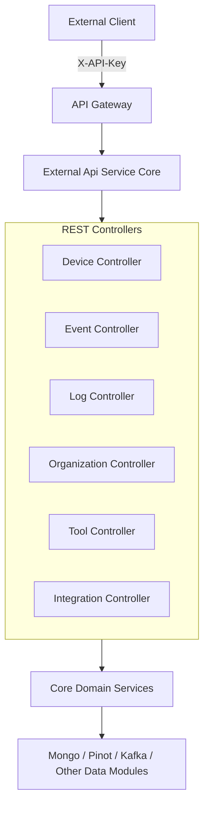
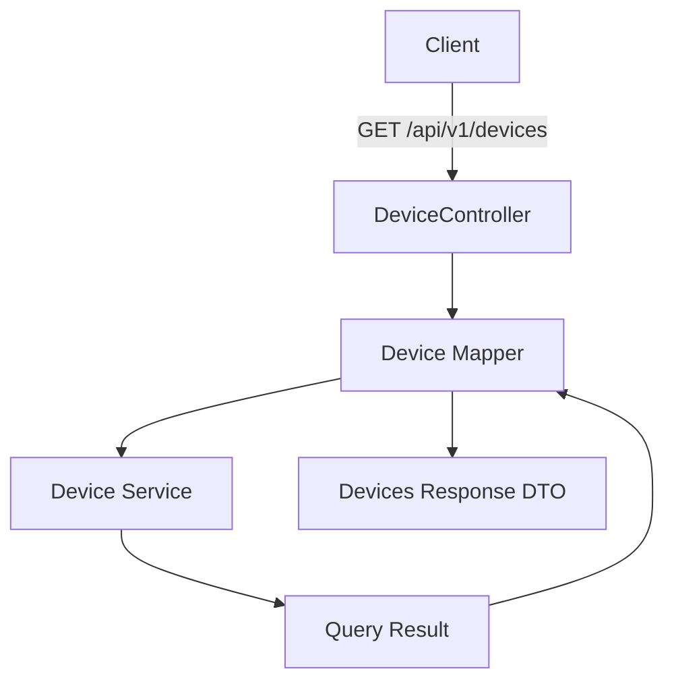
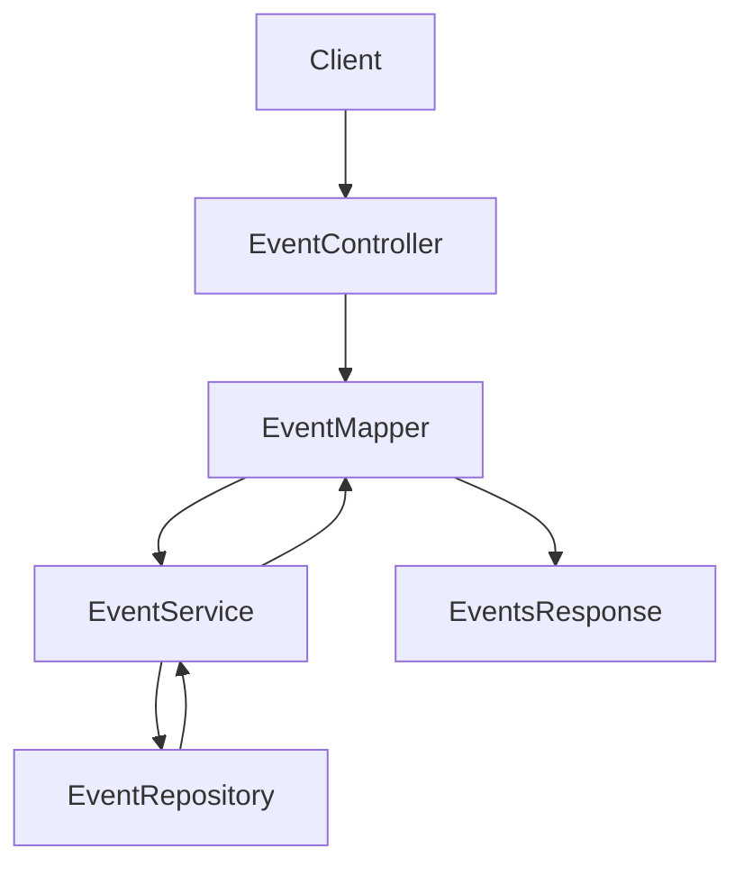
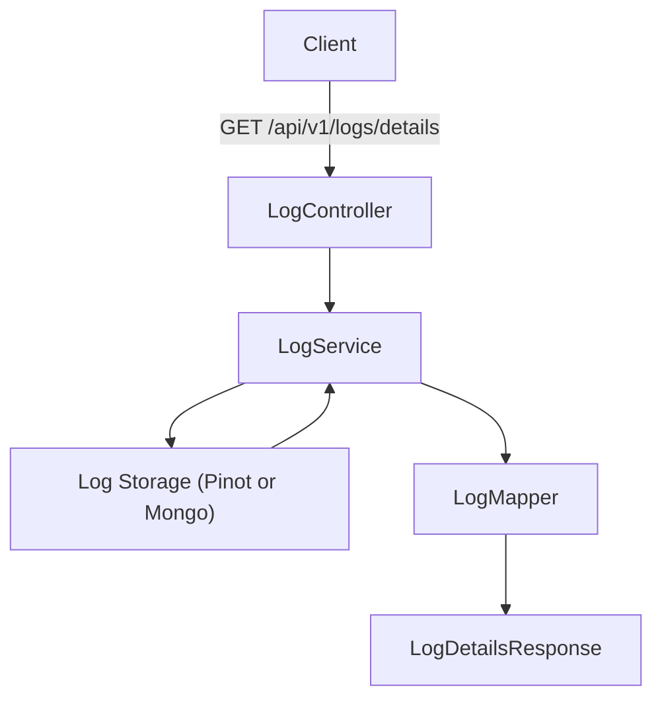
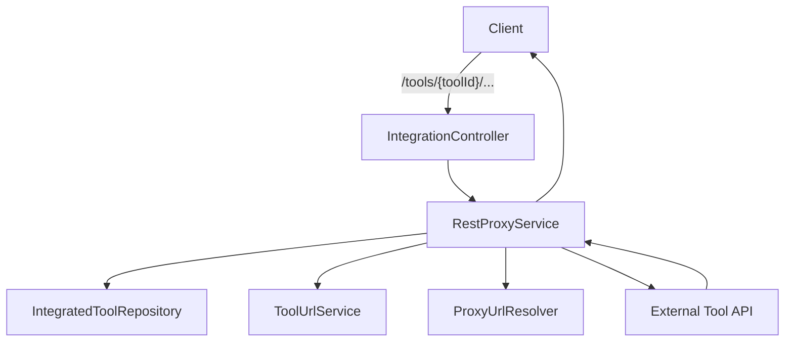
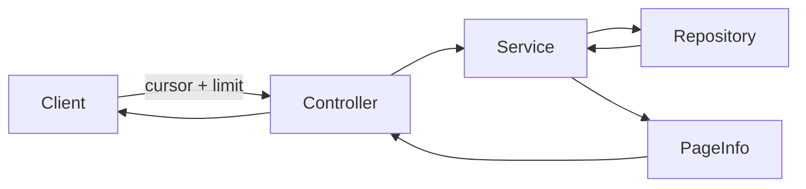

# External Api Service Core

## Overview

The **External Api Service Core** module exposes a public, API key–secured REST interface for interacting with the OpenFrame platform. It is designed for:

- Third-party integrations
- Automation workflows
- External reporting and analytics
- Tool-to-tool communication

Unlike the internal API modules, this module focuses on:

- Stable, versioned REST endpoints (`/api/v1/**`)
- API key–based authentication
- Explicit filtering, sorting, and pagination models
- Proxying requests to integrated tools
- OpenAPI documentation for external consumers

It acts as a façade over core domain services such as DeviceService, EventService, LogService, ToolService, and Organization services.

---

## High-Level Responsibilities

The External Api Service Core module provides:

1. **Device Management API** – Query, filter, and update devices
2. **Event API** – Query and manage platform events
3. **Log API** – Search and inspect system logs
4. **Organization API** – Full CRUD for organizations
5. **Tool API** – List and filter integrated tools
6. **Integration Proxy API** – Forward requests to integrated external tools
7. **OpenAPI Documentation Configuration** – Swagger/OpenAPI definition

---

## Architecture Overview

The module follows a layered REST architecture built on Spring Boot.



### Key Design Principles

- **Stateless REST API**
- **API key authentication via header**
- **Cursor-based pagination**
- **Structured filter criteria objects**
- **DTO mapping layer between domain and external models**
- **Tool API proxy abstraction**

---

## Authentication Model

All endpoints require an API key passed via the `X-API-Key` header.

```text
X-API-Key: ak_keyId.sk_secretKey
```

The API key is validated upstream (typically in the Gateway module), and contextual headers such as:

- `X-User-Id`
- `X-API-Key-Id`

are injected and consumed for logging and authorization context.

The OpenApiConfig class registers:

- API key security scheme
- Grouped API definitions
- Standard response codes
- Rate limit documentation

---

## Module Components

### 1. OpenApiConfig

Configures:

- OpenAPI metadata
- Security scheme (`ApiKeyAuth`)
- Server base path `/external-api`
- API grouping for `/api/v1/**` and `/tools/**`

This ensures consistent external documentation and discoverability.

---

# REST Controllers

Each controller exposes versioned REST endpoints under `/api/v1` or `/tools`.

---

## Device Controller

**Base Path:** `/api/v1/devices`

### Responsibilities

- Query devices with filtering
- Cursor-based pagination
- Sorting support
- Optional tag inclusion
- Update device status
- Provide filter metadata

### Flow



### Filtering Model

DeviceFilterCriteria includes:

- Statuses
- Device types
- OS types
- Organization IDs
- Tag names

Pagination is handled using:

- PaginationCriteria (cursor + limit)
- SortCriteria (field + direction)

---

## Event Controller

**Base Path:** `/api/v1/events`

### Responsibilities

- Query events with filters
- Create events
- Update events
- Fetch filter options

### Event Filtering

EventFilterCriteria supports:

- User IDs
- Event types
- Start and end dates

### Data Flow



---

## Log Controller

**Base Path:** `/api/v1/logs`

### Responsibilities

- Query logs with advanced filtering
- Retrieve log filter options
- Retrieve detailed log entries

### LogFilterCriteria

Supports:

- Date range
- Tool types
- Event types
- Severities
- Organization IDs
- Device ID

### Log Details Retrieval



---

## Organization Controller

**Base Path:** `/api/v1/organizations`

### Responsibilities

- List organizations with filtering
- Get organization by ID
- Get by business identifier
- Create organization
- Update organization
- Delete organization

Deletion safeguards:

- Prevent deletion if organization has associated machines

### Command vs Query Separation

- OrganizationQueryService handles search and filtering
- OrganizationCommandService handles mutations
- OrganizationService handles domain retrieval

This enforces clean separation between read and write logic.

---

## Tool Controller

**Base Path:** `/api/v1/tools`

### Responsibilities

- Query integrated tools
- Filter by:
  - Enabled state
  - Type
  - Category
- Retrieve tool filter options

ToolFilterCriteria includes:

- enabled
- type
- category
- platformCategory

---

## Integration Controller (Tool Proxy)

**Base Path:** `/tools/{toolId}/**`

This controller proxies HTTP requests to integrated external tools.

### Proxy Flow



### RestProxyService Responsibilities

1. Validate tool existence
2. Verify tool is enabled
3. Resolve target URL
4. Attach credentials (header or bearer token)
5. Forward HTTP method and body
6. Return upstream response

Supported methods:

- GET
- POST
- PUT
- PATCH
- DELETE
- OPTIONS

Timeout configuration:

- Connection request timeout: 10 seconds
- Response timeout: 60 seconds

---

# DTO Layer

The module defines REST-specific DTOs that isolate internal domain models from external consumers.

## Categories

### Device DTOs

- DeviceResponse
- DevicesResponse
- DeviceFilterCriteria
- DeviceFilterResponse
- TagResponse

### Event DTOs

- EventResponse
- EventsResponse
- EventFilterCriteria
- EventFilterResponse

### Log DTOs

- LogResponse
- LogsResponse
- LogDetailsResponse
- LogFilterCriteria
- LogFilterResponse

### Organization DTOs

- OrganizationsResponse

### Tool DTOs

- ToolResponse
- ToolsResponse
- ToolFilterCriteria
- ToolFilterResponse
- ToolUrlResponse

### Shared DTOs

- PaginationCriteria
- SortCriteria

---

# Pagination and Sorting

The module standardizes pagination using cursor-based pagination.



## PaginationCriteria

Fields:

- cursor
- limit (validated between 1 and 100)

## SortCriteria

Fields:

- field
- direction (ASC or DESC)

---

# Error Handling

Standard HTTP response codes are used consistently:

- 200 – Success
- 201 – Created
- 204 – No Content
- 400 – Bad Request
- 401 – Unauthorized
- 404 – Not Found
- 409 – Conflict
- 429 – Too Many Requests
- 500 – Internal Server Error

Custom exceptions include:

- DeviceNotFoundException
- EventNotFoundException
- LogNotFoundException
- OrganizationNotFoundException

---

# Interaction With Other Modules

The External Api Service Core depends on:

- Core domain services from Api Service Core
- Data repositories from Mongo data modules
- Log and event storage backends
- Integrated tool configuration modules
- Gateway and security modules for API key enforcement

It does not implement business logic itself; instead, it:

- Delegates to domain services
- Transforms inputs into filter objects
- Maps domain entities into external DTOs
- Enforces REST contracts

---

# Summary

The **External Api Service Core** module provides a secure, versioned, and well-documented REST API for external systems interacting with OpenFrame.

Key characteristics:

- API key–secured
- Cursor-based pagination
- Filter-driven querying
- DTO isolation layer
- Tool API proxy support
- Swagger/OpenAPI documentation built-in

It serves as the official integration surface of the OpenFrame platform for automation, reporting, and third-party system interoperability.
