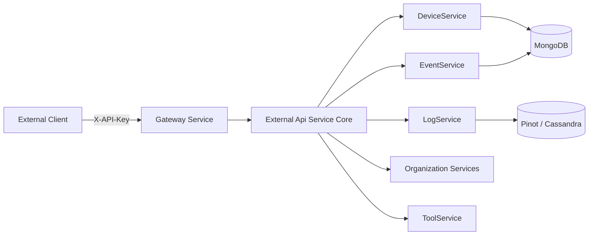
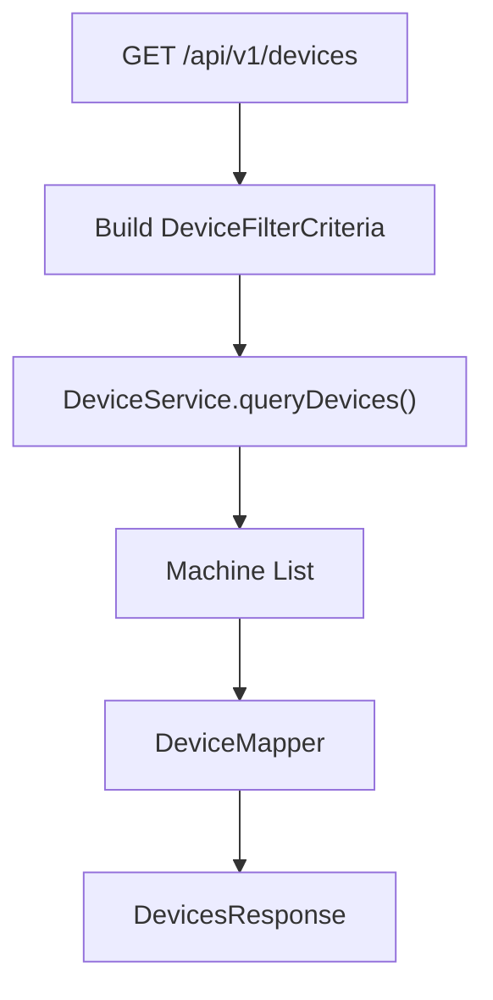
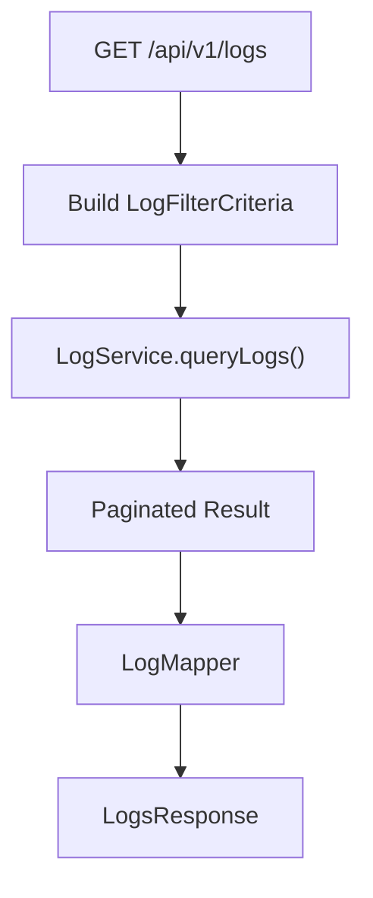
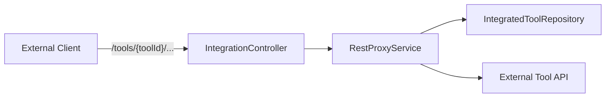
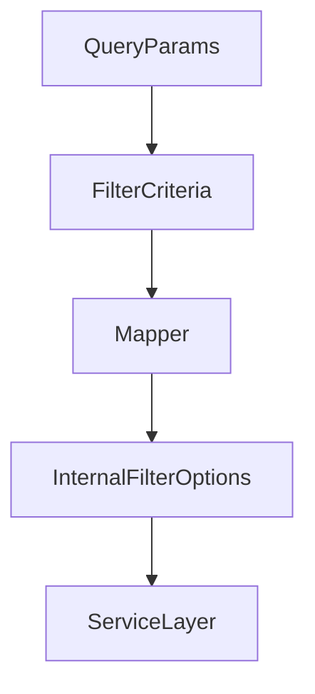

# External Api Service Core

## Overview

The **External Api Service Core** module exposes a secure, API key–based REST interface for external systems and integrations to interact with the OpenFrame platform.

It acts as a controlled façade over internal services such as DeviceService, EventService, LogService, Organization services, and ToolService, translating external REST contracts into internal domain operations.

Key characteristics:

- ✅ API key authentication via `X-API-Key`
- ✅ Cursor-based pagination
- ✅ Flexible filtering and sorting
- ✅ OpenAPI/Swagger documentation
- ✅ Integration proxy for third-party tools
- ✅ Clean separation between REST DTOs and internal domain models

---

## High-Level Responsibilities

The External Api Service Core is responsible for:

1. Exposing REST endpoints under `/api/v1/**`
2. Converting request parameters into internal filter and pagination models
3. Mapping domain entities into external response DTOs
4. Enforcing API key–based access control (handled upstream in the security layer)
5. Proxying API calls to integrated third-party tools

It does **not**:

- Contain core business logic
- Directly manage persistence
- Implement authentication logic itself

Instead, it delegates to services provided by the internal API layer and data modules.

---

## Architectural Positioning



### Flow Explanation

1. An external client sends a request with an `X-API-Key` header.
2. The Gateway layer validates the API key and injects contextual headers such as:
   - `X-User-Id`
   - `X-API-Key-Id`
3. The request reaches the External Api Service Core.
4. Controllers:
   - Build filter and pagination criteria
   - Delegate to internal services
   - Map domain objects to external DTOs
5. Services query MongoDB, Pinot, or other platform stores.

---

## Module Structure

### 1. Configuration

#### OpenApiConfig

Defines:

- OpenAPI metadata (title, version, license)
- API key security scheme (`ApiKeyAuth`)
- Swagger grouping for `/api/v1/**` and `/tools/**`
- Default rate limit documentation

Security scheme:

```text
Header: X-API-Key
Format: ak_keyId.sk_secretKey
```

This ensures all documented endpoints clearly indicate API key requirements.

---

### 2. REST Controllers

The module contains domain-specific REST controllers.

### Devices – DeviceController

Base path: `/api/v1/devices`

Responsibilities:

- List devices with filtering, sorting, and cursor pagination
- Retrieve single device by machine ID
- Retrieve available filter options with counts
- Update device status (e.g., DELETED, ARCHIVED)

Key concepts:

- `DeviceFilterCriteria`
- `PaginationCriteria`
- `SortCriteria`
- Optional tag enrichment (`includeTags=true`)



---

### Events – EventController

Base path: `/api/v1/events`

Responsibilities:

- Query events with date range, user IDs, and types
- Retrieve single event by ID
- Create and update events
- Provide filter metadata

Uses:

- `EventFilterCriteria`
- Cursor-based pagination
- Search + sorting

Events are backed by internal event services and persisted in platform storage.

---

### Logs – LogController

Base path: `/api/v1/logs`

Responsibilities:

- Query logs with advanced filtering:
  - Date range
  - Tool types
  - Event types
  - Severities
  - Organization IDs
- Retrieve filter options
- Fetch detailed log content

Log queries typically interact with analytical storage (e.g., Pinot) for high-volume log access.



---

### Organizations – OrganizationController

Base path: `/api/v1/organizations`

Responsibilities:

- List organizations with filtering and search
- Retrieve by database ID
- Retrieve by business `organizationId`
- Create, update, and delete organizations

Delegates to:

- OrganizationQueryService
- OrganizationCommandService
- OrganizationService

Deletion safeguards prevent removing organizations with associated machines.

---

### Tools – ToolController

Base path: `/api/v1/tools`

Responsibilities:

- List integrated tools
- Filter by type, category, platform
- Retrieve tool filter metadata

This endpoint exposes integration metadata without revealing sensitive internal structures.

---

### Integration Proxy – IntegrationController

Base path: `/tools/{toolId}/**`

This controller proxies arbitrary HTTP requests to an integrated tool.

It delegates to `RestProxyService`, which:

- Validates tool existence and enabled status
- Resolves target URL
- Injects tool credentials (header or bearer token)
- Forwards request using Apache HttpClient
- Returns downstream response as-is



This allows OpenFrame to act as a secure broker between clients and integrated platforms.

---

## DTO Layer Design

The module defines dedicated REST DTOs under `external.dto.*`.

### Design Principles

- ✅ No direct exposure of internal Mongo entities
- ✅ Explicit filter criteria objects
- ✅ Explicit response wrappers
- ✅ Consistent pagination model

### Pagination Model

Requests use:

```text
cursor: optional string
limit: 1–100 (default 20)
```

Responses include:

- `PageInfo` or equivalent cursor metadata
- `hasNextPage`
- `startCursor` / `endCursor`

Cursor-based pagination ensures stable ordering and scalability.

---

## Filtering and Sorting Strategy

Each domain exposes:

- `*FilterCriteria` (external input model)
- Conversion to internal filter options via mapper
- Optional `SortCriteria`

Pattern:



This separation prevents leaking internal filtering models to external clients.

---

## Security Model

The External Api Service Core assumes API key validation is handled upstream.

Headers injected into controllers:

- `X-User-Id`
- `X-API-Key-Id`

Controllers log contextual metadata but do not implement authentication logic directly.

API key security is documented via OpenAPI and enforced in the gateway/security layer.

---

## Error Handling

Standard HTTP status codes are used:

- `200` – Success
- `201` – Created
- `204` – No Content
- `400` – Validation or bad input
- `401` – Unauthorized
- `404` – Resource not found
- `409` – Conflict
- `500` – Internal server error

Domain-specific exceptions (e.g., DeviceNotFoundException, LogNotFoundException) are translated into structured error responses.

---

## Integration with Other Modules

The External Api Service Core relies on:

- API service core (business services)
- Data Mongo domain and repositories
- Data platform Cassandra and Pinot
- Data Redis cache
- Gateway service core
- Security core and OAuth BFF

It acts strictly as an external contract layer and does not duplicate business logic from those modules.

---

## Summary

The **External Api Service Core** module is the public REST façade of the OpenFrame platform.

It:

- Exposes stable, versioned endpoints (`/api/v1/**`)
- Enforces API key–based access
- Provides rich filtering, sorting, and pagination
- Separates external contracts from internal domain models
- Enables secure tool-level API proxying

Architecturally, it is a thin but critical boundary layer that ensures external integrations remain stable, secure, and decoupled from internal implementation details.
