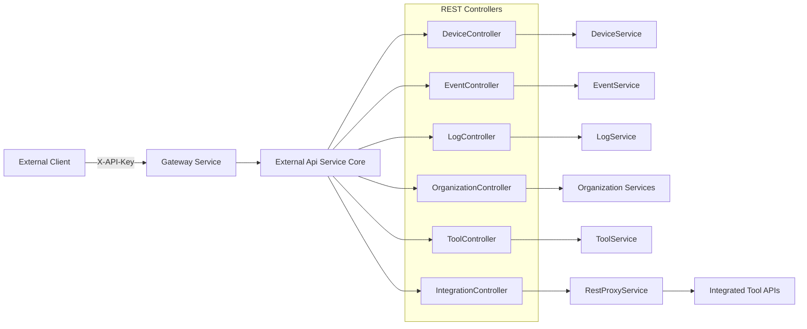
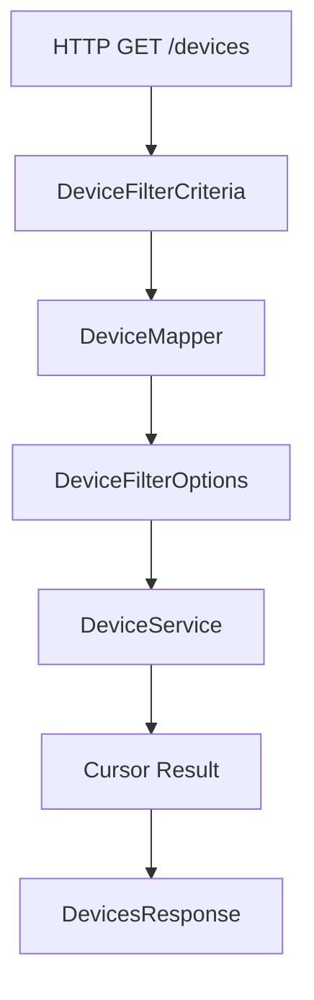
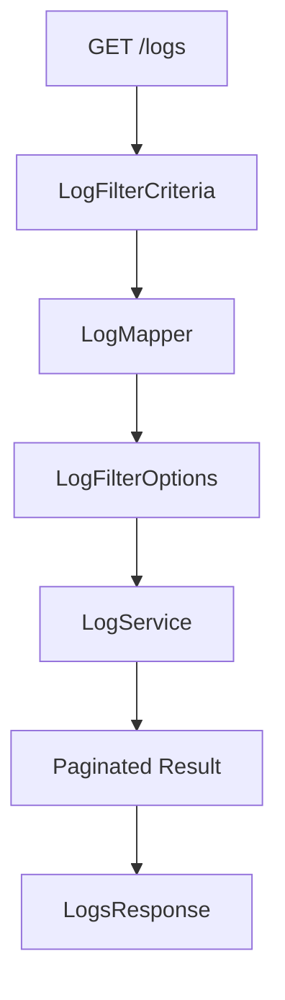
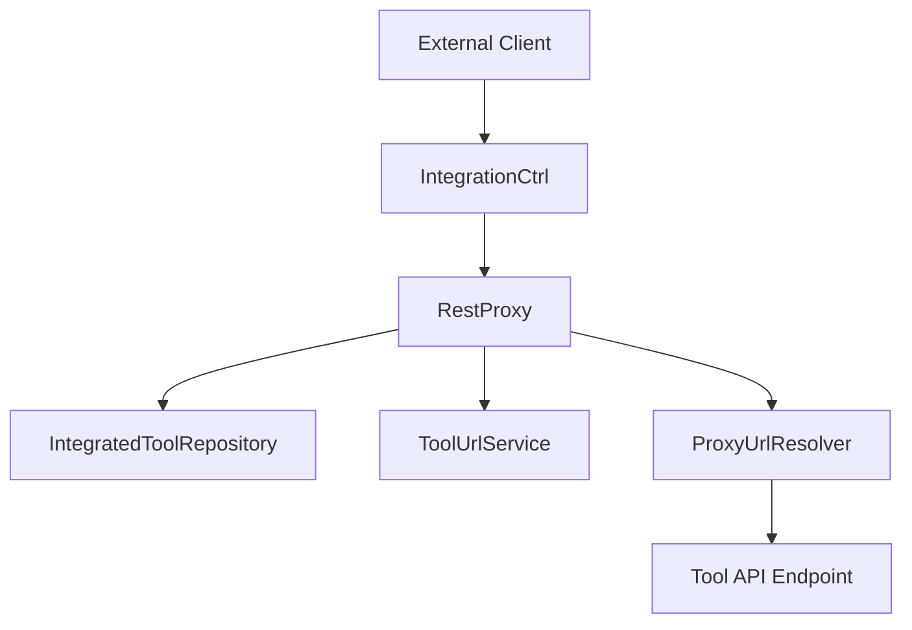
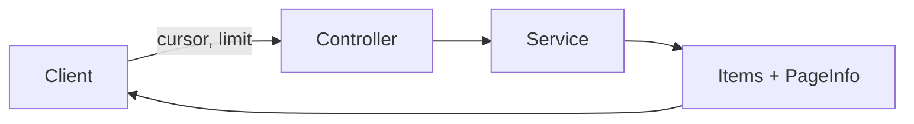
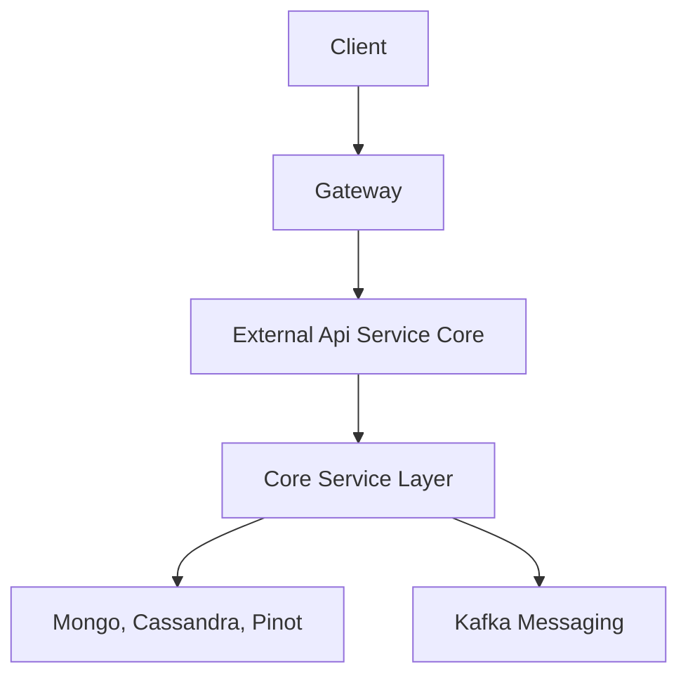

# External Api Service Core

## Overview

The **External Api Service Core** module exposes a secure, API key–based REST interface for programmatic access to OpenFrame platform capabilities. It is designed for external integrations, automation tools, and third-party systems that need controlled access to devices, events, logs, organizations, and integrated tools.

Unlike internal GraphQL or management services, this module provides:

- ✅ Stable REST endpoints under `/api/v1/**`
- ✅ API key authentication via `X-API-Key`
- ✅ Cursor-based pagination
- ✅ Rich filtering and sorting
- ✅ Tool API proxying via `/tools/{toolId}/**`
- ✅ OpenAPI/Swagger documentation

This module acts as a **secure external façade** over the internal service layer (DeviceService, EventService, LogService, Organization services, ToolService).

---

## High-Level Architecture



### Responsibilities

- Expose versioned REST APIs (`/api/v1/**`)
- Translate HTTP parameters into internal filter and pagination models
- Map domain objects into external DTOs
- Enforce API key–based authentication (via security layer)
- Proxy tool API calls securely

---

## Authentication Model

All endpoints require an API key passed in the `X-API-Key` header.

```text
X-API-Key: ak_keyId.sk_secretKey
```

### Security Characteristics

- API key validation handled by the security layer
- API key ID propagated internally via `X-API-Key-Id`
- Optional `X-User-Id` header for context
- Rate limiting enforced upstream

The OpenAPI configuration explicitly defines the API key security scheme.

---

## API Surface

All endpoints are versioned under:

```text
/api/v1
```

### Domain Areas

| Domain | Controller | Description |
|--------|------------|------------|
| Devices | DeviceController | Query, filter, update device status |
| Events | EventController | Query, create, update events |
| Logs | LogController | Query logs and retrieve detailed log entries |
| Organizations | OrganizationController | Full CRUD for organizations |
| Tools | ToolController | Query integrated tools and filters |
| Integrations | IntegrationController | Proxy external tool APIs |

---

# Core Components

## 1. OpenAPI Configuration

**Class:** `OpenApiConfig`

Responsibilities:

- Configures OpenAPI metadata
- Registers API key security scheme
- Groups endpoints for Swagger UI
- Documents authentication and rate limiting

This ensures:

- Discoverable API documentation
- Accurate security representation
- Clear developer onboarding

---

# Domain Controllers

Each controller follows a consistent pattern:

1. Parse query parameters
2. Build FilterCriteria
3. Build PaginationCriteria
4. Build SortCriteria
5. Call internal service
6. Map result to response DTO

---

## Device API

**Controller:** `DeviceController`

### Capabilities

- List devices with advanced filtering
- Retrieve single device
- Retrieve filter options with counts
- Update device status (ARCHIVED, DELETED)

### Filtering Model



Supports:

- Statuses
- Device types
- OS types
- Organization IDs
- Tag names
- Search
- Sorting
- Cursor-based pagination

Optional tag expansion via `includeTags=true`.

---

## Event API

**Controller:** `EventController`

### Capabilities

- Query events with filters
- Retrieve event by ID
- Create event
- Update event
- Retrieve event filters

Supports:

- Date range filtering
- Event types
- User IDs
- Search
- Cursor pagination
- Sorting

Events are mapped from domain `Event` into `EventResponse`.

---

## Log API

**Controller:** `LogController`

### Capabilities

- Query logs
- Retrieve log filters
- Retrieve detailed log entry

Logs use composite identity fields:

- ingestDay
- toolType
- eventType
- timestamp
- toolEventId

### Log Query Flow



Optimized for high-volume audit retrieval.

---

## Organization API

**Controller:** `OrganizationController`

### Capabilities

- List organizations
- Retrieve by ID
- Retrieve by business identifier
- Create organization
- Update organization
- Delete organization

Supports:

- Filtering by category
- Employee count ranges
- Contract status
- Search
- Sorting
- Cursor pagination

Deletion safeguards:

- Prevents deletion if organization has associated machines

---

## Tool API

**Controller:** `ToolController`

### Capabilities

- List integrated tools
- Retrieve tool filter options

Supports:

- Enabled status filtering
- Tool type filtering
- Category filtering
- Search
- Sorting

Returns:

- Tool URLs
- Platform category
- Credentials metadata (where permitted)

---

# Integration Proxy Layer

## IntegrationController + RestProxyService

This feature enables:

```text
/tools/{toolId}/**
```

To proxy any HTTP request to a configured integrated tool.

### Proxy Flow



### Proxy Features

- Resolves tool base URL dynamically
- Injects credentials automatically
- Supports API key header or Bearer token
- Rewrites target URI
- Handles all HTTP methods
- Timeout and connection configuration

Security controls:

- Tool must exist
- Tool must be enabled
- Credentials injected server-side
- No client-side credential exposure

---

# DTO Layer Design

The module defines dedicated external DTOs separate from internal domain models.

### Common Patterns

- `*FilterCriteria` – incoming query filters
- `*Response` – outbound payload
- `*FilterResponse` – filter metadata with counts
- `PaginationCriteria` – cursor + limit
- `SortCriteria` – field + direction

### Pagination Strategy

Cursor-based pagination:



Advantages:

- Stable under concurrent updates
- Efficient for large datasets
- Avoids offset-based performance issues

---

# Error Handling

Standard HTTP status codes:

| Code | Meaning |
|------|---------|
| 200 | Success |
| 201 | Created |
| 204 | No Content |
| 400 | Bad Request |
| 401 | Unauthorized |
| 404 | Not Found |
| 409 | Conflict |
| 429 | Rate Limit Exceeded |
| 500 | Internal Error |

Custom exceptions:

- DeviceNotFoundException
- EventNotFoundException
- LogNotFoundException
- OrganizationNotFoundException

---

# Design Principles

### 1. Clear Separation of Concerns

- Controllers: HTTP layer
- Services: Business logic
- Mappers: DTO translation
- DTOs: External contract

### 2. Stable Public Contract

External DTOs protect the internal domain from:

- Structural refactoring
- Internal field changes
- GraphQL-specific models

### 3. Consistent API Patterns

Every major domain supports:

- Filtering
- Search
- Sorting
- Pagination
- Filter metadata retrieval

### 4. Secure Tool Integration

The proxy model ensures:

- Centralized credential management
- Zero credential exposure to clients
- Unified routing for all tool APIs

---

# How It Fits in the Overall Platform

The External Api Service Core sits between:

- Upstream: Gateway and Security layers
- Downstream: Internal API services and data platform



It is the **official external integration boundary** of the OpenFrame platform.

---

# Summary

The **External Api Service Core** module provides:

- A secure REST interface for external integrations
- API key–based authentication
- Rich filtering and pagination
- Full CRUD for core domains
- High-volume log querying
- Secure tool API proxying
- OpenAPI documentation

It enables third-party systems, automation pipelines, and MSP integrations to interact safely and efficiently with the OpenFrame ecosystem.