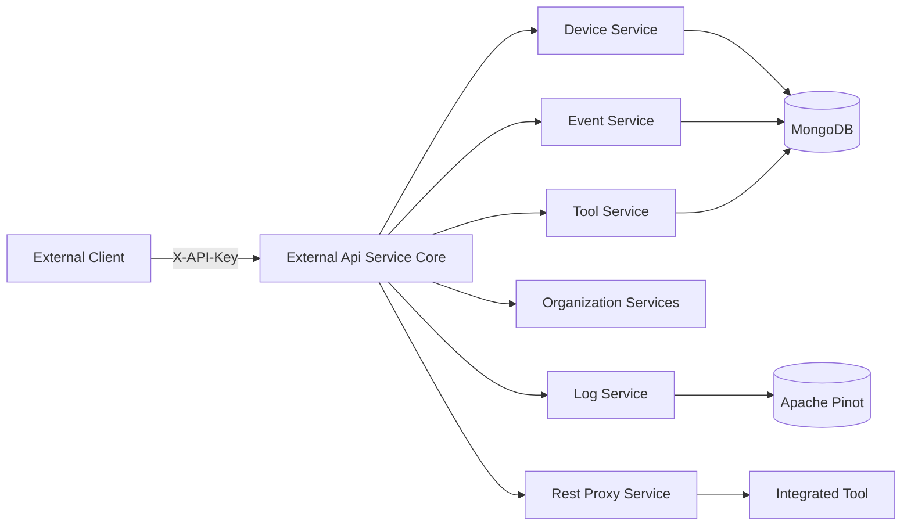
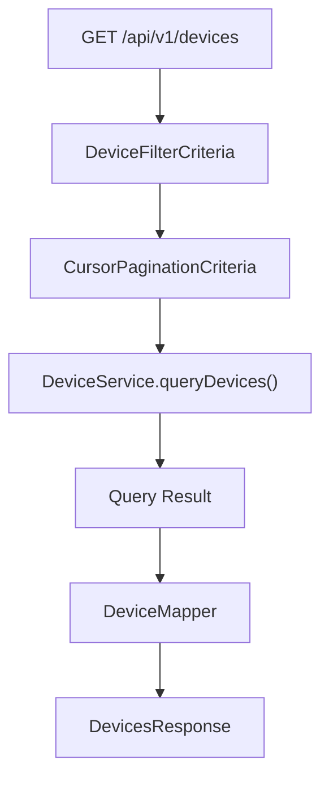
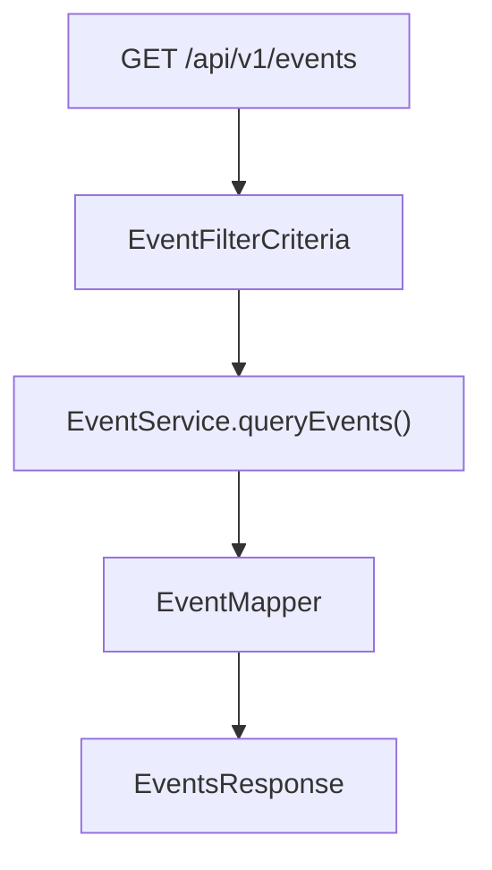
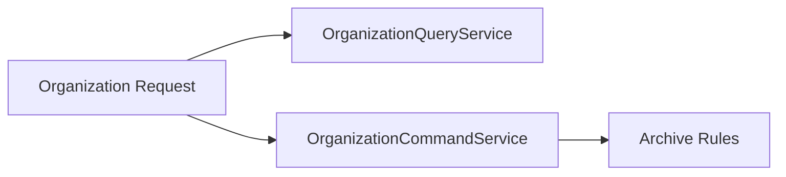
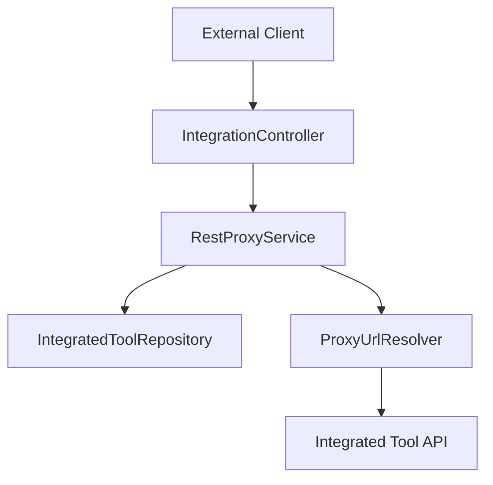

# External Api Service Core

## Overview

The **External Api Service Core** module exposes a secure, API key–based REST interface for external integrations with the OpenFrame platform.

It provides:

- Public REST endpoints under `/api/v1/**`
- Tool proxy endpoints under `/tools/**`
- OpenAPI (Swagger) documentation
- Cursor-based pagination, filtering, and sorting
- API key authentication via `X-API-Key`

Unlike the internal GraphQL-based API service, this module is purpose-built for third-party systems, automation scripts, and integration partners.

---

## Architectural Positioning

The External Api Service Core sits at the boundary between external consumers and the internal platform services.


```mermaid
flowchart LR
    Client["External Client"] -->|"X-API-Key"| ExternalAPI["External Api Service Core"]

    ExternalAPI --> DeviceService["Device Service"]
    ExternalAPI --> EventService["Event Service"]
    ExternalAPI --> LogService["Log Service"]
    ExternalAPI --> OrganizationService["Organization Services"]
    ExternalAPI --> ToolService["Tool Service"]

    ExternalAPI --> ProxyService["Rest Proxy Service"]
    ProxyService --> IntegratedTool["Integrated Tool"]

    DeviceService --> MongoDB[("MongoDB")]
    EventService --> MongoDB
    LogService --> Pinot[("Apache Pinot")]
    ToolService --> MongoDB
```

### Responsibilities

- Authenticate requests using API keys
- Translate REST query parameters into internal filter criteria
- Apply cursor-based pagination
- Map domain models into external DTOs
- Proxy tool-specific requests to integrated tools

---

## Authentication Model

All endpoints require an API key provided in the `X-API-Key` header.

```text
X-API-Key: ak_keyId.sk_secretKey
```

Internally:

- The API key is validated by upstream security filters
- `X-User-Id` and `X-API-Key-Id` headers are injected
- Controllers use those headers for auditing and authorization

The module does **not** perform token-based OAuth authentication. It is explicitly designed for machine-to-machine API key usage.

---

## OpenAPI Configuration

### OpenApiConfig

The `OpenApiConfig` class configures:

- API metadata (title, version, license)
- API key security scheme
- Grouped OpenAPI paths
- Server base path `/external-api`

Documented path groups:

```text
Included:
- /tools/**
- /api/v1/**

Excluded:
- /actuator/**
- /api/core/**
```

Security scheme definition:

```text
Type: APIKEY
In: HEADER
Header name: X-API-Key
```

---

# REST Controllers

All REST endpoints are versioned under `/api/v1` except integration proxy endpoints (`/tools/**`).

---

## DeviceController

**Base Path:** `/api/v1/devices`

### Capabilities

- List devices with filtering and pagination
- Retrieve a device by machine ID
- Retrieve device filter options
- Update device status

### Query Features

The controller converts query parameters into `DeviceFilterCriteria`:

- Status filters
- Device type filters
- OS type filters
- Organization filters
- Tag filters
- Search
- Sorting
- Cursor-based pagination


```mermaid
flowchart TD
    Request["GET /api/v1/devices"] --> Criteria["DeviceFilterCriteria"]
    Criteria --> Pagination["CursorPaginationCriteria"]
    Pagination --> Query["DeviceService.queryDevices()"]
    Query --> Result["Query Result"]
    Result --> Mapper["DeviceMapper"]
    Mapper --> Response["DevicesResponse"]
```

### Tag Enrichment

When `includeTags=true`, the controller:

1. Extracts machine IDs
2. Loads tags via `TagService`
3. Returns enriched response

Failures in tag loading fall back to non-enriched responses.

---

## EventController

**Base Path:** `/api/v1/events`

### Capabilities

- Query events with filtering
- Retrieve event by ID
- Create event
- Update event
- Retrieve filter options

### Filtering Dimensions

- User IDs
- Event types
- Date range
- Search term
- Sorting
- Cursor pagination


```mermaid
flowchart TD
    EventRequest["GET /api/v1/events"] --> Filter["EventFilterCriteria"]
    Filter --> Service["EventService.queryEvents()"]
    Service --> Mapper["EventMapper"]
    Mapper --> EventsResponse["EventsResponse"]
```

Create and update operations directly delegate to `EventService`.

---

## LogController

**Base Path:** `/api/v1/logs`

### Capabilities

- Query logs with filtering
- Retrieve log filter options
- Retrieve detailed log entry

### Filtering Dimensions

- Date range
- Tool type
- Event type
- Severity
- Organization
- Device ID
- Search
- Sorting
- Cursor pagination

Log queries are executed via `LogService`, which may retrieve data from analytics stores such as Apache Pinot.

Detailed log retrieval requires composite identifiers:

```text
ingestDay
toolType
eventType
timestamp
toolEventId
```

---

## OrganizationController

**Base Path:** `/api/v1/organizations`

### Capabilities

- List organizations with filtering
- Retrieve organization by database ID
- Retrieve organization by business identifier
- Create organization
- Update organization
- Update status (ACTIVE / ARCHIVED)
- Check archive eligibility

### Query Delegation

The controller delegates:

- Reads → `OrganizationQueryService`
- Writes → `OrganizationCommandService`
- Archival checks → `OrganizationService`


```mermaid
flowchart LR
    OrgRequest["Organization Request"] --> QueryService["OrganizationQueryService"]
    OrgRequest --> CommandService["OrganizationCommandService"]
    CommandService --> Validation["Archive Rules"]
```

Archiving is blocked when active devices exist.

---

## ToolController

**Base Path:** `/api/v1/tools`

### Capabilities

- List integrated tools
- Retrieve tool filter options

Filtering includes:

- Enabled status
- Tool type
- Category
- Search
- Sorting

Delegates to `ToolService` and maps results using `ToolMapper`.

---

## IntegrationController

**Base Path:** `/tools/{toolId}/**`

This controller proxies arbitrary HTTP requests to integrated tools.

Supported methods:

- GET
- POST
- PUT
- PATCH
- DELETE
- OPTIONS


```mermaid
flowchart TD
    Client["External Client"] --> ProxyController["IntegrationController"]
    ProxyController --> RestProxyService["RestProxyService"]
    RestProxyService --> ToolRepo["IntegratedToolRepository"]
    RestProxyService --> Resolver["ProxyUrlResolver"]
    Resolver --> TargetTool["Integrated Tool API"]
```

---

# Rest Proxy Service

The `RestProxyService` performs secure HTTP forwarding.

## Responsibilities

1. Validate tool existence
2. Verify tool is enabled
3. Resolve upstream URL
4. Attach tool credentials
5. Forward request
6. Return upstream response

## Credential Injection

Based on `APIKeyType`:

```text
HEADER       → Custom header injection
BEARER_TOKEN → Authorization: Bearer <token>
NONE         → No credential
```

## HTTP Client Configuration

- Connection timeout: 10 seconds
- Response timeout: 60 seconds
- Apache HttpClient 5

The service preserves:

- HTTP method
- Request body
- Response status code
- Response body

---

# Pagination Model

All list endpoints use cursor-based pagination.

Components:

- `CursorPaginationCriteria.fromRest(cursor, limit)`
- `SortInput.from(sortField, sortDirection)`

Benefits:

- Stable pagination
- Scalable large dataset traversal
- No offset-based performance degradation

---

# Error Handling

Standard HTTP status codes are used:

```text
200  Success
201  Created
204  No Content
400  Bad Request
401  Unauthorized
403  Forbidden
404  Not Found
409  Conflict
429  Too Many Requests
500  Internal Server Error
```

Domain-specific exceptions (e.g., `DeviceNotFoundException`, `OrganizationNotFoundException`) are translated into structured error responses.

---

# Data Sources and Dependencies

The module integrates with:

- MongoDB (devices, organizations, tools)
- Apache Pinot (log analytics)
- Integrated tool APIs (via proxy)
- Core domain services from the API layer

It does not directly manage persistence; instead, it orchestrates existing services.

---

# Key Design Characteristics

## 1. Separation of Concerns

- Controllers handle HTTP concerns
- Services perform business logic
- Mappers transform domain → external DTO
- Proxy service handles external tool routing

## 2. External-First Contract

The REST surface is optimized for:

- Predictable filtering
- Explicit query parameters
- Stable versioning (`/api/v1`)
- API key–based automation

## 3. Observability

All controllers log:

- Request parameters
- User ID
- API key ID
- Pagination and sorting

This enables auditability and traceability.

---

# Summary

The **External Api Service Core** module provides a secure, API key–driven REST interface for third-party integrations.

It:

- Exposes device, event, log, organization, and tool APIs
- Implements cursor-based pagination and rich filtering
- Proxies requests to integrated tools
- Enforces API key authentication
- Publishes OpenAPI documentation

It acts as the official external integration boundary of the OpenFrame platform, enabling automation, ecosystem integrations, and partner access without exposing internal GraphQL or domain-layer complexity.
