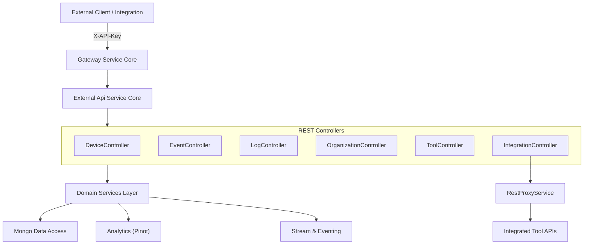
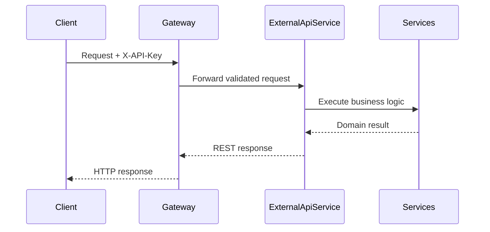
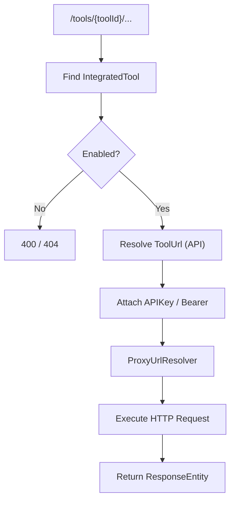
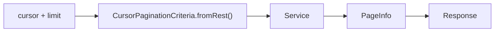

# External Api Service Core

## Overview

The **External Api Service Core** module exposes a public, API-key–secured REST interface for third-party systems and customer integrations to interact with the OpenFrame platform.

It provides:

- Public REST endpoints for devices, events, logs, organizations, and tools
- API-key based authentication (via `X-API-Key` header)
- Cursor-based pagination and filtering
- Tool API proxying for integrated platforms (RMM, MDM, etc.)
- OpenAPI (Swagger) documentation for discoverability

This module acts as a controlled, external-facing boundary on top of internal services defined across:

- API domain services (DeviceService, EventService, LogService, ToolService, Organization services)
- Mongo repositories and data model modules
- Stream processing and analytics modules (for logs/events)
- Gateway and authorization modules (for upstream security enforcement)

---

## High-Level Architecture


```mermaid
flowchart TD
    Client["External Client / Integration"] -->|"X-API-Key"| Gateway["Gateway Service Core"]
    Gateway --> ExternalApi["External Api Service Core"]

    subgraph rest_layer["REST Controllers"]
        DeviceCtrl["DeviceController"]
        EventCtrl["EventController"]
        LogCtrl["LogController"]
        OrgCtrl["OrganizationController"]
        ToolCtrl["ToolController"]
        IntegrationCtrl["IntegrationController"]
    end

    ExternalApi --> rest_layer

    rest_layer --> Services["Domain Services Layer"]
    Services --> Mongo["Mongo Data Access"]
    Services --> Pinot["Analytics (Pinot)"]
    Services --> Kafka["Stream & Eventing"]

    IntegrationCtrl --> RestProxy["RestProxyService"]
    RestProxy --> IntegratedTools["Integrated Tool APIs"]
```

### Architectural Role

The External Api Service Core is:

- **Northbound API layer** for external consumers
- **Stateless REST interface** over internal services
- **Security-aware boundary** relying on API keys
- **Proxy gateway** for integrated tool APIs

It does not implement deep business logic itself. Instead, it orchestrates:

- Filter construction
- Pagination translation
- Sorting conversion
- DTO mapping
- Delegation to internal services

---

## Authentication & Security Model

All endpoints require an API key.

### API Key Format

```text
X-API-Key: ak_keyId.sk_secretKey
```

### Security Flow


```mermaid
sequenceDiagram
    participant Client
    participant Gateway
    participant ExternalApi as ExternalApiService
    participant Services

    Client->>Gateway: Request + X-API-Key
    Gateway->>ExternalApi: Forward validated request
    ExternalApi->>Services: Execute business logic
    Services-->>ExternalApi: Domain result
    ExternalApi-->>Gateway: REST response
    Gateway-->>Client: HTTP response
```

Rate limits are enforced at the platform level and reflected in response headers:

- `X-RateLimit-Limit-Minute`
- `X-RateLimit-Remaining-Minute`
- `X-RateLimit-Limit-Hour`
- `X-RateLimit-Remaining-Hour`

---

## Module Components

### 1. OpenAPI Configuration

**Class:** `OpenApiConfig`

Responsibilities:

- Defines Swagger/OpenAPI metadata
- Documents authentication requirements
- Configures API grouping (`/tools/**`, `/api/v1/**`)
- Declares API key security scheme

This ensures external consumers can:

- Discover endpoints
- Understand rate limits
- View request/response schemas

---

## REST Controllers

Each controller follows a consistent pattern:

1. Parse query parameters
2. Build filter criteria DTO
3. Translate pagination via `CursorPaginationCriteria`
4. Apply sorting via `SortInput`
5. Delegate to domain service
6. Map domain result to external response DTO

---

### DeviceController

Base path:

```text
/api/v1/devices
```

#### Capabilities

- List devices (paginated, filtered, searchable)
- Get device by machine ID
- Retrieve device filter options with counts
- Update device status (DELETED / ARCHIVED)
- Optional tag expansion via `includeTags`

#### Filtering Model

Uses:

- `DeviceFilterCriteria`
- `CursorPaginationCriteria`
- `SortInput`

#### Data Mapping Flow


```mermaid
flowchart LR
    Request["GET /api/v1/devices"] --> Filter["DeviceFilterCriteria"]
    Filter --> Service["DeviceService.queryDevices()"]
    Service --> Result["Paged Machine Result"]
    Result --> Mapper["DeviceMapper"]
    Mapper --> Response["DevicesResponse"]
```

Optional tag enrichment:

- Calls `TagService.getTagsForMachines()`
- Merges tag data into `DeviceResponse`

---

### EventController

Base path:

```text
/api/v1/events
```

#### Capabilities

- List events (cursor-based pagination)
- Get event by ID
- Create event
- Update event
- Retrieve event filter metadata

Uses:

- `EventFilterCriteria`
- `EventService`
- `EventMapper`

Events represent domain-level occurrences (user actions, system events, integrations).

---

### LogController

Base path:

```text
/api/v1/logs
```

#### Capabilities

- Query logs with advanced filtering
- Retrieve filter metadata
- Get detailed log entry

Filtering supports:

- Date range
- Tool type
- Event type
- Severity
- Organization
- Device ID
- Search text

Logs are typically backed by analytics infrastructure (e.g., Pinot) and domain services.

---

### OrganizationController

Base path:

```text
/api/v1/organizations
```

#### Capabilities

- List organizations with filtering
- Get organization by database ID
- Get by business `organizationId`
- Create organization
- Update organization
- Archive validation (`can-archive`)
- Update organization status

Delegates to:

- `OrganizationQueryService`
- `OrganizationCommandService`
- `OrganizationService`

Supports both business ID and database ID access patterns.

---

### ToolController

Base path:

```text
/api/v1/tools
```

#### Capabilities

- List integrated tools
- Filter by type, category, enabled state
- Retrieve tool filter options

Uses:

- `ToolFilterCriteria`
- `ToolService`
- `ToolMapper`

This controller provides metadata about connected integrations (RMM, MDM, etc.).

---

### IntegrationController (Tool API Proxy)

Base path:

```text
/tools/{toolId}/**
```

This controller enables full HTTP proxying to integrated tools.

#### Supported Methods

- GET
- POST
- PUT
- PATCH
- DELETE
- OPTIONS

It delegates to `RestProxyService`.

---

## RestProxyService

The **RestProxyService** is a core infrastructure component enabling dynamic upstream API routing.

### Responsibilities

1. Resolve tool by ID via `IntegratedToolRepository`
2. Validate tool is enabled
3. Resolve correct API URL via `ToolUrlService`
4. Build headers (API key or bearer token)
5. Rewrite target URI via `ProxyUrlResolver`
6. Execute HTTP call using Apache HttpClient
7. Return proxied response

### Proxy Flow


```mermaid
flowchart TD
    Incoming["/tools/{toolId}/..."] --> Lookup["Find IntegratedTool"]
    Lookup --> Enabled{"Enabled?"}
    Enabled -->|No| Reject["400 / 404"]
    Enabled -->|Yes| ResolveUrl["Resolve ToolUrl (API)"]
    ResolveUrl --> BuildHeaders["Attach APIKey / Bearer"]
    BuildHeaders --> Rewrite["ProxyUrlResolver"]
    Rewrite --> HttpCall["Execute HTTP Request"]
    HttpCall --> Return["Return ResponseEntity"]
```

### Credential Injection

Supports:

- Header-based API keys
- Bearer tokens
- No-auth tools

This allows uniform integration with heterogeneous external systems.

---

## External DTO Layer

The module defines dedicated REST DTOs under `com.openframe.external.dto.*`.

These DTOs:

- Decouple internal domain models from public contract
- Stabilize API response formats
- Provide Swagger annotations
- Support pagination metadata (`PageInfo`)

Examples:

- `DeviceResponse`, `DevicesResponse`
- `EventResponse`, `EventsResponse`
- `LogResponse`, `LogsResponse`, `LogDetailsResponse`
- `OrganizationsResponse`
- `ToolResponse`, `ToolsResponse`

This separation prevents leaking internal document structures.

---

## Pagination & Sorting Model

The External Api Service Core standardizes pagination via cursor-based semantics.


```mermaid
flowchart LR
    Client["cursor + limit"] --> CursorCriteria["CursorPaginationCriteria.fromRest()"]
    CursorCriteria --> Service
    Service --> PageInfo
    PageInfo --> Response
```

Benefits:

- Scalable pagination for large datasets
- Stable sorting
- Efficient backend queries

Sorting is abstracted using:

- `SortInput.from(field, direction)`

---

## Error Handling

Common HTTP responses:

- 200 – Success
- 201 – Created
- 204 – No Content
- 400 – Validation error
- 401 – Unauthorized
- 404 – Not Found
- 409 – Conflict
- 429 – Rate limit exceeded
- 500 – Internal error

Errors return structured `ErrorResponse` payloads.

---

## Integration Within the Platform

The External Api Service Core integrates with:

- Domain services (device, event, log, organization, tool)
- Mongo repositories (data model modules)
- Analytics layer (for log querying)
- Stream/eventing infrastructure (for event generation)
- Gateway module (traffic routing & JWT/API key enforcement)
- Authorization module (tenant & identity management)

It is intentionally thin and orchestration-focused, serving as a:

- Public contract boundary
- Stable integration surface
- Secure proxy interface

---

## Summary

The **External Api Service Core** module provides:

- Public REST APIs for core OpenFrame entities
- API-key based authentication model
- Cursor-based pagination & flexible filtering
- Tool API proxying for external integrations
- Strict DTO-based response contracts
- Full OpenAPI documentation

It plays a critical role in enabling:

- Third-party automation
- Customer integrations
- Ecosystem expansion
- Controlled external access to OpenFrame capabilities

This module should remain:

- Stateless
- Contract-stable
- Strictly layered over domain services
- Security-conscious
