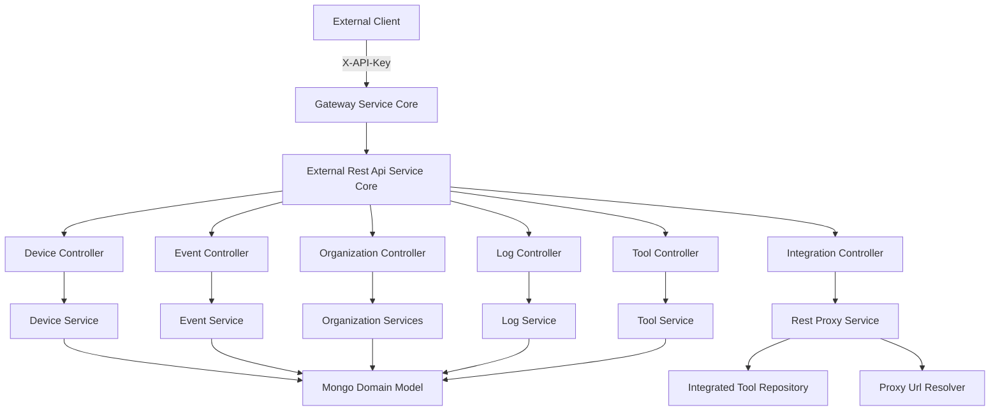
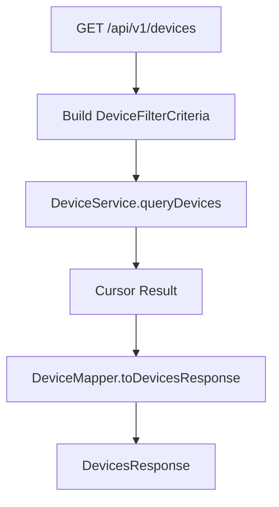
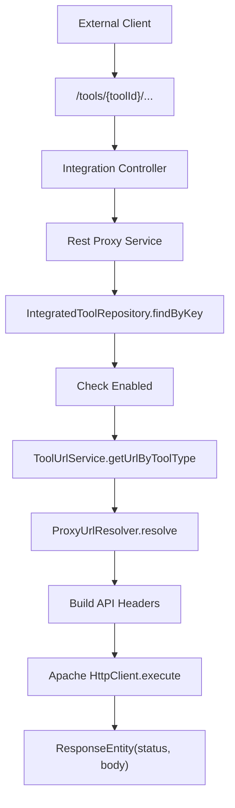
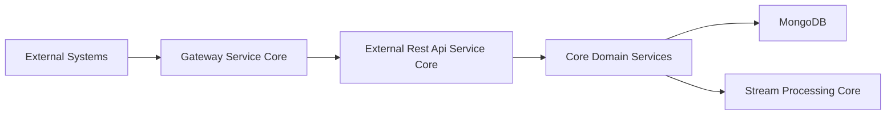

# External Rest Api Service Core

## Overview

The **External Rest Api Service Core** module exposes a stable, API-key–secured REST interface for external integrations with the OpenFrame platform. It provides:

- Programmatic access to devices, events, logs, organizations, and tools
- Cursor-based pagination and flexible filtering
- Tool-to-tool proxying via dynamic upstream resolution
- OpenAPI documentation with API key security definitions

This module is designed for third-party systems, automation scripts, and partner integrations that require direct REST access to OpenFrame capabilities without using the internal GraphQL or UI APIs.

---

## High-Level Responsibilities

- Expose versioned REST endpoints under `/api/v1/**`
- Enforce API key–based authentication (via upstream security configuration)
- Provide consistent filtering, sorting, and cursor pagination
- Map domain models to external DTOs
- Proxy requests to integrated external tools
- Publish OpenAPI (Swagger) documentation

---

## Architecture Overview



### Key Characteristics

- **Stateless REST controllers** using Spring MVC
- **Cursor-based pagination** via shared DTO utilities
- **Consistent filtering model** using `*FilterCriteria` objects
- **DTO mapping layer** to isolate domain documents from external contracts
- **Dynamic upstream proxying** for integrated tools

---

## API Documentation Configuration

### OpenApiConfig

**Component:**  
`openframe-oss-lib.openframe-external-api-service-core.src.main.java.com.openframe.external.config.OpenApiConfig.OpenApiConfig`

Responsibilities:

- Configures OpenAPI metadata (title, version, contact, license)
- Declares `ApiKeyAuth` security scheme
- Documents required `X-API-Key` header
- Groups endpoints under `external-api`
- Excludes internal and actuator endpoints

#### Security Scheme

```text
Header: X-API-Key
Format: ak_keyId.sk_secretKey
```

All endpoints require the API key header. Rate limiting headers are included in responses as defined in the OpenAPI description.

---

## REST Controllers

All REST endpoints are versioned under `/api/v1/**` (except tool proxy endpoints under `/tools/**`).

### 1. Device Controller

**Component:**  
`openframe-oss-lib.openframe-external-api-service-core.src.main.java.com.openframe.external.controller.DeviceController.DeviceController`

**Base Path:** `/api/v1/devices`

#### Responsibilities

- Retrieve paginated device lists
- Filter by:
  - Status
  - Device type
  - OS type
  - Organization
  - Tags
  - Search term
- Cursor-based pagination
- Sorting via `SortInput`
- Optional tag enrichment (`includeTags=true`)
- Update device status (ARCHIVED / DELETED)

#### Pagination Model

Uses shared:

- `CursorPaginationCriteria.fromRest(cursor, limit)`
- `SortInput.from(sortField, sortDirection)`

#### Flow Example



---

### 2. Event Controller

**Component:**  
`openframe-oss-lib.openframe-external-api-service-core.src.main.java.com.openframe.external.controller.EventController.EventController`

**Base Path:** `/api/v1/events`

#### Responsibilities

- Query events with:
  - User IDs
  - Event types
  - Date range
  - Search
- Cursor-based pagination
- Create event
- Update event
- Retrieve filter metadata

Supports full CRUD operations for event records.

---

### 3. Log Controller

**Component:**  
`openframe-oss-lib.openframe-external-api-service-core.src.main.java.com.openframe.external.controller.LogController.LogController`

**Base Path:** `/api/v1/logs`

#### Responsibilities

- Query audit/system logs
- Filter by:
  - Date range
  - Tool type
  - Event type
  - Severity
  - Organization
  - Device ID
- Cursor pagination
- Retrieve filter metadata
- Retrieve detailed log entry using composite identifiers

#### Log Detail Lookup

Requires:

- `ingestDay`
- `toolType`
- `eventType`
- `timestamp`
- `toolEventId`

This reflects the compound key structure of log storage.

---

### 4. Organization Controller

**Component:**  
`openframe-oss-lib.openframe-external-api-service-core.src.main.java.com.openframe.external.controller.OrganizationController.OrganizationController`

**Base Path:** `/api/v1/organizations`

#### Responsibilities

- List organizations with filters:
  - Category
  - Employee range
  - Contract status
  - Organization status
- Search
- Cursor pagination
- Get by ID
- Get by business identifier (`organizationId`)
- Create organization
- Update organization
- Check archival eligibility
- Update organization status

#### Command vs Query Separation

- `OrganizationQueryService` → filtering & pagination
- `OrganizationCommandService` → mutations
- `OrganizationService` → direct lookups and validation logic

---

### 5. Tool Controller

**Component:**  
`openframe-oss-lib.openframe-external-api-service-core.src.main.java.com.openframe.external.controller.ToolController.ToolController`

**Base Path:** `/api/v1/tools`

#### Responsibilities

- Retrieve integrated tools
- Filter by:
  - Enabled state
  - Type
  - Category
- Search
- Sorting
- Retrieve filter metadata

This exposes configured external integrations in a safe, filtered manner.

---

### 6. Integration Controller

**Component:**  
`openframe-oss-lib.openframe-external-api-service-core.src.main.java.com.openframe.external.controller.IntegrationController.IntegrationController`

**Base Path:** `/tools/{toolId}/**`

This controller enables **dynamic proxying** of API requests to integrated third-party tools.

All HTTP methods are supported:

- GET
- POST
- PUT
- PATCH
- DELETE
- OPTIONS

It delegates all logic to the **Rest Proxy Service**.

---

## Rest Proxy Service

**Component:**  
`openframe-oss-lib.openframe-external-api-service-core.src.main.java.com.openframe.external.service.RestProxyService.RestProxyService`

The **Rest Proxy Service** is responsible for safely forwarding incoming requests to configured integrated tools.

### Core Responsibilities

1. Resolve tool by `toolId`
2. Validate tool exists and is enabled
3. Retrieve API URL (`ToolUrlType.API`)
4. Resolve target URI using `ProxyUrlResolver`
5. Build outbound headers (including API key / bearer token if configured)
6. Execute HTTP request via Apache HttpClient
7. Return downstream status + body

---

## Proxy Execution Flow



### Authentication Handling

Depending on tool configuration:

- `HEADER` → Custom header injection
- `BEARER_TOKEN` → `Authorization: Bearer <token>`
- `NONE` → No credential injection

### Timeout Configuration

- Connection request timeout: 10 seconds
- Response timeout: 60 seconds

---

## Cross-Cutting Concerns

### 1. API Key Authentication

All endpoints require:

```text
X-API-Key: ak_keyId.sk_secretKey
```

Security validation is enforced by upstream configuration (typically in gateway/security modules).

Controllers optionally receive:

- `X-User-Id`
- `X-API-Key-Id`

These are injected after authentication for logging and auditing.

---

### 2. Cursor-Based Pagination

All list endpoints use:

- Cursor token
- Limit (1–100)
- Sort field + direction

This ensures:

- Stable ordering
- Scalable queries
- No offset-based pagination performance degradation

---

### 3. DTO Mapping Layer

Each controller uses a dedicated mapper:

- `DeviceMapper`
- `EventMapper`
- `LogMapper`
- `OrganizationMapper`
- `ToolMapper`

This prevents direct exposure of internal Mongo domain documents.

---

## Error Handling Model

Standard HTTP codes:

- `200` – Success
- `201` – Created
- `204` – No Content
- `400` – Validation error
- `401` – Invalid or missing API key
- `404` – Resource not found
- `409` – Conflict (e.g., archive constraint)
- `429` – Rate limit exceeded
- `500` – Internal error

Custom exceptions:

- `DeviceNotFoundException`
- `EventNotFoundException`
- `OrganizationNotFoundException`
- `LogNotFoundException`

---

## How This Module Fits in the Platform

The **External Rest Api Service Core** acts as the public REST boundary of OpenFrame.

It:

- Depends on domain services and repositories
- Is typically deployed behind the Gateway Service Core
- Relies on shared DTOs and pagination utilities
- Integrates with the Mongo domain model
- Bridges external systems with internal services

### Position in Overall Architecture



---

## Summary

The **External Rest Api Service Core** module provides:

- A secure, API-key–based REST surface
- Rich filtering and pagination capabilities
- Full CRUD for key business entities
- Integrated tool proxying
- OpenAPI-based documentation

It is the primary entry point for third-party automation, integrations, and external service connectivity within the OpenFrame ecosystem.