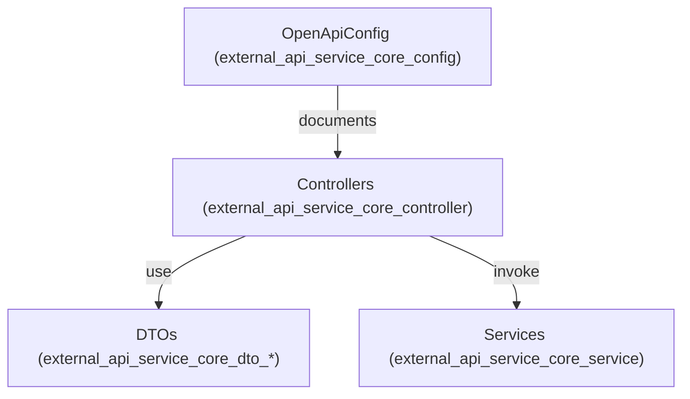
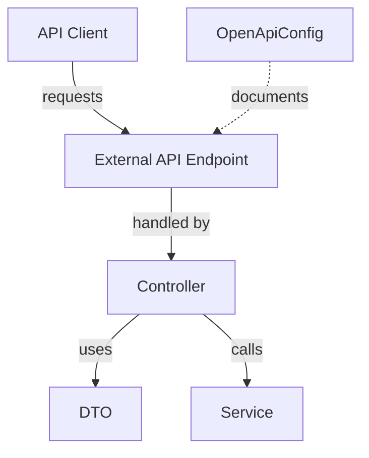
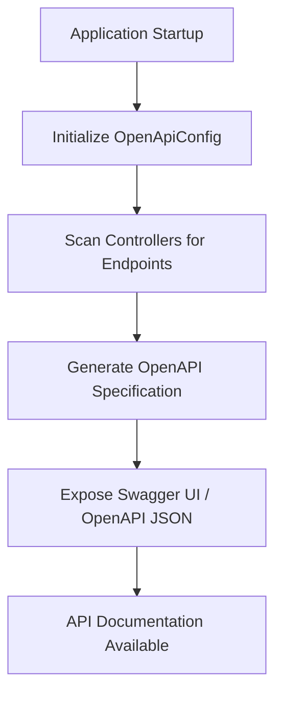

# external_api_service_core_config Module Documentation

## Introduction

The `external_api_service_core_config` module provides the foundational configuration for the External API Service. It is responsible for setting up the OpenAPI (Swagger) documentation and related configuration for the external API endpoints. This module ensures that the API is discoverable, well-documented, and adheres to the required standards for external integrations.

This module is typically used in conjunction with the controllers, DTOs, and services defined in the `external_api_service_core_controller`, `external_api_service_core_dto_*`, and `external_api_service_core_service` modules. For a complete understanding of the API's capabilities and data structures, refer to those modules as well.

## Core Component

### OpenApiConfig

The `OpenApiConfig` component is the central configuration class for OpenAPI/Swagger documentation in the External API Service. It defines how the API documentation is generated, what metadata is included, and how the documentation is exposed to consumers.

#### Responsibilities
- Configures the OpenAPI specification for the external API endpoints.
- Sets up metadata such as API title, description, version, and contact information.
- May define security schemes (e.g., API keys, OAuth2) for the documentation UI.
- Ensures that all controllers and endpoints in the `external_api_service_core_controller` module are included in the documentation.

#### Typical Configuration Tasks
- Setting up the base path for the API documentation.
- Customizing the appearance and grouping of endpoints.
- Enabling or disabling certain endpoints from being documented.
- Integrating with authentication mechanisms if required.

## Architecture and Relationships

The `external_api_service_core_config` module is a thin configuration layer that interacts with the following modules:

- **[external_api_service_core_controller](external_api_service_core_controller.md):** Provides the REST controllers whose endpoints are documented by the OpenAPI configuration.
- **[external_api_service_core_dto_audit](external_api_service_core_dto_audit.md), [external_api_service_core_dto_device](external_api_service_core_dto_device.md), [external_api_service_core_dto_event](external_api_service_core_dto_event.md), [external_api_service_core_dto_organization](external_api_service_core_dto_organization.md), [external_api_service_core_dto_shared](external_api_service_core_dto_shared.md), [external_api_service_core_dto_tool](external_api_service_core_dto_tool.md):** Define the data transfer objects (DTOs) that are referenced in the API documentation.
- **[external_api_service_core_service](external_api_service_core_service.md):** Provides backend services that are invoked by the controllers.

### High-Level Architecture

### Data Flow

## Process Flow: API Documentation Generation

## Integration in the System

The `external_api_service_core_config` module is typically loaded at application startup. It ensures that all API endpoints are discoverable and documented, which is essential for external consumers, integrators, and developers. It does not contain business logic or data processing code; instead, it acts as a bridge between the API implementation and its documentation.

## References
- [external_api_service_core_controller](external_api_service_core_controller.md): REST controllers documented by this configuration.
- [external_api_service_core_dto_audit](external_api_service_core_dto_audit.md), [external_api_service_core_dto_device](external_api_service_core_dto_device.md), [external_api_service_core_dto_event](external_api_service_core_dto_event.md), [external_api_service_core_dto_organization](external_api_service_core_dto_organization.md), [external_api_service_core_dto_shared](external_api_service_core_dto_shared.md), [external_api_service_core_dto_tool](external_api_service_core_dto_tool.md): DTOs referenced in the API documentation.
- [external_api_service_core_service](external_api_service_core_service.md): Backend services invoked by the controllers.

## See Also
- [api_service_core_config](api_service_core_config.md): For core API configuration patterns and security setup.
- [gateway_service_core_config](gateway_service_core_config.md): For gateway-level API configuration and routing.
