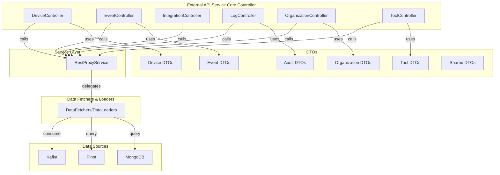
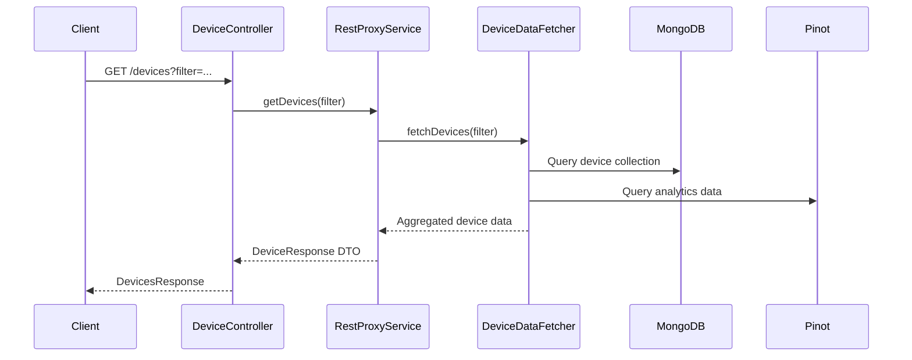

# external_api_service_core_controller

## Introduction

The `external_api_service_core_controller` module provides the primary REST API controllers for external integrations and client applications. It exposes endpoints for managing and querying devices, events, integrations, logs, organizations, and tools. This module acts as the main entry point for external consumers to interact with the system's core resources, aggregating and orchestrating data from various internal services and data sources.

## Core Functionality

This module is responsible for:
- Exposing RESTful endpoints for external clients
- Handling requests related to devices, events, integrations, logs, organizations, and tools
- Validating and transforming input/output data using DTOs
- Delegating business logic to service layers (e.g., `RestProxyService`)
- Aggregating data from multiple sources for comprehensive responses

## Core Components

- **DeviceController**: Manages device-related endpoints (listing, filtering, details)
- **EventController**: Handles event queries and filtering
- **IntegrationController**: Exposes integration-related APIs
- **LogController**: Provides access to audit and activity logs
- **OrganizationController**: Manages organization data and queries
- **ToolController**: Handles tool listing, filtering, and details

Each controller typically:
- Accepts HTTP requests (GET, POST, etc.)
- Validates and parses input using DTOs (see [external_api_service_core_dto_*](external_api_service_core_dto_audit.md), etc.)
- Invokes service layer methods (see [external_api_service_core_service.md](external_api_service_core_service.md))
- Returns structured responses using output DTOs

## Architecture Overview

## Component Interactions

### Request Flow Example

### Dependency Relationships

- **DTOs**: Used for request/response payloads ([external_api_service_core_dto_audit.md](external_api_service_core_dto_audit.md), [external_api_service_core_dto_device.md](external_api_service_core_dto_device.md), etc.)
- **Service Layer**: Business logic and orchestration ([external_api_service_core_service.md](external_api_service_core_service.md))
- **Data Fetchers/Loaders**: Efficient data retrieval ([api_service_core_datafetcher.md](api_service_core_datafetcher.md), [api_service_core_dataloader.md](api_service_core_dataloader.md))
- **Data Sources**: Underlying storage and analytics (MongoDB, Pinot, Kafka)

## Data Flow

- **Input**: HTTP requests with query parameters or JSON bodies, mapped to input DTOs
- **Processing**: Controllers validate and parse input, delegate to services, which may aggregate data from multiple sources
- **Output**: Structured response DTOs returned to clients

## Integration with Other Modules

- **DTO Modules**: Defines input/output schemas ([external_api_service_core_dto_audit.md](external_api_service_core_dto_audit.md), [external_api_service_core_dto_device.md](external_api_service_core_dto_device.md), [external_api_service_core_dto_event.md](external_api_service_core_dto_event.md), [external_api_service_core_dto_organization.md](external_api_service_core_dto_organization.md), [external_api_service_core_dto_tool.md](external_api_service_core_dto_tool.md), [external_api_service_core_dto_shared.md](external_api_service_core_dto_shared.md))
- **Service Layer**: Implements business logic ([external_api_service_core_service.md](external_api_service_core_service.md))
- **Data Fetchers/Loaders**: Efficient data access ([api_service_core_datafetcher.md](api_service_core_datafetcher.md), [api_service_core_dataloader.md](api_service_core_dataloader.md))
- **Config**: OpenAPI and other configuration ([external_api_service_core_config.md](external_api_service_core_config.md))

## References

- [external_api_service_core_dto_audit.md](external_api_service_core_dto_audit.md)
- [external_api_service_core_dto_device.md](external_api_service_core_dto_device.md)
- [external_api_service_core_dto_event.md](external_api_service_core_dto_event.md)
- [external_api_service_core_dto_organization.md](external_api_service_core_dto_organization.md)
- [external_api_service_core_dto_tool.md](external_api_service_core_dto_tool.md)
- [external_api_service_core_dto_shared.md](external_api_service_core_dto_shared.md)
- [external_api_service_core_service.md](external_api_service_core_service.md)
- [api_service_core_datafetcher.md](api_service_core_datafetcher.md)
- [api_service_core_dataloader.md](api_service_core_dataloader.md)
- [external_api_service_core_config.md](external_api_service_core_config.md)

---

This documentation provides a high-level overview. For detailed API contracts and data models, refer to the linked DTO and service documentation files.
