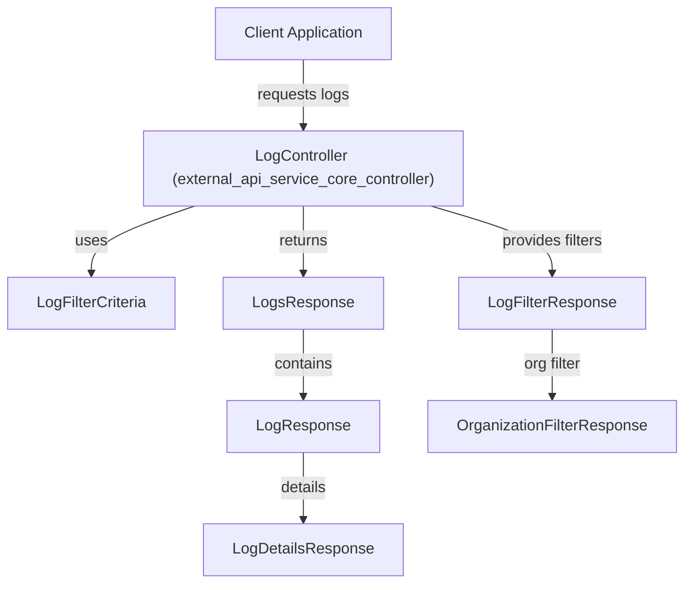
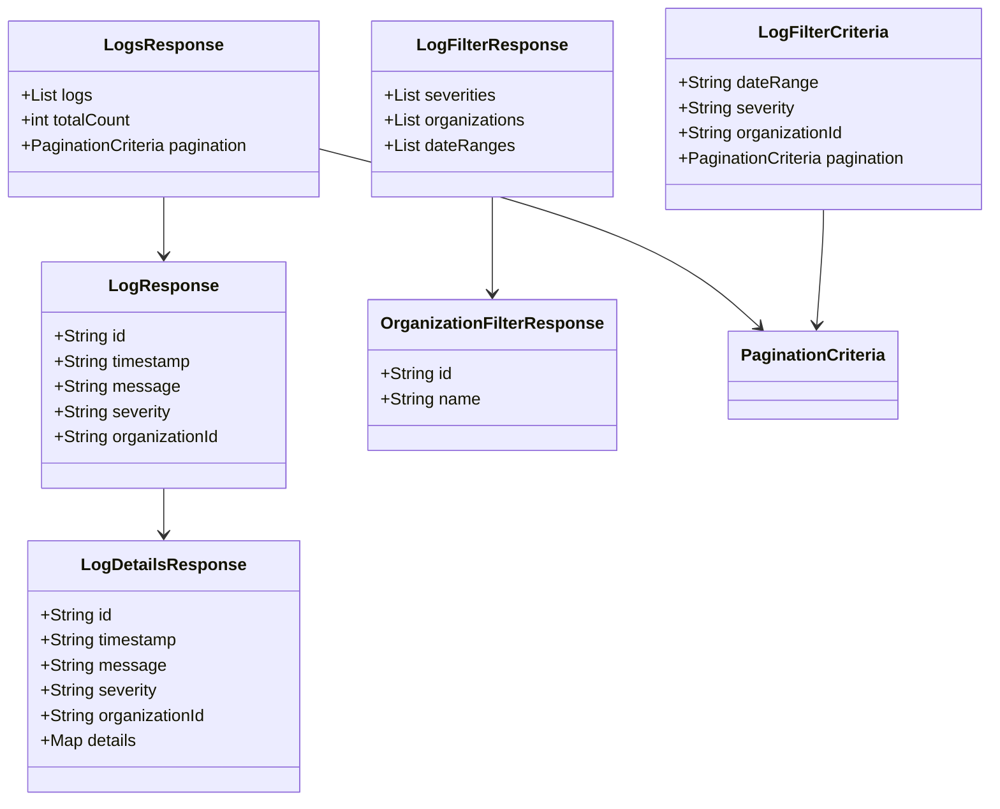

# external_api_service_core_dto_audit Module Documentation

## Introduction

The `external_api_service_core_dto_audit` module defines the core Data Transfer Objects (DTOs) used for representing, filtering, and responding to audit log data in the external API service. These DTOs are essential for structuring the data exchanged between the API controllers (such as the LogController) and clients, enabling robust querying, filtering, and presentation of audit log information. This module is a key part of the audit log feature, supporting log retrieval, filtering, and pagination in a consistent and extensible manner.

## Core Functionality

- **Defines DTOs for audit log responses and filtering**: Structures the data for log details, filter criteria, and paginated log responses.
- **Supports advanced filtering**: Enables clients to specify complex filter criteria for querying logs, including organization-based filtering.
- **Integrates with pagination and shared response patterns**: Leverages shared pagination criteria for scalable log retrieval.

## Key Components

The following are the primary DTOs provided by this module:

- **LogDetailsResponse**: Represents the detailed information of a single audit log entry.
- **LogFilterCriteria**: Encapsulates the filter options available for querying logs (e.g., by date, severity, organization).
- **LogFilterResponse**: Structures the available filter options and their possible values for the client UI.
- **LogResponse**: Represents a single log entry in a list or paginated response.
- **LogsResponse**: Encapsulates a paginated list of log entries, along with metadata such as total count and pagination info.
- **OrganizationFilterResponse**: Represents organization-specific filter options for audit logs.

## Architecture and Component Relationships

The DTOs in this module are designed to be used by the [external_api_service_core_controller.md](external_api_service_core_controller.md) (notably the `LogController`) and are typically returned by the API endpoints responsible for audit log retrieval and filtering. They are also consumed by frontend clients for rendering log tables, filter dropdowns, and detail views.

### High-Level Data Flow

### Component Interaction

- **LogController** (from [external_api_service_core_controller.md](external_api_service_core_controller.md)) receives filter criteria from the client, typically as a `LogFilterCriteria` object.
- The controller queries the underlying log data source, applies the filters, and returns a `LogsResponse` containing a list of `LogResponse` objects.
- For detailed log views, a `LogDetailsResponse` is provided.
- Filter options for the UI are structured using `LogFilterResponse` and `OrganizationFilterResponse`.

### Dependencies

- **Pagination**: Uses `PaginationCriteria` from [external_api_service_core_dto_shared.md](external_api_service_core_dto_shared.md) for paginated log retrieval.
- **Organization Filtering**: Integrates with organization DTOs from [external_api_service_core_dto_organization.md](external_api_service_core_dto_organization.md) and [api_lib_dto_audit.md](api_lib_dto_audit.md) for organization-based log filtering.
- **Controller Layer**: Closely coupled with the `LogController` in [external_api_service_core_controller.md](external_api_service_core_controller.md).

## Data Model Overview

## Example Usage

- **Fetching logs**: The client sends a request with a `LogFilterCriteria` payload. The API responds with a `LogsResponse` containing paginated log entries.
- **Fetching filter options**: The client requests available filter options, receiving a `LogFilterResponse` for populating UI dropdowns.
- **Fetching log details**: The client requests a specific log entry by ID, receiving a `LogDetailsResponse`.

## Related Modules

- [external_api_service_core_controller.md](external_api_service_core_controller.md): Contains the `LogController` and other API controllers.
- [external_api_service_core_dto_shared.md](external_api_service_core_dto_shared.md): Defines `PaginationCriteria` used for paginated responses.
- [external_api_service_core_dto_organization.md](external_api_service_core_dto_organization.md): Organization DTOs for filtering and response.
- [api_lib_dto_audit.md](api_lib_dto_audit.md): Shared audit DTOs and filter options used across API layers.

## Summary

The `external_api_service_core_dto_audit` module is central to the audit log feature of the external API service, providing the DTOs necessary for robust, filterable, and paginated log retrieval. It is designed for seamless integration with the controller layer and supports extensible filtering and organization-based log queries. For implementation details of the log filtering logic and data sources, refer to the [external_api_service_core_controller.md](external_api_service_core_controller.md) and [api_lib_dto_audit.md](api_lib_dto_audit.md) documentation.