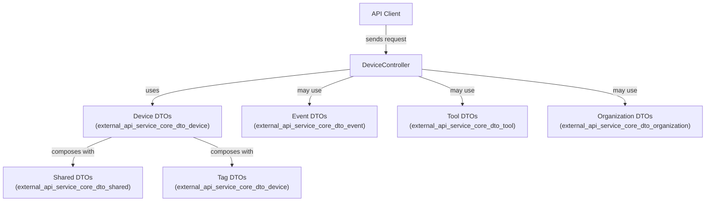
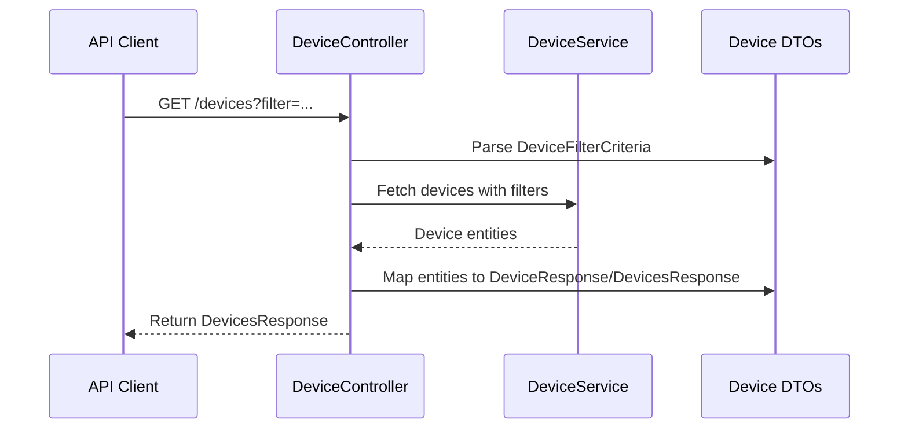

# external_api_service_core_dto_device Module Documentation

## Introduction

The `external_api_service_core_dto_device` module defines the core Data Transfer Objects (DTOs) used for representing device-related data in the external API service layer. These DTOs are essential for structuring device information, filtering criteria, and response formats exchanged between the API and its consumers. The module enables consistent, type-safe communication for device operations such as listing, filtering, and retrieving device details.

This module is a key part of the external API's device management functionality and interacts closely with other DTO modules (such as audit, event, tool, and organization DTOs) and the device controller in the API service layer.

## Core Components

The following DTOs are defined in this module:

- **DeviceFilterCriteria**: Criteria for filtering devices in API queries.
- **DeviceFilterItem**: Represents a single filterable device attribute or option.
- **DeviceFilterResponse**: Encapsulates the available device filters and their options for the API consumer.
- **DeviceResponse**: Represents a single device's data as returned by the API.
- **DevicesResponse**: Represents a paginated or bulk response containing multiple devices.
- **TagFilterItem**: Represents a tag filter option for devices.
- **TagResponse**: Represents tag data associated with devices.

## Module Architecture and Relationships

The `external_api_service_core_dto_device` module is part of a broader DTO layer that standardizes data exchange across the external API. It is designed to work in conjunction with:

- **Controller Layer**: Especially the [external_api_service_core_controller](external_api_service_core_controller.md) (notably `DeviceController`), which uses these DTOs to handle API requests and responses.
- **Other DTO Modules**: Such as [external_api_service_core_dto_event](external_api_service_core_dto_event.md), [external_api_service_core_dto_tool](external_api_service_core_dto_tool.md), and [external_api_service_core_dto_organization](external_api_service_core_dto_organization.md) for cross-entity filtering and response composition.
- **Shared DTOs**: Like [external_api_service_core_dto_shared](external_api_service_core_dto_shared.md) for pagination and common criteria.

### High-Level Architecture



### Component Interaction

- **DeviceController**: Receives API requests, utilizes filter and response DTOs to process and return device data.
- **DeviceFilterCriteria**: Used in request payloads to specify filtering options.
- **DeviceFilterResponse**: Returned to clients to describe available filter options.
- **DeviceResponse / DevicesResponse**: Used in API responses to deliver device data.
- **TagFilterItem / TagResponse**: Used for tag-based filtering and representation.

## Data Flow Example

Below is a typical data flow for a device list API request:



## Dependencies and Integration

- **DeviceController** ([external_api_service_core_controller.md](external_api_service_core_controller.md)): Main consumer of these DTOs for device-related endpoints.
- **Device Service Layer**: Not directly part of this module, but typically consumes and produces these DTOs.
- **Other DTO Modules**: For cross-entity filtering and response composition, see:
    - [external_api_service_core_dto_event.md](external_api_service_core_dto_event.md)
    - [external_api_service_core_dto_tool.md](external_api_service_core_dto_tool.md)
    - [external_api_service_core_dto_organization.md](external_api_service_core_dto_organization.md)
    - [external_api_service_core_dto_shared.md](external_api_service_core_dto_shared.md)

## Example Usage

### Filtering Devices

A client can request a list of devices with specific filters:

```json
{
  "filter": {
    "status": "active",
    "tags": ["production", "linux"],
    "organizationId": "org_123"
  },
  "pagination": {
    "page": 1,
    "size": 20
  }
}
```

The API will respond with a `DevicesResponse` containing a list of `DeviceResponse` objects and pagination metadata.

## Related Documentation

- [external_api_service_core_controller.md](external_api_service_core_controller.md)
- [external_api_service_core_dto_event.md](external_api_service_core_dto_event.md)
- [external_api_service_core_dto_tool.md](external_api_service_core_dto_tool.md)
- [external_api_service_core_dto_organization.md](external_api_service_core_dto_organization.md)
- [external_api_service_core_dto_shared.md](external_api_service_core_dto_shared.md)

## Summary

The `external_api_service_core_dto_device` module is central to the device management API, providing the necessary DTOs for filtering, representing, and responding with device data. It is designed for extensibility and interoperability with other API modules, ensuring a robust and consistent developer experience.
