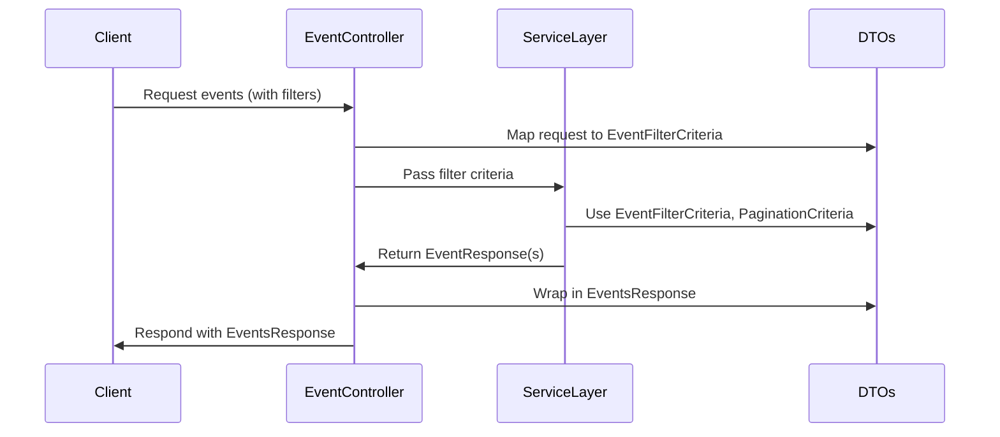

# external_api_service_core_dto_event Module Documentation

## Introduction

The `external_api_service_core_dto_event` module provides Data Transfer Objects (DTOs) for representing, filtering, and responding to event-related data in the external API service layer. These DTOs are essential for structuring event data exchanged between the API controllers, service layers, and clients, ensuring type safety, validation, and clear contract definitions for event operations.

This module is a key part of the event management subsystem, supporting event querying, filtering, and response formatting. It is typically used in conjunction with the [external_api_service_core_controller](external_api_service_core_controller.md) (notably the `EventController`), and interacts with other DTO modules for pagination, filtering, and shared response structures.

## Core Components

- **EventFilterCriteria**: Defines the criteria for filtering events, such as by type, date range, or status.
- **EventFilterResponse**: Represents the response structure for event filter options, often used to populate filter dropdowns or UI elements.
- **EventResponse**: Encapsulates the details of a single event, including metadata and relevant fields for API consumers.
- **EventsResponse**: Provides a paginated or aggregated response containing multiple `EventResponse` objects, along with metadata such as total count or pagination info.

## Module Architecture and Relationships

The `external_api_service_core_dto_event` module is designed to be used by the API layer and service layer for event-related operations. It interacts with several other modules for filtering, pagination, and shared response structures.

### High-Level Architecture

```mermaid
flowchart TD
    EventController["EventController\n(external_api_service_core_controller)"] -->|uses| EventFilterCriteria["EventFilterCriteria\n(external_api_service_core_dto_event)"]
    EventController -->|uses| EventResponse["EventResponse\n(external_api_service_core_dto_event)"]
    EventController -->|uses| EventsResponse["EventsResponse\n(external_api_service_core_dto_event)"]
    EventController -->|uses| EventFilterResponse["EventFilterResponse\n(external_api_service_core_dto_event)"]
    EventController -->|uses| PaginationCriteria["PaginationCriteria\n(external_api_service_core_dto_shared)"]
    EventController -->|uses| EventFilters["EventFilters\n(api_lib_dto_event)"]
    EventController -->|uses| EventFilterOptions["EventFilterOptions\n(api_lib_dto_event)"]
    EventController -->|uses| EventFilterInput["EventFilterInput\n(api_service_core_dto_event)"]
    EventController -->|uses| CreateEventInput["CreateEventInput\n(api_service_core_dto_event)"]
```



### Component Interaction Flow



## Data Flow and Usage

1. **Filtering Events**: Clients specify filter criteria (e.g., event type, date range) using the structure defined in `EventFilterCriteria`. The controller maps incoming requests to this DTO.
2. **Fetching Events**: The service layer uses the filter criteria and pagination info to query the underlying data sources, returning a list of events.
3. **Responding to Clients**: The results are mapped to `EventResponse` objects, which are then aggregated into an `EventsResponse` for the client. Filter options for UI are provided via `EventFilterResponse`.

## Dependencies and Related Modules

- **[external_api_service_core_controller](external_api_service_core_controller.md)**: Uses these DTOs in the `EventController` for handling event-related API endpoints.
- **[api_lib_dto_event](api_lib_dto_event.md)**: Provides lower-level filter option and filter structures used by this module.
- **[api_service_core_dto_event](api_service_core_dto_event.md)**: Supplies input DTOs for event creation and filtering.
- **[external_api_service_core_dto_shared](external_api_service_core_dto_shared.md)**: Supplies `PaginationCriteria` for paginated responses.

## Example Usage

```json
{
  "criteria": {
    "eventType": "LOGIN",
    "dateRange": {
      "from": "2024-01-01T00:00:00Z",
      "to": "2024-01-31T23:59:59Z"
    }
  },
  "pagination": {
    "page": 1,
    "size": 20
  }
}
```

## See Also

- [external_api_service_core_controller](external_api_service_core_controller.md)
- [api_lib_dto_event](api_lib_dto_event.md)
- [api_service_core_dto_event](api_service_core_dto_event.md)
- [external_api_service_core_dto_shared](external_api_service_core_dto_shared.md)

---
This documentation provides an overview of the `external_api_service_core_dto_event` module, its core components, and its role in the broader system. For details on related DTOs and controllers, refer to the linked documentation files.
