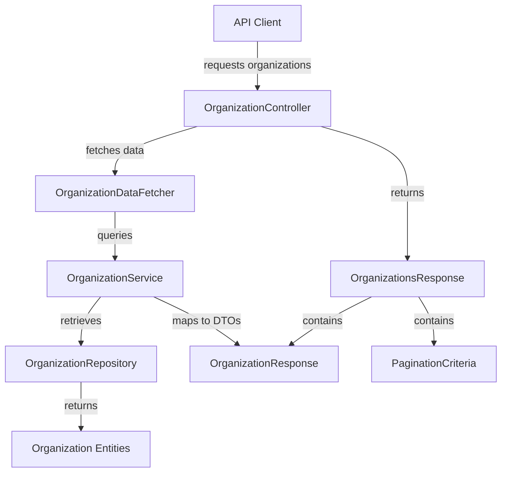
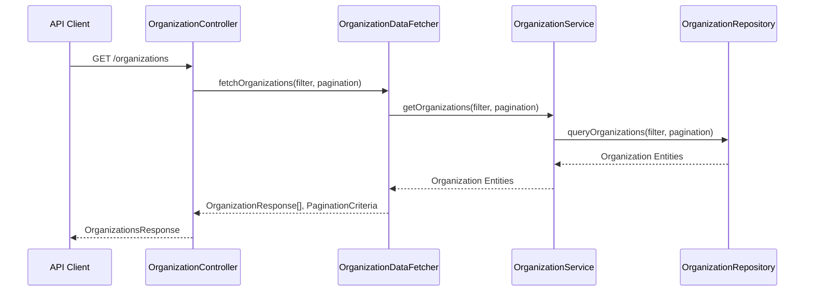

# external_api_service_core_dto_organization Module Documentation

## Introduction

The `external_api_service_core_dto_organization` module provides the primary Data Transfer Object (DTO) for organization-related API responses in the external API service layer. It is designed to standardize and encapsulate the structure of organization data returned by the API, supporting consistent and efficient data exchange between the backend and external clients.

This module is a key part of the API's response model, ensuring that organization data is delivered in a predictable, paginated, and extensible format. It is typically used in conjunction with organization controllers, data fetchers, and service layers that handle organization queries and listings.

## Core Component

### OrganizationsResponse

The main DTO in this module is `OrganizationsResponse`, which represents a paginated list of organizations returned by the API. It is structured to support efficient client-side pagination and filtering.

#### Typical Structure

```text
OrganizationsResponse {
    organizations: OrganizationResponse[],
    pagination: PaginationCriteria
}
```
- `organizations`: An array of organization DTOs, each representing an individual organization (see [`OrganizationResponse`](api_lib_dto_organization.md)).
- `pagination`: Pagination metadata for the response (see [`PaginationCriteria`](external_api_service_core_dto_shared.md)).

## Architecture and Data Flow

The `OrganizationsResponse` DTO is used as the standard response type for organization listing endpoints in the external API. It is constructed by the organization controller after querying the organization data source, applying filters, and paginating the results.

### Component Relationships



- **OrganizationController**: Handles incoming API requests for organizations and returns an `OrganizationsResponse`.
- **OrganizationDataFetcher/Service/Repository**: Responsible for retrieving, filtering, and paginating organization data from the data source.
- **OrganizationResponse**: DTO for a single organization (see [`api_lib_dto_organization.md`](api_lib_dto_organization.md)).
- **PaginationCriteria**: DTO for pagination metadata (see [`external_api_service_core_dto_shared.md`](external_api_service_core_dto_shared.md)).

## Usage in the Overall System

The `external_api_service_core_dto_organization` module is tightly integrated with the following modules:

- **Controller Layer**: Used by `OrganizationController` in [`external_api_service_core_controller.md`](external_api_service_core_controller.md) to return organization lists.
- **Data Fetcher Layer**: Utilized by `OrganizationDataFetcher` in [`api_service_core_datafetcher.md`](api_service_core_datafetcher.md) to structure outgoing data.
- **DTO Composition**: Composes with `OrganizationResponse` from [`api_lib_dto_organization.md`](api_lib_dto_organization.md) and `PaginationCriteria` from [`external_api_service_core_dto_shared.md`](external_api_service_core_dto_shared.md).

## Process Flow Example

Below is a high-level process flow for a typical organization listing API call:



## Related Modules

- [api_lib_dto_organization.md](api_lib_dto_organization.md): Defines `OrganizationResponse` and organization filter DTOs.
- [external_api_service_core_dto_shared.md](external_api_service_core_dto_shared.md): Defines `PaginationCriteria` for paginated responses.
- [external_api_service_core_controller.md](external_api_service_core_controller.md): Contains the `OrganizationController` that uses this DTO.
- [api_service_core_datafetcher.md](api_service_core_datafetcher.md): Contains the `OrganizationDataFetcher` that prepares data for this DTO.

## Summary

The `external_api_service_core_dto_organization` module is essential for delivering paginated organization data in the external API. By standardizing the response format, it enables consistent, efficient, and extensible organization data delivery across the system.
