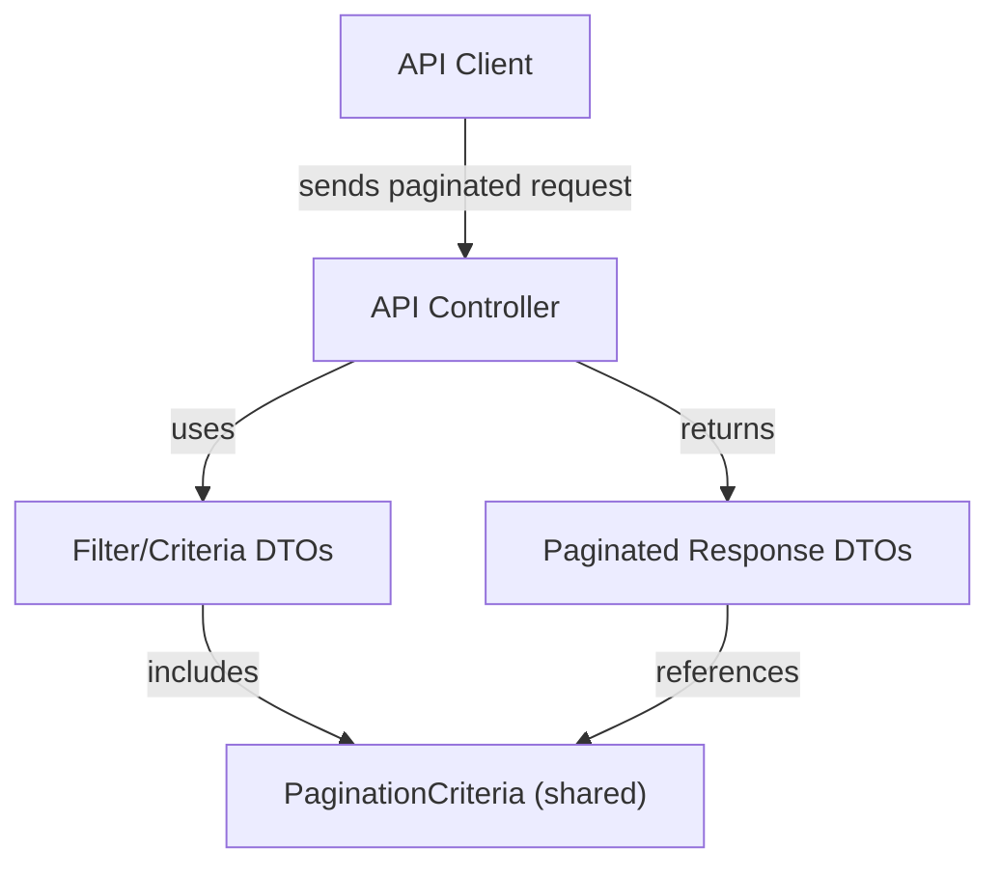
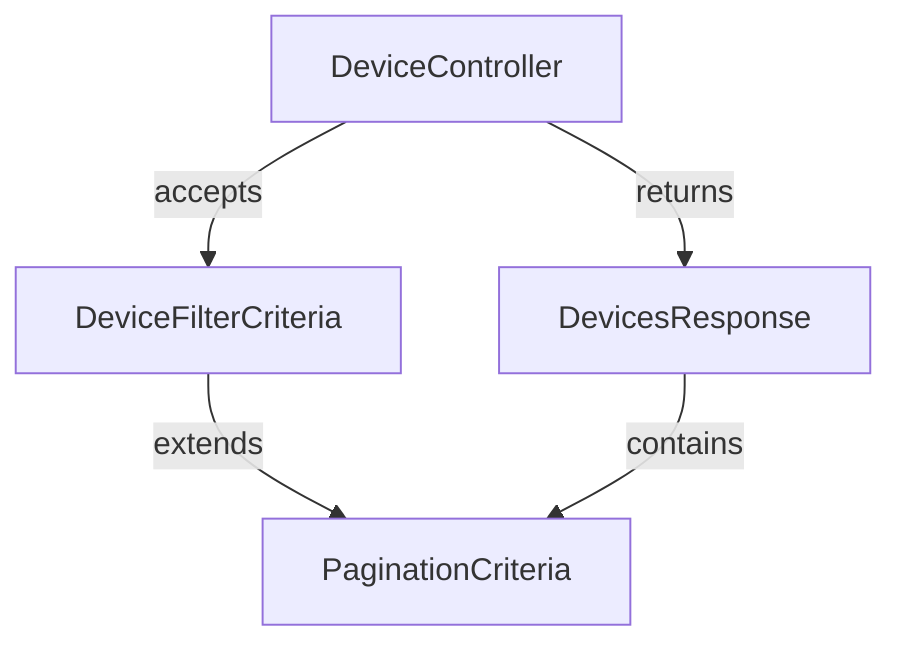

# external_api_service_core_dto_shared Module Documentation

## Introduction

The `external_api_service_core_dto_shared` module provides shared Data Transfer Object (DTO) definitions for the External API Service. Its primary purpose is to standardize and centralize common request and response structures—specifically, pagination criteria—across multiple API endpoints. This ensures consistency, reusability, and maintainability throughout the API layer.

## Core Component

### PaginationCriteria

The main component of this module is `PaginationCriteria`, which encapsulates the parameters required for paginated API requests. This DTO is used by various controllers and response types to enable efficient data retrieval and navigation in large datasets.

#### Typical Fields (Example)
> **Note:** The actual fields may vary, but a typical pagination criteria DTO includes:

- `page`: The current page number (integer)
- `size`: The number of items per page (integer)
- `sort`: Sorting options (string or list)
- `cursor`: Cursor for cursor-based pagination (string, optional)

## Architecture and Relationships

The `PaginationCriteria` DTO is a foundational building block for paginated queries in the external API. It is referenced by filter and response DTOs in other modules, such as:

- [external_api_service_core_dto_audit.md](external_api_service_core_dto_audit.md)
- [external_api_service_core_dto_device.md](external_api_service_core_dto_device.md)
- [external_api_service_core_dto_event.md](external_api_service_core_dto_event.md)
- [external_api_service_core_dto_organization.md](external_api_service_core_dto_organization.md)
- [external_api_service_core_dto_tool.md](external_api_service_core_dto_tool.md)

This shared structure allows all these modules to implement consistent pagination logic in their respective controllers and data fetchers.

### High-Level Architecture Diagram

### Component Interaction Example

## Data Flow

1. **Client Request:**
    - The client sends a request to an API endpoint, including pagination parameters (e.g., `page`, `size`, `cursor`).
2. **Controller Handling:**
    - The controller receives the request and maps the pagination parameters to a `PaginationCriteria` instance (often via a filter DTO).
3. **Service/Data Fetcher:**
    - The service or data fetcher uses the criteria to query the data source efficiently.
4. **Response Construction:**
    - The response DTO includes pagination metadata (e.g., total count, next cursor) for client-side navigation.

## Module Dependencies

The `external_api_service_core_dto_shared` module is referenced by multiple filter and response DTOs in the following modules:

- [external_api_service_core_dto_audit.md](external_api_service_core_dto_audit.md)
- [external_api_service_core_dto_device.md](external_api_service_core_dto_device.md)
- [external_api_service_core_dto_event.md](external_api_service_core_dto_event.md)
- [external_api_service_core_dto_organization.md](external_api_service_core_dto_organization.md)
- [external_api_service_core_dto_tool.md](external_api_service_core_dto_tool.md)

For details on how pagination is implemented in specific domains, refer to the documentation for those modules.

## How It Fits Into the Overall System

The `external_api_service_core_dto_shared` module is a low-level utility module that underpins the API's ability to handle large datasets efficiently. By providing a single, reusable pagination criteria definition, it:

- Reduces code duplication
- Ensures consistent API behavior
- Simplifies maintenance and future enhancements

It is a critical part of the DTO layer, supporting scalable and user-friendly API design.

## References

- [external_api_service_core_dto_audit.md](external_api_service_core_dto_audit.md)
- [external_api_service_core_dto_device.md](external_api_service_core_dto_device.md)
- [external_api_service_core_dto_event.md](external_api_service_core_dto_event.md)
- [external_api_service_core_dto_organization.md](external_api_service_core_dto_organization.md)
- [external_api_service_core_dto_tool.md](external_api_service_core_dto_tool.md)
- [api_lib_dto_shared.md](api_lib_dto_shared.md) (for lower-level shared DTOs)

---

*For further details on pagination and shared DTOs, see the referenced module documentation above.*
