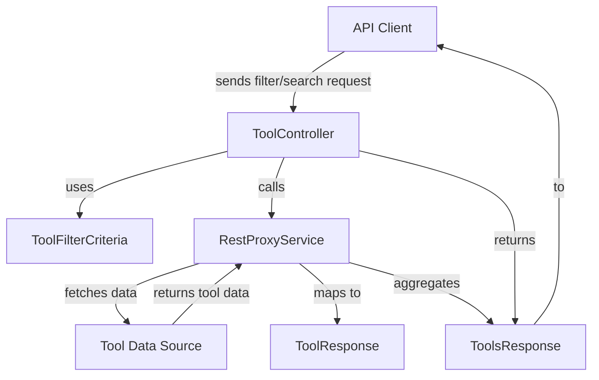
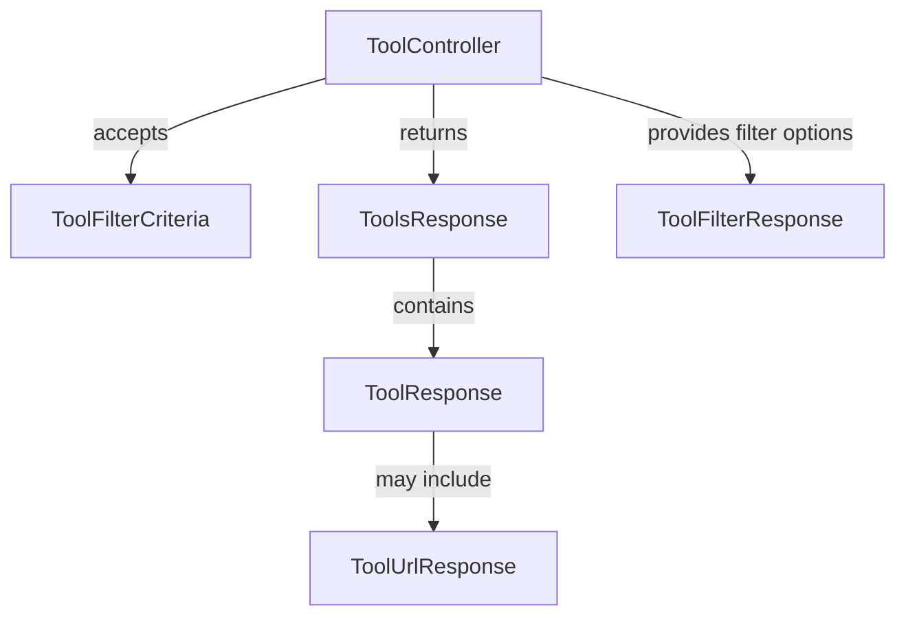

# external_api_service_core_dto_tool Module Documentation

## Introduction

The `external_api_service_core_dto_tool` module defines the Data Transfer Objects (DTOs) used for representing, filtering, and transferring tool-related data in the external API service layer. These DTOs are essential for structuring API responses and requests related to tools, ensuring consistent data exchange between the backend and external clients (such as frontend applications or third-party integrations).

This module is a key part of the external API's contract for tool management, supporting operations such as listing tools, filtering tools based on various criteria, and providing detailed tool information.

## Core Components

The module provides the following DTOs:

- **ToolFilterCriteria**: Defines the criteria for filtering tools in API requests.
- **ToolFilterResponse**: Represents the available filter options and their possible values for tools.
- **ToolResponse**: Encapsulates the detailed information of a single tool.
- **ToolUrlResponse**: Contains URL-related information for a tool (e.g., documentation, download links).
- **ToolsResponse**: Represents a paginated or aggregated list of tools in API responses.

## Architecture and Relationships

The `external_api_service_core_dto_tool` module is part of the broader external API service layer. It interacts closely with:

- **Controllers**: Such as `ToolController` in [external_api_service_core_controller.md](external_api_service_core_controller.md), which use these DTOs to handle HTTP requests and responses.
- **Service Layer**: Business logic in services (e.g., `RestProxyService` in [external_api_service_core_service.md](external_api_service_core_service.md)) populates and consumes these DTOs.
- **Other DTO Modules**: For pagination and filtering, it may reference shared DTOs like `PaginationCriteria` from [external_api_service_core_dto_shared.md](external_api_service_core_dto_shared.md).

### High-Level Data Flow

### Component Interaction

## Dependencies and Integration

- **Pagination**: For paginated tool lists, `ToolsResponse` may use `PaginationCriteria` from [external_api_service_core_dto_shared.md](external_api_service_core_dto_shared.md).
- **Filtering**: Filtering logic is coordinated with filter DTOs from related modules, such as `ToolFilterOptions` in [api_lib_dto_tool.md](api_lib_dto_tool.md).
- **Controllers and Services**: The DTOs are used by the `ToolController` ([external_api_service_core_controller.md](external_api_service_core_controller.md)) and service classes ([external_api_service_core_service.md](external_api_service_core_service.md)).

## Example Usage

- **Listing Tools**: A client sends a request with `ToolFilterCriteria` to the API. The controller processes the request, applies filters, and returns a `ToolsResponse` containing a list of `ToolResponse` objects.
- **Fetching Filter Options**: The API can return a `ToolFilterResponse` to help clients build dynamic filter UIs.
- **Getting Tool Details**: A request for a specific tool returns a `ToolResponse`, possibly including URLs in a `ToolUrlResponse`.

## Related Documentation

- [external_api_service_core_controller.md](external_api_service_core_controller.md): For details on the API controllers using these DTOs.
- [external_api_service_core_service.md](external_api_service_core_service.md): For service layer logic.
- [external_api_service_core_dto_shared.md](external_api_service_core_dto_shared.md): For shared DTOs like pagination.
- [api_lib_dto_tool.md](api_lib_dto_tool.md): For internal tool filter options and structures.

## Summary

The `external_api_service_core_dto_tool` module is central to the external API's tool management capabilities, providing the structured data models required for robust, flexible, and consistent API interactions regarding tools. It is designed for seamless integration with controllers, services, and other DTO modules, supporting scalable and maintainable API development.
