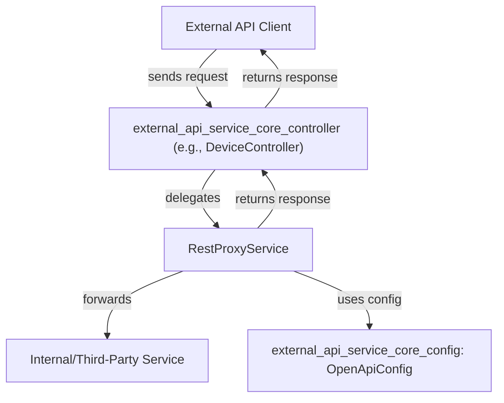
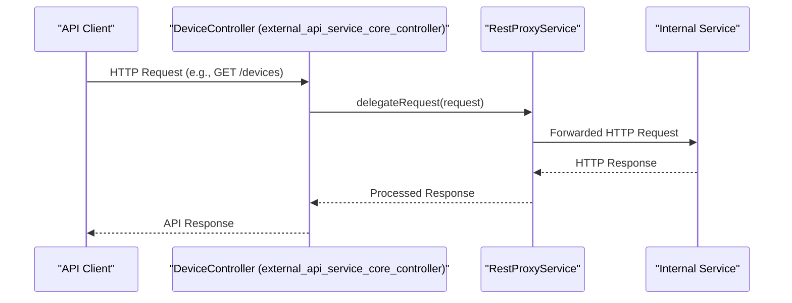

# external_api_service_core_service

## Introduction

The `external_api_service_core_service` module provides core service logic for the external API layer of the system. Its primary responsibility is to facilitate secure, reliable, and efficient communication between the external API controllers and downstream services or data sources. The main component in this module is the `RestProxyService`, which acts as a proxy and abstraction layer for outbound REST API calls, handling cross-cutting concerns such as authentication, error handling, and request transformation.

This module is a critical part of the external API stack, enabling the system to expose device, event, log, organization, and tool data to external consumers in a consistent and maintainable way.

---

## Core Component: RestProxyService

### Purpose

- Acts as a proxy for outbound REST API calls from the external API layer.
- Centralizes logic for authentication, request/response transformation, and error handling.
- Decouples controller logic from direct HTTP client usage, improving maintainability and testability.

### Key Responsibilities

- **Request Forwarding:** Forwards requests from external API controllers to internal or third-party services.
- **Authentication Handling:** Injects necessary authentication headers or tokens.
- **Error Management:** Standardizes error handling and response mapping.
- **Data Transformation:** Optionally transforms request and response payloads as needed.

### Typical Usage Flow

1. An external API controller (e.g., `DeviceController`, `EventController`) receives a client request.
2. The controller delegates the outbound call to `RestProxyService`.
3. `RestProxyService` prepares the request, adds authentication, and forwards it to the target service.
4. The response is processed, errors are handled, and the result is returned to the controller.

---

## Architecture & Component Relationships

The following diagram illustrates how `RestProxyService` fits into the external API service architecture:

### Component Interactions

- **Controllers:** The controllers in `external_api_service_core_controller` (such as `DeviceController`, `EventController`, etc.) depend on `RestProxyService` for outbound calls.
- **Configuration:** `RestProxyService` may utilize configuration from `external_api_service_core_config` (e.g., `OpenApiConfig`) for endpoint URLs, authentication, and other settings.
- **Downstream Services:** The actual data sources or services may be internal microservices or third-party APIs.

---

## Data Flow Example

Below is a simplified data flow for a typical request handled by the external API service:

---

## Dependencies & Integration Points

- **Controllers:**
  - [external_api_service_core_controller.md](external_api_service_core_controller.md)
- **Configuration:**
  - [external_api_service_core_config.md](external_api_service_core_config.md)
- **DTOs (Data Transfer Objects):**
  - [external_api_service_core_dto_audit.md](external_api_service_core_dto_audit.md)
  - [external_api_service_core_dto_device.md](external_api_service_core_dto_device.md)
  - [external_api_service_core_dto_event.md](external_api_service_core_dto_event.md)
  - [external_api_service_core_dto_organization.md](external_api_service_core_dto_organization.md)
  - [external_api_service_core_dto_tool.md](external_api_service_core_dto_tool.md)
  - [external_api_service_core_dto_shared.md](external_api_service_core_dto_shared.md)

---

## How This Module Fits Into the Overall System

The `external_api_service_core_service` module is a foundational building block for the external API layer. It ensures that all outbound communication from the API controllers is handled in a consistent, secure, and maintainable manner. By centralizing proxy logic, it reduces code duplication, simplifies controller implementations, and provides a single point for cross-cutting concerns such as authentication and error handling.

This module works closely with:
- **Controllers** ([external_api_service_core_controller.md](external_api_service_core_controller.md)) to handle incoming API requests.
- **Configuration** ([external_api_service_core_config.md](external_api_service_core_config.md)) for endpoint and authentication settings.
- **DTOs** for request and response data structures.

---

## See Also
- [external_api_service_core_controller.md](external_api_service_core_controller.md)
- [external_api_service_core_config.md](external_api_service_core_config.md)
- [external_api_service_core_dto_audit.md](external_api_service_core_dto_audit.md)
- [external_api_service_core_dto_device.md](external_api_service_core_dto_device.md)
- [external_api_service_core_dto_event.md](external_api_service_core_dto_event.md)
- [external_api_service_core_dto_organization.md](external_api_service_core_dto_organization.md)
- [external_api_service_core_dto_tool.md](external_api_service_core_dto_tool.md)
- [external_api_service_core_dto_shared.md](external_api_service_core_dto_shared.md)
