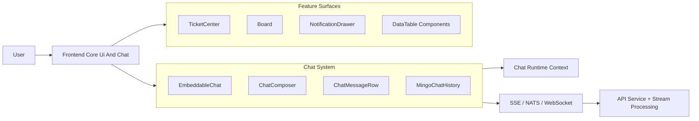
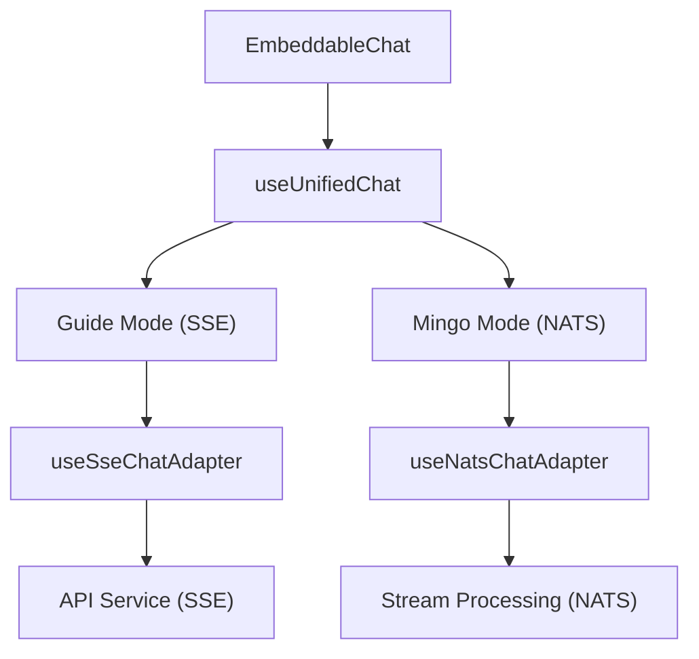
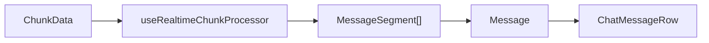
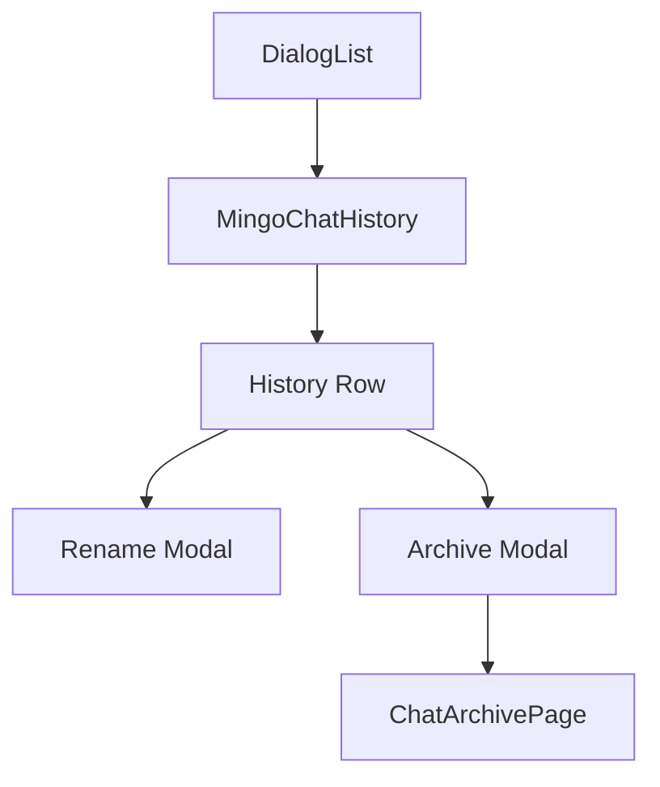
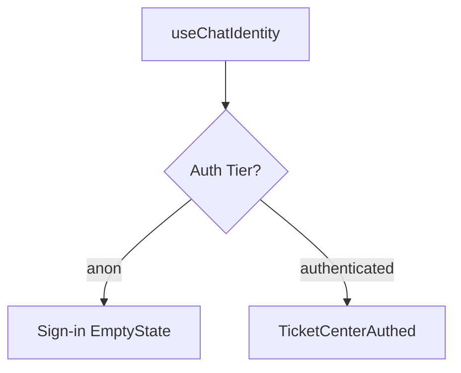
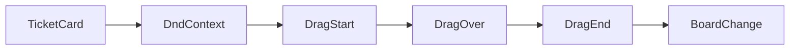
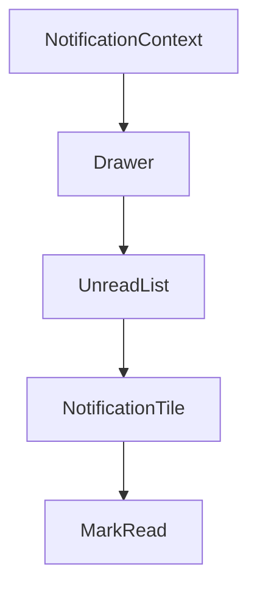
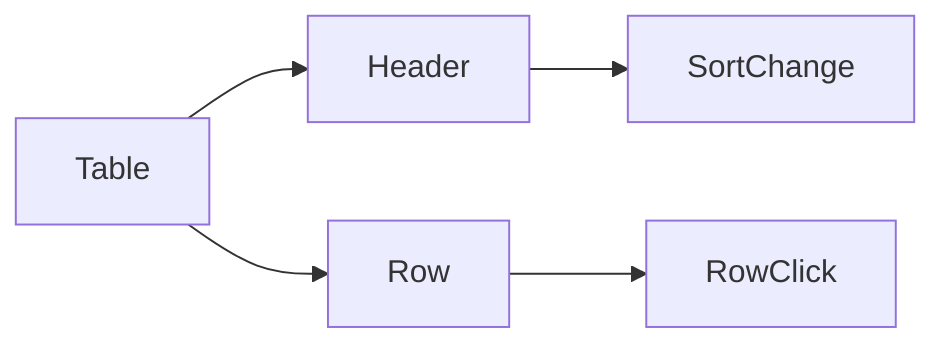
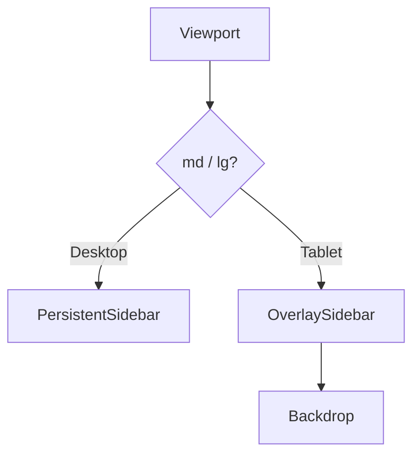
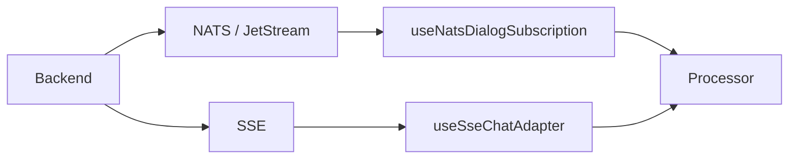

# Frontend Core Ui And Chat

The **Frontend Core Ui And Chat** module provides the reusable UI foundation and real-time AI chat experience for the OpenFrame platform.

It is designed to be:

- ✅ **Embeddable** – works inside Hub, standalone apps, or third-party platforms
- ✅ **Runtime-driven** – all navigation, identity, and endpoints flow through runtime context
- ✅ **Transport-agnostic** – supports SSE (Guide mode) and NATS/WebSocket (Mingo mode)
- ✅ **Design-system aligned** – built entirely on ODS tokens and shared UI primitives

This module powers:

- The floating **"Ask AI"** assistant panel
- AI-driven conversations (Guide + Mingo modes)
- Ticket Center
- Board (Kanban-style) views
- Notifications Drawer
- Data Tables and filtering surfaces
- Navigation and layout primitives

---

## 1. Architectural Overview

At a high level, the module sits on top of platform runtime and backend services while remaining UI-focused and transport-agnostic.

### Key Concepts

- **Runtime-first design**: `useRequiredChatRuntime()` injects identity, endpoints, platform source, and navigation behavior.
- **Mode-based chat engine**: Guide (SSE/RAG) and Mingo (NATS/agent) are pluggable via `useUnifiedChat`.
- **Composable UI primitives**: All surfaces share ODS-based components (Button, Card, Drawer, Tag, etc.).
- **Strict separation of concerns**:
  - Transport + state: hooks
  - Rendering: components
  - Platform integration: runtime context

---

# 2. Chat System

The Chat system is the core of this module and is built around `EmbeddableChat`.

## 2.1 EmbeddableChat

**Core component:**

- `EmbeddableChatProps`

`EmbeddableChat` is a portable AI assistant panel that:

- Supports controlled and uncontrolled open state
- Can render inside a Drawer shell or as a shell-less body
- Switches between Guide and Mingo modes
- Manages dialog history, archive view, rename/archive modals
- Renders streaming messages with inline entity cards

### Mode Architecture

### Responsibilities

- Floating trigger button
- Drawer rendering (Radix-based)
- Identity-aware greeting
- Slash command onboarding
- Attachment support (Guide-only)
- Source citation chips
- Archive page
- Inline entity card dispatch

---

## 2.2 Message Model

The chat uses a **segment-based message architecture**.

Core message types:

- `TextMessageData`
- `ExecutedToolMessageData`
- `AIMetadataMessageData`
- `ApprovalRequest`
- `ApprovalBatchData`

Messages are rendered using:

- `ChatMessageRow`
- `ChatMessageList`
- Segment-aware renderers (tool execution, approvals, thinking, etc.)

### Segment Flow

This design allows:

- Streaming token updates
- Inline tool execution state
- Approval workflows
- Context compaction visualization

---

## 2.3 Chat Composer

**Core component:**

- `ChatComposerProps`

`ChatComposer` renders:

- `ChatInput`
- Model usage row (`ModelDisplay`)
- Attachment add button (Guide mode only)
- Archived state placeholder

It integrates with:

- Slash commands
- Token usage reporting
- Streaming stop control
- Attachment staging and upload state

---

## 2.4 Dialog History & Archive

Core components:

- `MingoChatHistoryProps`
- `ChatArchivePageProps`

Features:

- Grouping: Today / Yesterday / Older
- Infinite scroll with sentinel
- Rename / Archive actions
- Restore archived dialogs
- Scroll fade affordances

---

# 3. Ticket Center

**Core component:**

- `TicketCenterProps`

The Ticket Center provides a customer-facing support surface tightly integrated with chat identity.

### Identity Gate

### Features

- Optimistic ticket creation
- Inline conversation threads
- Close / reopen actions
- Refetch and cache management
- Support system health awareness

TicketCenter intentionally does not bundle providers; embedders supply:

- QueryClientProvider
- ChatRuntimeContext

---

# 4. Board (Kanban Surface)

Core components:

- `BoardProps`
- `TicketCardProps`

The Board implements a drag-and-drop Kanban system using `@dnd-kit`.

### Drag Flow

Capabilities:

- Cross-column drag with allowedFromColumns rules
- Optimistic reordering
- Infinite scroll per column
- Overlay preview during drag
- Horizontal scrollbar with custom thumb

---

# 5. Notifications Drawer

**Core component:**

- `NotificationDrawerProps`

Features:

- Right-side Drawer
- Infinite scroll unread list
- "Complete All" bulk action
- Live pop-up toggle
- History navigation callback

---

# 6. Data Table System

Core components:

- `DataTableHeaderProps`
- `DataTableRowProps`
- `TableProps` (deprecated legacy types)

Built on:

- `@tanstack/react-table`

### Header Capabilities

- Consumer-driven sorting
- Filter dropdown integration
- Sticky header support
- Responsive column hiding

### Row Behavior

- Full-row link mode
- Action bubbling guard via `data-no-row-click`
- Portal-safe click handling

---

# 7. Navigation & Layout Primitives

Core components:

- `HeaderProps`
- `NavigationSidebarProps`
- `PageLayoutProps`

### Sidebar Behavior

Features:

- Persisted minimized state (localStorage)
- Tablet overlay mode
- Escape-to-close
- Disabled state for full navigation lock

---

# 8. Shared UI Components

Additional reusable UI primitives included:

- `OrganizationCard`
- `TagsManager`
- `FilterModal`
- `ChatTicketList`

These are fully ODS-aligned and used across:

- Board
- Ticket Center
- Admin surfaces
- Data listing pages

---

# 9. Network & Transport Types

Core transport types:

- `NetworkResponse`
- `PaginatedResponse`
- `WebSocketConfig`
- `WebSocketMessage`
- `ChunkData`

### Real-Time Pipeline

The real-time system supports:

- Reconnection backoff tuning
- Chunk catch-up
- Token usage telemetry
- Approval lifecycle events

---

# 10. How This Module Fits Into OpenFrame

The **Frontend Core Ui And Chat** module is the presentation and interaction layer for:

- `api-service-core-http-and-graphql` (SSE Guide mode)
- `stream-processing-kafka` (via NATS agent streaming)
- `authorization-service-core` (identity via runtime)
- `gateway-service-core` (WebSocket + routing)

It does **not**:

- Own authentication
- Own data persistence
- Own API contracts

Instead, it consumes them via:

- Runtime context
- Hooks
- Transport adapters

---

# 11. Design Principles

1. **Runtime abstraction over hard imports**
2. **Segment-first message rendering**
3. **Feature-flag-driven extensibility**
4. **Platform-neutral embedding**
5. **Strict separation of transport and presentation**

---

# Conclusion

The **Frontend Core Ui And Chat** module is the reusable UI and AI interaction layer of OpenFrame.

It provides:

- A fully embeddable AI assistant
- Real-time streaming with approval workflows
- Ticket management
- Drag-and-drop board workflows
- Data-table and filtering primitives
- Responsive navigation framework

By centralizing chat logic, UI components, and interaction patterns in a single portable module, OpenFrame ensures consistent UX across Hub, customer portals, and embedded third-party environments.