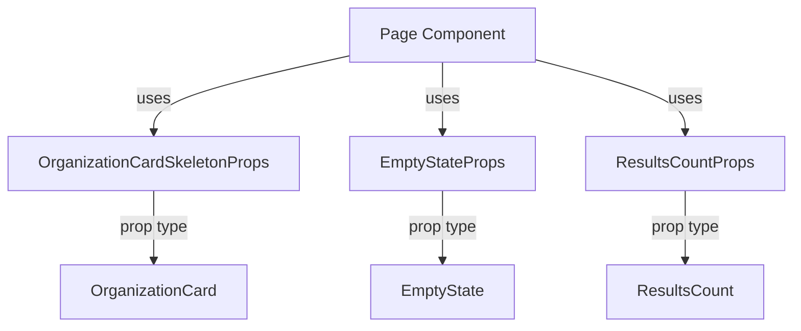
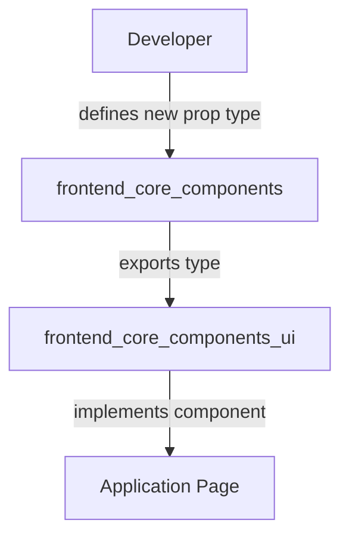

# frontend_core_components Module Documentation

## Introduction

The `frontend_core_components` module provides foundational React component types, props, and shared UI primitives for the frontend application. It acts as a central library of reusable building blocks, context types, and UI skeletons that are leveraged across feature modules, UI libraries, and navigation components. This module is essential for maintaining consistency, reusability, and type safety throughout the frontend codebase.

## Core Functionality

- **Context Types**: Provides authentication context types for global state management.
- **UI Primitives**: Supplies basic UI building blocks such as empty states, skeleton loaders, tooltips, and scroll areas.
- **Component Props**: Defines prop types for common UI elements (inputs, textareas, tooltips, etc.).
- **Vendor and Organization Skeletons**: Includes skeleton loaders for organization and vendor cards to improve perceived performance during data fetching.
- **Reusable UI Elements**: Offers shared components like FAQ items, results count, and vendor tags/icons.

## Key Components

| Component Name                | Description                                                                 |
|-------------------------------|-----------------------------------------------------------------------------|
| `AuthContextType`             | Type definition for authentication context (see also [frontend_core_types_auth.md]) |
| `EmptyStateProps`             | Props for rendering empty state UI components                               |
| `FaqItem`                     | Type for FAQ entries                                                        |
| `ImageCropperProps`           | Props for image cropping UI components                                      |
| `InputProps`                  | Props for input fields (see also [frontend_core_components_ui.md])          |
| `JoinWaitlistButtonProps`     | Props for the join waitlist button (see also [frontend_core_components_features.md]) |
| `OrganizationCardSkeletonProps` | Props for organization card skeleton loader                                 |
| `ResultsCountProps`           | Props for displaying results count in lists/tables                          |
| `ScrollAreaProps`             | Props for scrollable area components                                        |
| `TextareaProps`               | Props for textarea fields (see also [frontend_core_components_ui.md])       |
| `TooltipRootProps`            | Props for tooltip root elements                                             |
| `VendorIconProps`             | Props for vendor icon components                                            |
| `VendorTagProps`              | Props for vendor tag display components                                     |

> **Note:** Many of these types are used by or extended in other frontend modules such as `frontend_core_components_ui`, `frontend_core_components_features`, and `frontend_core_types_auth`. For detailed prop definitions and advanced usage, refer to the respective module documentation.

## Architecture Overview

The `frontend_core_components` module is designed to be consumed by higher-level UI and feature modules. It does not implement business logic or data fetching, but instead focuses on providing type-safe, reusable UI primitives and context types.

### Module Relationships

```mermaid
flowchart TD
    Core["frontend_core_components"]
    UI["frontend_core_components_ui"]
    Features["frontend_core_components_features"]
    Navigation["frontend_core_components_navigation"]
    Shared["frontend_core_components_shared"]
    Onboarding["frontend_core_components_shared_onboarding"]
    TypesAuth["frontend_core_types_auth"]
    TypesFAQ["frontend_core_types_faq"]
    TypesVendor["frontend_core_types_vendor_links"]

    Core --> UI
    Core --> Features
    Core --> Navigation
    Core --> Shared
    Core --> Onboarding
    Core --> TypesAuth
    Core --> TypesFAQ
    Core --> TypesVendor
```

- **Downstream Usage**: Modules such as `frontend_core_components_ui`, `frontend_core_components_features`, and `frontend_core_components_navigation` import and extend types from `frontend_core_components`.
- **Type Dependencies**: Some types (e.g., `AuthContextType`) are also defined or extended in [frontend_core_types_auth.md].

## Component Interaction and Data Flow

The module itself does not manage data or state, but its types and props are used to:
- Define the shape of props for UI components
- Standardize context and state management patterns (e.g., authentication context)
- Provide skeleton and empty state components for use during asynchronous data loading

### Example: UI Component Consumption

- **Page components** import prop types from `frontend_core_components` to ensure type safety and consistency.
- **UI components** such as `OrganizationCard`, `EmptyState`, and `ResultsCount` use these prop types for their props.

## Integration with Other Modules

- **UI Library**: [frontend_core_components_ui.md] extends and implements many of the prop types defined here.
- **Feature Modules**: [frontend_core_components_features.md] and [frontend_core_components_navigation.md] use these types for feature-specific UI.
- **Type Definitions**: [frontend_core_types_auth.md], [frontend_core_types_faq.md], and [frontend_core_types_vendor_links.md] provide additional type definitions and extensions.

## Process Flow: Adding a New UI Primitive

1. **Developer** defines a new prop type in `frontend_core_components`.
2. The type is exported and consumed by `frontend_core_components_ui`.
3. The UI component is implemented and used in application pages.

## References

- [frontend_core_components_ui.md]
- [frontend_core_components_features.md]
- [frontend_core_components_navigation.md]
- [frontend_core_types_auth.md]
- [frontend_core_types_faq.md]
- [frontend_core_types_vendor_links.md]

## Summary

The `frontend_core_components` module is the foundation for type-safe, reusable UI primitives and context types in the frontend codebase. It is designed for maximum reusability and consistency, and is a critical dependency for all higher-level UI and feature modules.