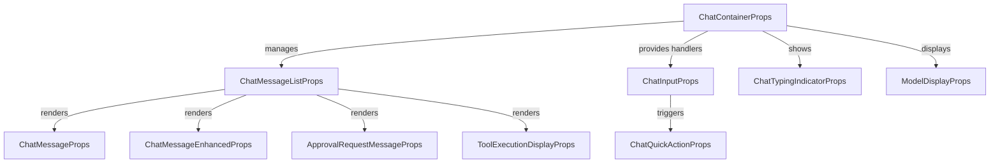

# frontend_core_components_chat Module Documentation

## Introduction

The `frontend_core_components_chat` module provides the foundational React component props and types for building a robust, interactive chat interface within the frontend application. This module is designed to support real-time messaging, user interaction, tool execution feedback, and enhanced chat experiences such as typing indicators and quick actions. It serves as the core building block for any chat-related features in the frontend, ensuring consistency, reusability, and type safety across the application.

## Core Functionality

This module defines the prop types for the main chat UI components, including:
- **Chat container and message list**
- **Individual chat messages (with enhanced and tool execution variants)**
- **Input and quick action controls**
- **Typing indicators and approval request messages**
- **Model and tool execution displays**

These types are intended to be used by the actual React components (typically implemented in a separate `components` or `features` module), ensuring that all chat UI elements adhere to a consistent contract.

## Component Overview

| Component Name                  | Purpose                                                                 |
|---------------------------------|-------------------------------------------------------------------------|
| `ChatContainerProps`            | Props for the main chat container, managing state and context           |
| `ChatMessageListProps`          | Props for rendering a list of chat messages                             |
| `ChatMessageProps`              | Props for a single chat message                                         |
| `ChatMessageEnhancedProps`      | Extended props for messages with additional metadata or actions         |
| `ChatInputProps`                | Props for the chat input field, including handlers and state            |
| `ChatQuickActionProps`          | Props for quick action buttons (e.g., canned responses, shortcuts)      |
| `ChatTypingIndicatorProps`      | Props for displaying typing indicators                                  |
| `ApprovalRequestMessageProps`   | Props for messages requesting user approval or confirmation             |
| `ModelDisplayProps`             | Props for displaying the current AI/model in use                        |
| `ToolExecutionDisplayProps`     | Props for showing tool execution results or status within the chat      |

## Architecture & Data Flow

The chat system is designed around a unidirectional data flow, where the chat container manages the overall state and context, passing relevant data and handlers down to child components. User actions (such as sending a message or triggering a quick action) are bubbled up to the container, which then updates the state and propagates changes to the message list and other UI elements.

### High-Level Component Interaction

### Data Flow Example

1. **User types a message** in the input field (`ChatInputProps`).
2. **On submit**, the input triggers a handler in the chat container (`ChatContainerProps`).
3. The container **updates the message list state** and passes new props to `ChatMessageListProps`.
4. The message list **renders the new message** using `ChatMessageProps` or `ChatMessageEnhancedProps`.
5. If a tool execution is triggered, `ToolExecutionDisplayProps` is used to show the result/status inline.
6. Typing indicators (`ChatTypingIndicatorProps`) and approval requests (`ApprovalRequestMessageProps`) are rendered as needed.

### Integration with Other Modules

- **Feature Components**: The chat UI may leverage feature-specific components from [`frontend_core_components_features.md`](frontend_core_components_features.md) for advanced actions, onboarding, or enrichment.
- **UI Components**: Shared UI elements (buttons, loaders, cards) are defined in [`frontend_core_components_ui.md`](frontend_core_components_ui.md).
- **Hooks and State**: Pagination and server/client state management are handled via hooks from [`frontend_core_hooks_ui.md`](frontend_core_hooks_ui.md).
- **Types and Models**: Message, user, and tool types are defined in [`frontend_core_types_*`](frontend_core_types_auth.md), [`frontend_core_types_slack.md`], etc.

## Dependencies

The chat components are designed to be agnostic of backend implementation, but they often interact with:
- **Authentication context** ([`frontend_core_types_auth.md`](frontend_core_types_auth.md)) for user identity
- **Tool execution and status** ([`frontend_core_components_features.md`](frontend_core_components_features.md))
- **Real-time events** (e.g., via WebSocket or polling, not defined here)

## Extending the Chat System

To extend or customize the chat experience:
- Implement new message types by extending `ChatMessageProps` or `ChatMessageEnhancedProps`
- Add new quick actions via `ChatQuickActionProps`
- Integrate additional tool execution displays using `ToolExecutionDisplayProps`
- Leverage shared UI and feature components for consistent look and feel

## Related Documentation

- [frontend_core_components_features.md](frontend_core_components_features.md)
- [frontend_core_components_ui.md](frontend_core_components_ui.md)
- [frontend_core_hooks_ui.md](frontend_core_hooks_ui.md)
- [frontend_core_types_auth.md](frontend_core_types_auth.md)
- [frontend_core_types_slack.md](frontend_core_types_slack.md)

## Summary

The `frontend_core_components_chat` module is the backbone for all chat-related UI in the frontend, providing a flexible, extensible, and type-safe foundation for building modern, interactive chat experiences. For implementation details and advanced usage, refer to the related modules and the actual component implementations.