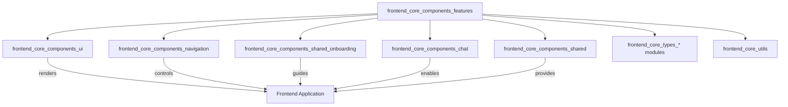
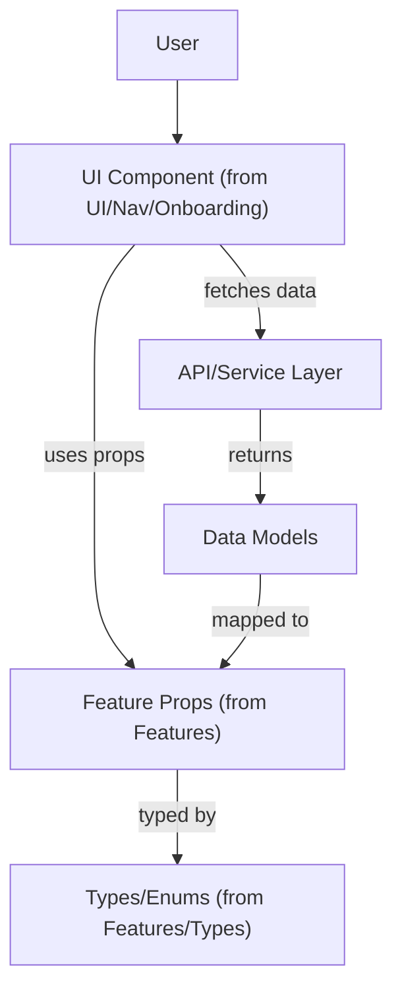
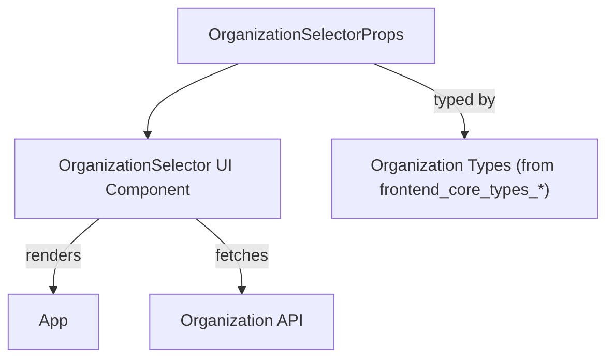
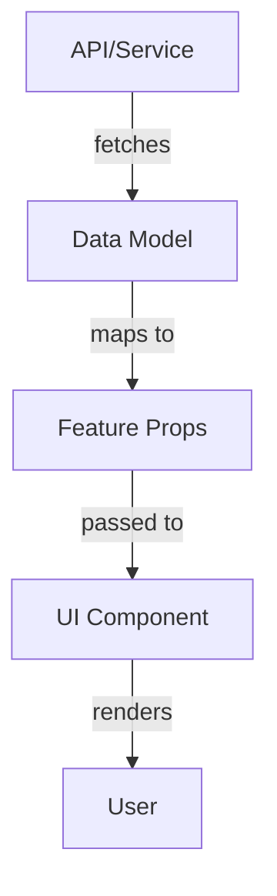

# frontend_core_components_features Module Documentation

## Introduction

The `frontend_core_components_features` module provides a set of reusable, feature-focused React component types and configuration objects for building advanced UI features in the frontend application. These components are designed to support a wide range of product features, including AI enrichment, SSO status, organization and platform selectors, media display, SEO previews, and more. The module acts as a bridge between UI primitives (from `frontend_core_components_ui`), navigation, shared onboarding, and higher-level feature logic, enabling rapid development of complex, interactive user experiences.

This module is a core part of the frontend architecture, facilitating feature composition and integration across the application. It is intended to be used in conjunction with other frontend modules such as `frontend_core_components_ui`, `frontend_core_components_navigation`, and `frontend_core_components_chat`.

## Core Components

- **AIEnrichSectionProps**: Props for AI enrichment feature sections.
- **AIStatusIndicatorProps**: Props for displaying AI status indicators.
- **SSOConfigStatus**: Type representing the status of SSO configuration.
- **CommandBoxProps**: Props for command input boxes.
- **FigmaPrototypeViewerConfig**: Configuration for embedding Figma prototypes.
- **FiltersDropdownProps**: Props for filter dropdown UI elements.
- **JoinWaitlistButtonProps**: Props for the join waitlist button.
- **MediaItem**: Type representing a media item (image, video, etc.).
- **OrganizationIconProps**: Props for displaying organization icons.
- **OrganizationSelectorProps**: Props for organization selection components.
- **OSPlatformSelectorProps**: Props for selecting operating system platforms.
- **PathsDisplayProps**: Props for displaying file or navigation paths.
- **SectionSelectorProps**: Props for section selection UI.
- **SEOEditorPreviewProps**: Props for SEO preview editor components.
- **SocialPlatform**: Enum/type for supported social platforms.
- **SocialLink**: Type for social media links.
- **StartWithOpenFrameButtonProps**: Props for the OpenFrame start button.
- **Tag**: Type for tag objects used in filtering, categorization, or display.

## Module Architecture

The `frontend_core_components_features` module is structured to provide feature-level component props and configuration types, which are then consumed by UI components, navigation elements, and shared onboarding flows. It does not implement UI logic directly, but instead defines the contracts and data structures that enable feature-rich UI composition.

### High-Level Architecture



### Component Interaction and Data Flow



### Example: Organization Selection Feature



## Dependencies and Integration

The module is designed to be used in tandem with:

- [frontend_core_components_ui.md](frontend_core_components_ui.md): For rendering the actual UI elements using the props and types defined here.
- [frontend_core_components_navigation.md](frontend_core_components_navigation.md): For navigation and sidebar/header integration.
- [frontend_core_components_chat.md](frontend_core_components_chat.md): For chat and AI-related features.
- [frontend_core_components_shared_onboarding.md](frontend_core_components_shared_onboarding.md): For onboarding flows that use feature props.
- [frontend_core_types_*.md](frontend_core_types_access_code_cohorts.md), etc.: For shared type definitions and enums.
- [frontend_core_utils.md](frontend_core_utils.md): For utility types and helpers (e.g., OSPlatformOption).

## Typical Usage Pattern

1. **Define Feature Props**: Use the types from this module to type the props of a feature component.
2. **Compose UI**: Pass these props to UI components from `frontend_core_components_ui` or navigation components.
3. **Integrate with Data**: Map API/service data to the feature props as needed.
4. **Leverage Shared Types**: Use enums and types from `frontend_core_types_*` for consistency.

## Example: Using AIStatusIndicatorProps

```typescript
import { AIStatusIndicatorProps } from 'frontend_core_components_features';
import { AIStatusIndicator } from 'frontend_core_components_ui';

const statusProps: AIStatusIndicatorProps = {
  status: 'active',
  lastUpdated: new Date(),
};

<AIStatusIndicator {...statusProps} />
```

## Process Flow: Feature Prop Usage



## Extending and Maintaining the Module

- **Add new feature prop types** as new features are introduced.
- **Keep prop types decoupled from UI logic** to maximize reusability.
- **Reference shared types** from `frontend_core_types_*` and `frontend_core_utils` for consistency.
- **Document new props and their intended usage** in this file.

## See Also

- [frontend_core_components_ui.md](frontend_core_components_ui.md)
- [frontend_core_components_navigation.md](frontend_core_components_navigation.md)
- [frontend_core_components_chat.md](frontend_core_components_chat.md)
- [frontend_core_components_shared_onboarding.md](frontend_core_components_shared_onboarding.md)
- [frontend_core_types_access_code_cohorts.md](frontend_core_types_access_code_cohorts.md)
- [frontend_core_utils.md](frontend_core_utils.md)
