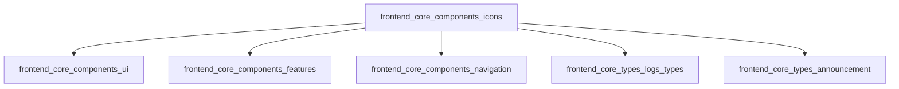
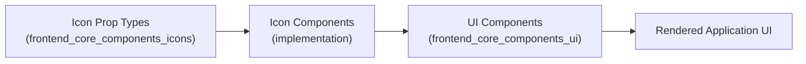

# frontend_core_components_icons

## Introduction

The `frontend_core_components_icons` module provides reusable icon components for the frontend application. These icons are designed to be used across various UI elements, ensuring visual consistency and improving user experience. The module currently includes the following core components:

- `FleetIconProps`
- `ThumbsDownIconProps`

These components are typically used as props for icon-rendering React components, enabling type safety and flexibility in icon usage throughout the frontend codebase.

---

## Core Functionality

### Purpose

The primary purpose of this module is to centralize the definition and typing of icon-related props, making it easy for developers to implement and maintain icon components. By standardizing icon props, the module ensures that icons are rendered consistently and can be easily extended or themed as needed.

### Key Components

#### 1. FleetIconProps
- **Description:** Defines the properties required for rendering the Fleet icon. This may include size, color, and other SVG or styling attributes.
- **Usage:** Used by the Fleet icon component to ensure correct prop types and facilitate customization.

#### 2. ThumbsDownIconProps
- **Description:** Specifies the properties for the Thumbs Down icon, such as size, color, and accessibility attributes.
- **Usage:** Used by the Thumbs Down icon component for consistent rendering and accessibility support.

---

## Architecture & Component Relationships

The `frontend_core_components_icons` module is a foundational part of the frontend component system. It is typically consumed by higher-level UI modules, such as:

- [`frontend_core_components_ui`](frontend_core_components_ui.md): Uses icon components within UI elements like buttons, cards, and menus.
- [`frontend_core_components_features`](frontend_core_components_features.md): May use icons to visually represent features or statuses.
- [`frontend_core_components_navigation`](frontend_core_components_navigation.md): Utilizes icons in navigation bars and sidebars.

The icon prop types defined here are also referenced by other type modules, such as:
- [`frontend_core_types_logs_types`](frontend_core_types_logs_types.md): For log severity or tool icons.
- [`frontend_core_types_announcement`](frontend_core_types_announcement.md): For announcement icons and SVG uploads.

### Module Dependency Diagram

---

## Data Flow & Usage Patterns

The typical data flow for icon usage in the frontend is as follows:

1. **Icon Prop Definition:** Icon prop types (e.g., `FleetIconProps`) are defined in this module.
2. **Component Implementation:** UI or feature components import these prop types and implement icon components accordingly.
3. **Component Composition:** Higher-level UI components compose icon components, passing the appropriate props for rendering.
4. **Application Rendering:** The composed UI is rendered, displaying icons with consistent styling and behavior.

### Data Flow Diagram

---

## Extensibility & Best Practices

- **Adding New Icons:** To add a new icon, define a new prop type in this module and implement the corresponding icon component in the UI layer.
- **Type Safety:** Always use the defined prop types to ensure consistency and prevent runtime errors.
- **Accessibility:** Include accessibility attributes (e.g., `aria-label`) in icon prop definitions where appropriate.
- **Reusability:** Centralize icon prop definitions to maximize reusability across the frontend codebase.

---

## Related Modules

- [frontend_core_components_ui.md](frontend_core_components_ui.md): For UI components that consume icon props.
- [frontend_core_types_logs_types.md](frontend_core_types_logs_types.md): For log and tool icon types.
- [frontend_core_types_announcement.md](frontend_core_types_announcement.md): For announcement and SVG icon types.

---

## Summary

The `frontend_core_components_icons` module is a key building block for consistent and maintainable icon usage in the frontend application. By centralizing icon prop definitions, it enables scalable UI development and ensures a cohesive user experience across the platform.
