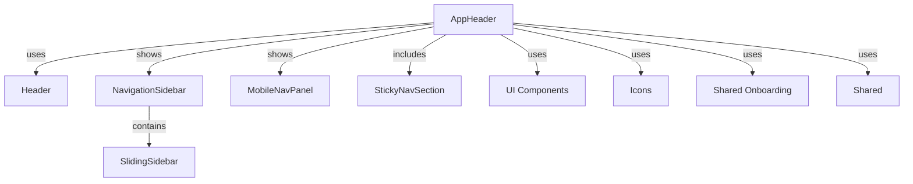
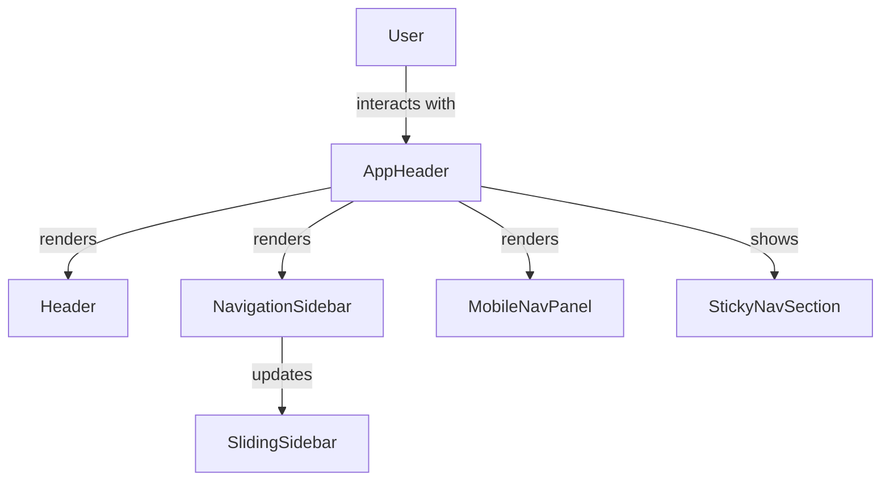

# frontend_core_components_navigation

## Introduction

The `frontend_core_components_navigation` module provides the foundational navigation and layout components for the frontend application. It is responsible for rendering the main navigation structures, including headers, sidebars, mobile navigation panels, and sticky navigation sections. These components ensure a consistent and responsive user experience across different devices and screen sizes, and serve as the backbone for user interaction and page routing within the application.

## Core Components

- **AppHeaderProps**: Props for the main application header component, which typically includes branding, navigation links, user menus, and notifications.
- **HeaderSkeletonProps**: Props for a skeleton loader version of the header, used during data fetching or loading states.
- **HeaderProps**: Props for the header component, encapsulating configuration for navigation, user actions, and contextual information.
- **MobileNavPanelProps**: Props for the mobile navigation panel, providing a responsive navigation experience on smaller screens.
- **NavigationSidebarProps**: Props for the sidebar navigation, which may include links, icons, and section groupings for desktop or wide-screen layouts.
- **SlidingSidebarProps**: Props for a sidebar that can slide in and out, supporting dynamic navigation or contextual menus.
- **StickyNavSection**: A component or prop type for sections of navigation that remain fixed (sticky) as the user scrolls.

## Architecture Overview

The navigation module is designed to be highly composable and responsive, supporting both desktop and mobile layouts. It interacts closely with UI components ([frontend_core_components_ui.md]), iconography ([frontend_core_components_icons.md]), and shared onboarding or state ([frontend_core_components_shared_onboarding.md], [frontend_core_components_shared.md]).



## Component Relationships and Data Flow

- **AppHeader** is the entry point for navigation, rendering the main header and delegating to either the sidebar or mobile panel based on screen size.
- **Header** and **HeaderSkeleton** provide the actual header UI and loading state, respectively.
- **NavigationSidebar** and **SlidingSidebar** manage persistent and dynamic navigation links, often using icon components from [frontend_core_components_icons.md].
- **MobileNavPanel** is conditionally rendered for mobile devices, ensuring navigation is accessible and user-friendly.
- **StickyNavSection** is used for navigation elements that should remain visible during scrolling, such as section tabs or quick actions.

### Data Flow Example



## Integration with Other Modules

- **UI Components** ([frontend_core_components_ui.md]): Used for buttons, menus, loaders, and other interactive elements within navigation.
- **Icons** ([frontend_core_components_icons.md]): Provides iconography for navigation links and actions.
- **Shared Onboarding** ([frontend_core_components_shared_onboarding.md]): May be used to display onboarding steps or walkthroughs within navigation panels.
- **Shared** ([frontend_core_components_shared.md]): Supplies skeleton loaders and other shared UI primitives.

## Extensibility and Customization

The navigation components are designed to be:
- **Composable**: Can be combined or extended to fit different layout needs.
- **Responsive**: Adapt to various screen sizes and device types.
- **Themed**: Support theming and branding via props and context.
- **Accessible**: Built with accessibility best practices in mind.

## Example Usage

```javascript
import { AppHeader, NavigationSidebar, MobileNavPanel } from 'frontend_core_components_navigation';

function MainLayout() {
  return (
    <div>
      <AppHeader />
      <NavigationSidebar />
      <MobileNavPanel />
      {/* ...rest of the app */}
    </div>
  );
}
```

## Related Documentation

- [frontend_core_components_ui.md]: UI primitives and layout components
- [frontend_core_components_icons.md]: Icon components for navigation
- [frontend_core_components_shared_onboarding.md]: Onboarding and walkthrough components
- [frontend_core_components_shared.md]: Shared skeletons and UI utilities

---

This documentation provides an overview of the `frontend_core_components_navigation` module, its architecture, and its integration points. For details on individual components, refer to the respective module documentation files linked above.
