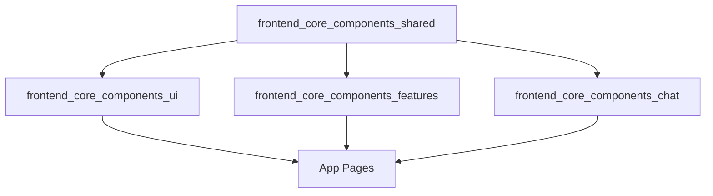

# frontend_core_components_shared Module Documentation

## Introduction

The `frontend_core_components_shared` module provides shared React component types and props that are used across multiple frontend modules, particularly for UI skeletons and loading states. Its primary goal is to promote consistency and reusability in the user interface, especially for detail pages that require a skeleton loader while data is being fetched or processed.

This module is designed to be lightweight and acts as a foundational building block for higher-level UI modules such as `frontend_core_components_ui`, `frontend_core_components_features`, and `frontend_core_components_chat`. By centralizing shared component props, it helps reduce duplication and ensures a unified look and feel across the application.

## Core Component: DetailPageSkeletonProps

### Purpose

`DetailPageSkeletonProps` defines the properties for a skeleton loader component typically used on detail pages. This skeleton is displayed while the actual content is loading, providing users with a visual placeholder and improving perceived performance.

### Usage Context

- Used by UI components that render detail pages (e.g., user profiles, device details, organization details).
- Consumed by modules such as [`frontend_core_components_ui.md`](frontend_core_components_ui.md) and [`frontend_core_components_features.md`](frontend_core_components_features.md) to maintain a consistent loading experience.

### Example Usage

```tsx
import { DetailPageSkeletonProps } from 'frontend_core_components_shared';

const MyDetailPageSkeleton: React.FC<DetailPageSkeletonProps> = (props) => (
  <DetailPageSkeleton {...props} />
);
```

## Architecture and Relationships

The `frontend_core_components_shared` module is part of the shared frontend layer, sitting between low-level UI primitives and higher-level feature or page components. It is intentionally kept minimal, containing only the most widely reused prop types and interfaces.

### Component Relationship Diagram



### Data Flow

- **Props defined in `frontend_core_components_shared`** are imported and used by UI and feature components.
- **UI and feature components** compose these shared props into more complex components, which are then rendered in application pages.

## Integration with Other Modules

- **UI Components**: See [`frontend_core_components_ui.md`](frontend_core_components_ui.md) for details on how shared props are used in table, card, and loader components.
- **Feature Components**: See [`frontend_core_components_features.md`](frontend_core_components_features.md) for usage in feature-specific UI elements.
- **Chat Components**: See [`frontend_core_components_chat.md`](frontend_core_components_chat.md) for chat-related skeletons and shared UI props.

## Best Practices

- **Reusability**: Always use shared prop types from this module when building new skeleton or loading components to ensure consistency.
- **Extensibility**: If you need to extend skeleton props, consider updating this module so all consumers benefit from the change.
- **Documentation**: Reference this module in documentation for any new shared UI component props.

## Related Documentation

- [frontend_core_components_ui.md](frontend_core_components_ui.md)
- [frontend_core_components_features.md](frontend_core_components_features.md)
- [frontend_core_components_chat.md](frontend_core_components_chat.md)

---

*For more information on shared UI patterns and skeleton loaders, see the documentation for the related UI and feature modules listed above.*
