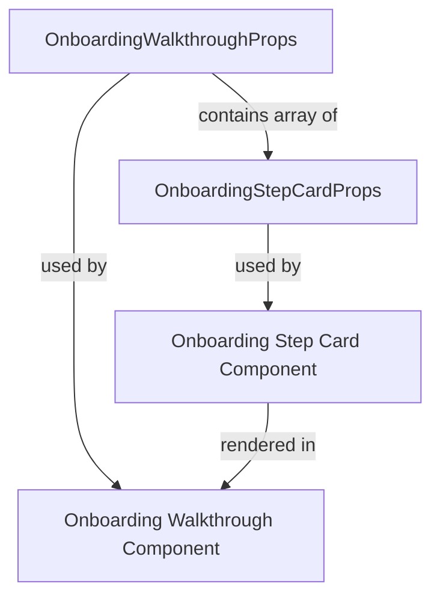
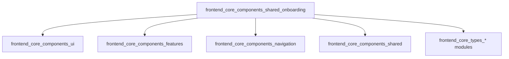
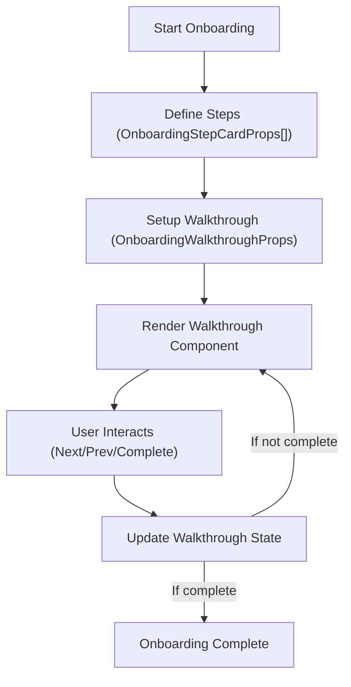

# frontend_core_components_shared_onboarding

## Introduction

The `frontend_core_components_shared_onboarding` module provides reusable React component props and types for building onboarding experiences in the frontend application. It is designed to standardize and streamline the creation of onboarding flows, walkthroughs, and step-based user guidance across the platform. This module is part of the shared frontend core components, ensuring consistency and reusability in onboarding UI patterns.

**Core Components:**
- `OnboardingStepCardProps`
- `OnboardingWalkthroughProps`

## Purpose and Core Functionality

The primary goal of this module is to define the props and types required for onboarding-related UI components. These types are used by actual React components (typically implemented elsewhere) to render onboarding step cards and walkthrough flows. By centralizing these definitions, the module ensures that onboarding experiences are:
- **Consistent**: All onboarding flows use the same structure and data contracts.
- **Reusable**: Types can be imported and used across different features or products.
- **Maintainable**: Updates to onboarding props/types propagate throughout the codebase.

## Architecture and Component Relationships

The module is purely a type/props definition module. It does not contain business logic or UI rendering code, but it is foundational for any onboarding UI components in the frontend. The typical usage pattern is:

- **OnboardingStepCardProps**: Defines the properties for a single onboarding step card (e.g., title, description, icon, completion state).
- **OnboardingWalkthroughProps**: Defines the properties for a multi-step onboarding walkthrough (e.g., steps array, current step index, navigation handlers).

These props are consumed by UI components (often in `frontend_core_components_ui` or feature-specific modules) to render onboarding flows.

### Component Interaction Diagram

### Module Dependency Diagram

- **Note:** The actual UI components that use these props are implemented in modules such as [frontend_core_components_ui.md], [frontend_core_components_features.md], and [frontend_core_components_navigation.md].

## Data Flow and Usage

The onboarding flow typically works as follows:

1. **Definition**: An array of `OnboardingStepCardProps` is created to represent each step in the onboarding process.
2. **Walkthrough**: The `OnboardingWalkthroughProps` type is used to manage the walkthrough state (current step, navigation, etc.).
3. **Rendering**: UI components receive these props and render the onboarding UI accordingly.

### Onboarding Process Flow

## Integration with the Overall System

The onboarding types defined in this module are used throughout the frontend application wherever onboarding flows are needed. They are often combined with UI components from:
- [frontend_core_components_ui.md]: For rendering cards, navigation, and layout
- [frontend_core_components_features.md]: For feature-specific onboarding
- [frontend_core_components_navigation.md]: For navigation during onboarding
- [frontend_core_components_shared.md]: For shared skeletons and loading states

This modular approach allows teams to build onboarding experiences that are visually and functionally consistent across the platform.

## References

- [frontend_core_components_ui.md]
- [frontend_core_components_features.md]
- [frontend_core_components_navigation.md]
- [frontend_core_components_shared.md]
- [frontend_core_types_access_code_cohorts.md] (and other types modules as needed)

## Summary

The `frontend_core_components_shared_onboarding` module is a foundational part of the frontend architecture for onboarding flows. By providing standardized props and types, it enables the rapid development of consistent, maintainable, and reusable onboarding experiences across the application.
