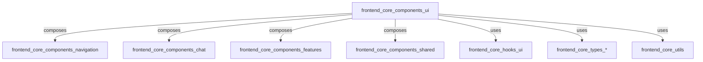
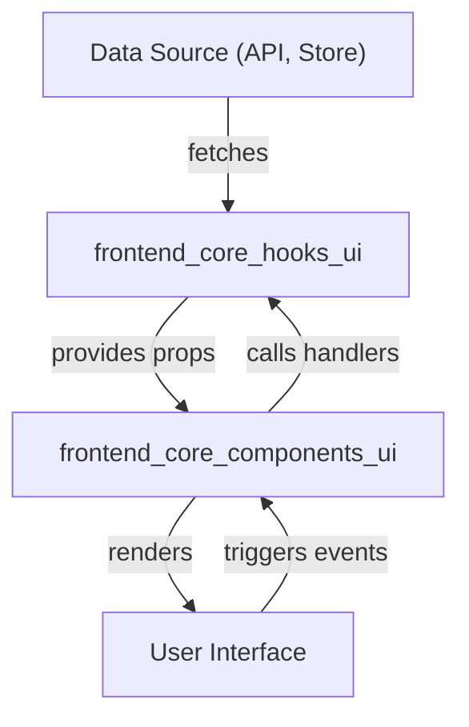
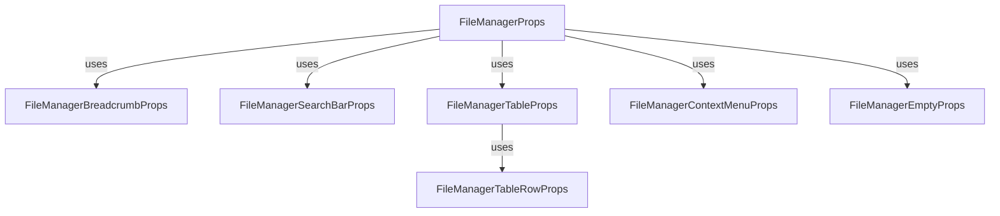
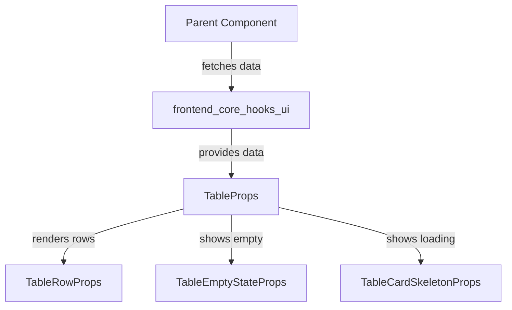

# frontend_core_components_ui

## Introduction

The `frontend_core_components_ui` module provides a comprehensive set of reusable UI components and props interfaces for building rich, interactive, and consistent user interfaces in the frontend application. These components are designed to be modular, composable, and easily integrated with other frontend modules, supporting a wide range of use cases such as file management, device and organization display, interactive cards, tables, loaders, and more.

This module is a foundational part of the frontend architecture, enabling rapid development and a unified look and feel across the application. It is intended to be used in conjunction with other frontend modules such as navigation, chat, features, and shared components.

---

## Core Functionality

The module exports the following core components and prop types:

- **ActionsMenuProps**
- **BrandAssociationGridProps**
- **ChevronButtonProps**
- **ContentLoaderProps**
- **DeviceCardProps**
- **FeatureCardGridProps**
- **FileManagerBreadcrumbProps**
- **FileManagerEmptyProps**
- **FileManagerSearchBarProps**
- **FileManagerTableRowProps**
- **FileManagerProps**
- **FileManagerContextMenuProps**
- **FileManagerTableProps**
- **HighlightCardProps**
- **InputProps**
- **InteractiveCardProps**
- **LogTableRowProps**
- **MoreActionsMenuProps**
- **OrganizationCardProps**
- **PageLoaderProps**
- **SearchBarProps**
- **SelectCardProps**
- **ServiceCardProps**
- **SliderProps**
- **TabNavigationProps**
- **TableCardSkeletonProps**
- **FilterSection**
- **TableHeaderProps**
- **TableEmptyStateProps**
- **TableProps**
- **TableRowProps**
- **TextareaProps**

These components are primarily focused on UI presentation and user interaction, and are designed to be stateless or minimally stateful, with data and event handling passed in via props.

---

## Architecture Overview

The `frontend_core_components_ui` module is structured as a collection of UI components, each encapsulating a specific piece of functionality or visual pattern. These components are typically composed together to build higher-level features and pages.

### High-Level Architecture

- **Composes**: UI components are often used within navigation, chat, features, and shared modules to build complex UIs.
- **Uses**: UI components rely on hooks, types, and utility functions for data, state management, and platform-specific logic.

---

## Component Categories and Relationships

### 1. File Management Components

- **FileManagerProps, FileManagerTableProps, FileManagerTableRowProps, FileManagerBreadcrumbProps, FileManagerEmptyProps, FileManagerSearchBarProps, FileManagerContextMenuProps**
    - Provide a complete file management UI, including navigation, search, context menus, and empty states.
    - Can be composed together to create a file explorer or file selection dialog.

### 2. Table and Data Display Components

- **TableProps, TableRowProps, TableHeaderProps, TableEmptyStateProps, TableCardSkeletonProps, LogTableRowProps**
    - Used for displaying tabular data, logs, and loading skeletons.
    - Support filtering, sorting, and empty state handling.

### 3. Card and Grid Components

- **DeviceCardProps, FeatureCardGridProps, HighlightCardProps, InteractiveCardProps, OrganizationCardProps, SelectCardProps, ServiceCardProps, BrandAssociationGridProps**
    - Present information in card or grid layouts for devices, features, organizations, and services.
    - Support selection, highlighting, and interactivity.

### 4. Navigation and Interaction Components

- **ActionsMenuProps, MoreActionsMenuProps, TabNavigationProps, ChevronButtonProps, SearchBarProps, SliderProps, FilterSection**
    - Provide menus, navigation tabs, search bars, sliders, and filter sections for user interaction.

### 5. Loaders and Inputs

- **ContentLoaderProps, PageLoaderProps, InputProps, TextareaProps**
    - Show loading states and provide input fields for user data entry.

---

## Data Flow and Component Interaction

UI components in this module are designed to be highly composable and to receive data and event handlers via props. They do not manage global state directly, but instead interact with stateful logic provided by hooks (see [frontend_core_hooks_ui.md]) and data types (see [frontend_core_types_*].md).

### Example Data Flow

- Data is fetched from APIs or stores, often using hooks.
- Hooks provide data and event handlers as props to UI components.
- UI components render the interface and trigger events (e.g., clicks, input changes).
- Event handlers are passed back to hooks or parent components for processing.

---

## Dependencies and Integration

The `frontend_core_components_ui` module is intended to be used alongside other frontend modules:

- **[frontend_core_components_navigation.md]**: For navigation bars, sidebars, and headers.
- **[frontend_core_components_chat.md]**: For chat and messaging UIs.
- **[frontend_core_components_features.md]**: For feature-specific UI elements.
- **[frontend_core_components_shared.md]**: For shared skeletons, tooltips, and other common UI patterns.
- **[frontend_core_hooks_ui.md]**: For pagination, filtering, and other UI logic hooks.
- **[frontend_core_types_*].md**: For type definitions used in props and state.
- **[frontend_core_utils.md]**: For utility functions and platform options.

---

## Example: Composing a File Manager UI

---

## Process Flow: Table Data Rendering

---

## Extending and Customizing UI Components

- All components are designed to be extended via props and composition.
- Custom renderers, event handlers, and styles can be passed in as needed.
- For advanced use cases, combine with hooks and types from other frontend modules.

---

## See Also

- [frontend_core_components_navigation.md]
- [frontend_core_components_chat.md]
- [frontend_core_components_features.md]
- [frontend_core_components_shared.md]
- [frontend_core_hooks_ui.md]
- [frontend_core_types_access_code_cohorts.md], [frontend_core_types_announcement.md], etc.
- [frontend_core_utils.md]

---

## Summary

The `frontend_core_components_ui` module is a central building block for frontend development, providing a rich set of UI components that are composable, reusable, and easily integrated with the rest of the frontend architecture. By leveraging these components, developers can build consistent, maintainable, and feature-rich user interfaces efficiently.
