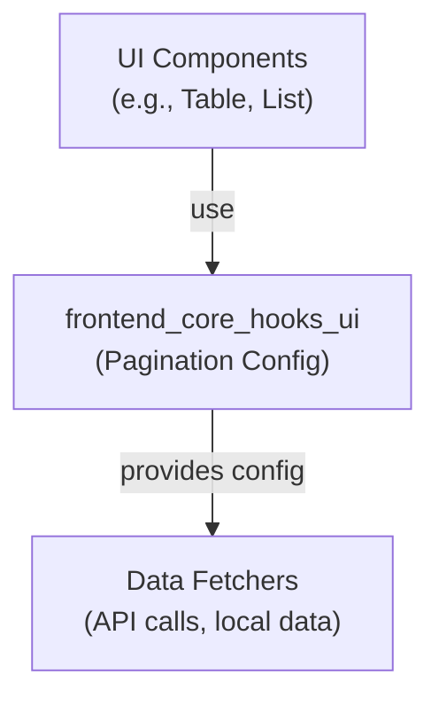
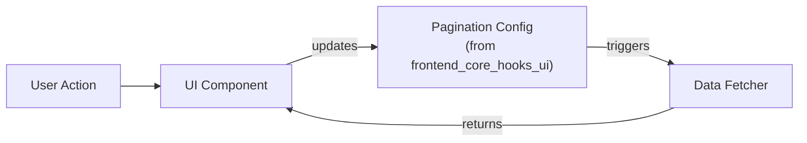

# frontend_core_hooks_ui Module Documentation

## Introduction

The `frontend_core_hooks_ui` module provides core pagination configuration hooks for frontend applications. It defines standardized configuration objects and utilities for managing both client-side and server-side pagination in UI components. This module is designed to be used by UI components that require paginated data display, such as tables, lists, and grids, ensuring a consistent and reusable approach to pagination logic across the frontend codebase.

## Core Components

- **ClientPaginationConfig**: Configuration for client-side pagination (pagination handled entirely in the browser).
- **ServerPaginationConfig**: Configuration for server-side pagination (pagination handled by backend API calls).

These configuration objects are typically used as props or context values in UI components, enabling them to manage pagination state, page size, and navigation in a standardized way.

## Architecture Overview

The `frontend_core_hooks_ui` module is a foundational utility layer that sits between UI components (such as those in [`frontend_core_components_ui.md`](frontend_core_components_ui.md)) and the data-fetching logic. It does not fetch data itself, but provides the configuration and state management patterns required for paginated data display.



- **UI Components**: Consume pagination config from `frontend_core_hooks_ui` to render paginated data and handle user interactions (page change, page size change, etc.).
- **Data Fetchers**: Use the config to request the correct data slice from the backend or local store.

## Component Relationships

### With UI Components

UI components such as tables, lists, and grids (see [`frontend_core_components_ui.md`](frontend_core_components_ui.md)) rely on the pagination config objects from this module to:
- Track current page and page size
- Handle user actions (next/previous page, page size change)
- Display pagination controls

### With Data Fetching Logic

When using server-side pagination, the `ServerPaginationConfig` is passed to data-fetching hooks or functions, which then use its values to construct API requests (e.g., including `page`, `pageSize`, or cursor tokens in the request).

For client-side pagination, `ClientPaginationConfig` is used to slice the already-fetched data array in the browser.

## Data Flow



- User interacts with pagination controls in the UI component
- UI component updates the pagination config (from this module)
- Pagination config triggers data fetching (for server-side) or data slicing (for client-side)
- UI component re-renders with the new data

## Example Usage

```typescript
import { ClientPaginationConfig, ServerPaginationConfig } from 'frontend_core_hooks_ui';

// Example: Using in a Table component
const [pagination, setPagination] = useState<ServerPaginationConfig>({
  page: 1,
  pageSize: 20,
  total: 0,
});

// Pass pagination config to data fetcher and UI component
<TableComponent
  pagination={pagination}
  onPageChange={setPagination}
/>
```

## Integration with Other Modules

- **UI Components**: See [`frontend_core_components_ui.md`](frontend_core_components_ui.md) for components that consume pagination config.
- **Data Fetching**: For server-side pagination, see API DTOs such as [`api_lib_dto.md`](api_lib_dto.md) and [`api_lib_dto_shared.md`](api_lib_dto_shared.md) for pagination-related request/response types (e.g., `CursorPaginationInput`).

## Extensibility

The pagination config pattern established in this module can be extended to support advanced features such as:
- Cursor-based pagination (see [`api_lib_dto_shared.md`](api_lib_dto_shared.md): `CursorPaginationInput`)
- Infinite scrolling
- Custom page size options

## Summary

The `frontend_core_hooks_ui` module is a lightweight but essential part of the frontend architecture, enabling consistent, reusable, and extensible pagination logic for UI components. It acts as a bridge between UI state and data-fetching logic, supporting both client-side and server-side pagination patterns.
