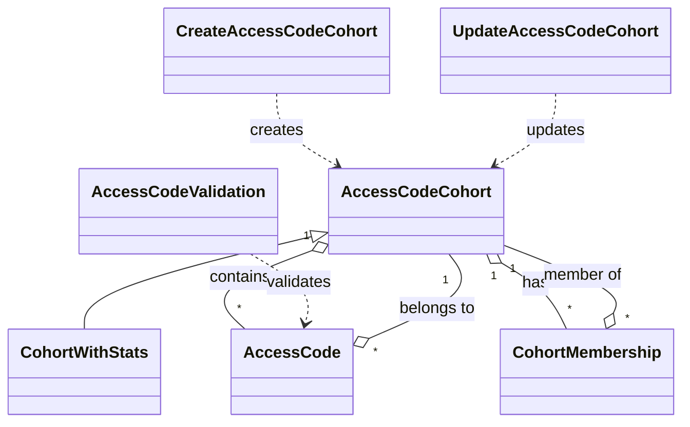
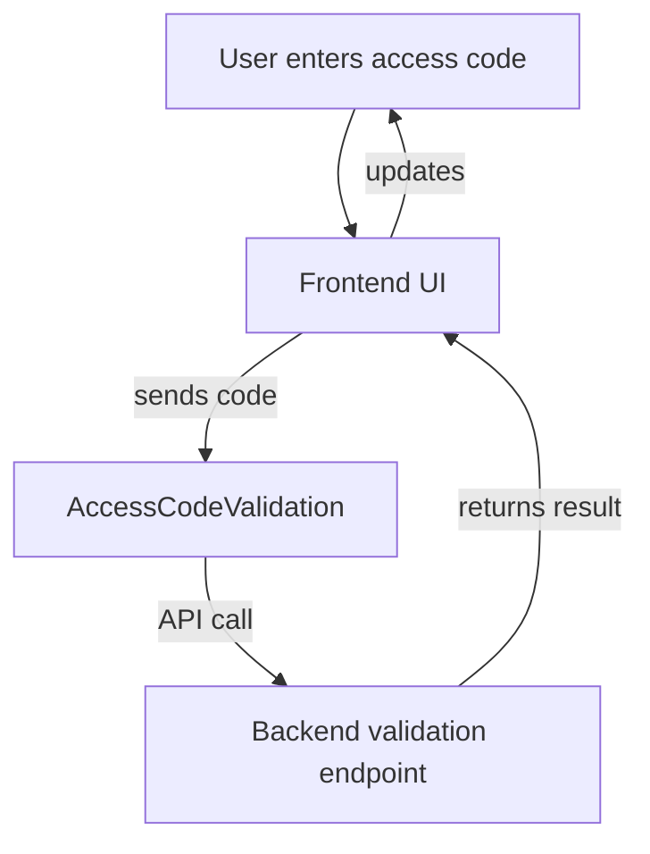
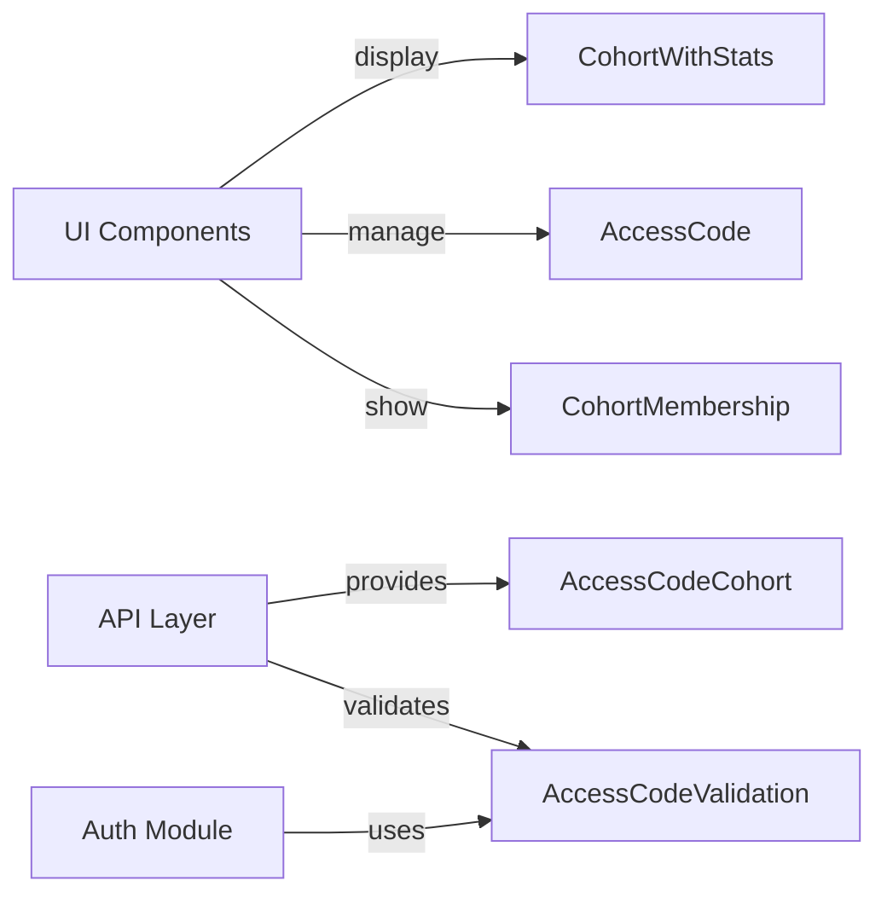

# frontend_core_types_access_code_cohorts

## Introduction

The `frontend_core_types_access_code_cohorts` module defines the core type structures for managing access code cohorts within the frontend application. These types are foundational for features related to access code distribution, cohort membership, validation, and cohort statistics. The module is designed to support robust access control and group-based feature enablement, often used in onboarding, beta programs, or segmented feature rollouts.

## Core Functionality

This module provides type definitions for:
- **Access Code Cohorts**: Logical groupings of access codes, often representing a user segment or experimental group.
- **Access Codes**: Unique codes that grant access to specific features or areas of the application.
- **Cohort Membership**: The relationship between users and cohorts, including membership status and metadata.
- **Cohort Statistics**: Aggregated data about cohort usage and membership.
- **Validation and Update Operations**: Structures for validating access codes and updating cohort information.

These types are used throughout the frontend to ensure type safety, facilitate API integration, and enable consistent UI/UX patterns for access code management.

## Core Components

- `AccessCodeCohort`: Represents a group of access codes with shared properties (e.g., name, description, creation date).
- `CreateAccessCodeCohort`: Structure for creating a new cohort, including required fields.
- `AccessCode`: Represents an individual access code, its status, and associated cohort.
- `CohortMembership`: Describes a user's membership in a cohort, including join date and status.
- `CohortWithStats`: Extends `AccessCodeCohort` with statistical data (e.g., number of members, codes used).
- `AccessCodeValidation`: Structure for validating an access code (e.g., for login or feature unlock).
- `UpdateAccessCodeCohort`: Structure for updating cohort properties.

## Architecture and Relationships

The following diagram illustrates the relationships between the core types in this module:



### Data Flow Example: Access Code Validation



## Integration with Other Modules

- **API Integration**: These types are typically used in conjunction with API DTOs (see [api_lib_dto_audit.md], [api_lib_dto_organization.md]) for sending and receiving cohort and access code data.
- **UI Components**: Types like `CohortWithStats` and `CohortMembership` are used by frontend components (see [frontend_core_components_ui.md], [frontend_core_components_features.md]) to display cohort information and manage user interactions.
- **Authentication and Authorization**: Access code validation types may interact with authentication flows (see [frontend_core_types_auth.md]).

## Example Usage

```typescript
import { AccessCodeCohort, AccessCode, CohortMembership } from './frontend_core_types_access_code_cohorts';

// Example: Creating a new cohort
const newCohort: CreateAccessCodeCohort = {
  name: 'Beta Testers',
  description: 'Cohort for beta feature access',
  // ...other required fields
};

// Example: Validating an access code
const validationRequest: AccessCodeValidation = {
  code: 'ABC123',
  // ...other validation fields
};
```

## Component Interaction Overview



## See Also

- [frontend_core_types_auth.md] - For authentication-related types and flows
- [frontend_core_components_ui.md] - For UI components that consume these types
- [api_lib_dto_organization.md] - For organization and cohort API DTOs

---
*This documentation is auto-generated. For implementation details, refer to the respective type definitions in the codebase.*
