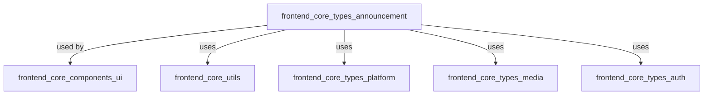
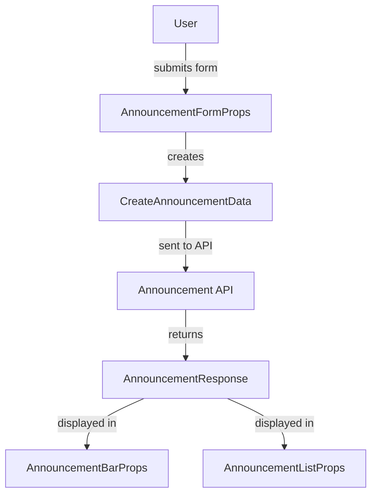
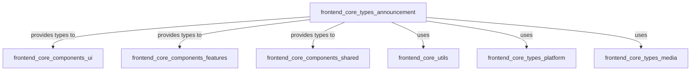

# frontend_core_types_announcement

## Introduction

The `frontend_core_types_announcement` module defines the core type definitions and data structures for managing announcements within the frontend application. These types are used throughout the frontend to support features such as announcement creation, listing, filtering, statistics, icon uploads, and display components. The module is designed to provide a strongly-typed interface for all announcement-related operations, ensuring consistency and type safety across the application.

This module is a foundational part of the announcement system and interacts with other frontend modules (such as UI components, shared utilities, and platform configuration) to deliver a seamless user experience for announcement management.

---

## Core Functionality

The module provides type definitions for:
- **Announcement creation and update**: Structures for creating and updating announcements, including support for icon uploads and platform-specific configuration.
- **Announcement listing and filtering**: Types for paginated listing, filtering, and sorting of announcements.
- **Announcement display**: Props for announcement bar and list components, as well as SVG icon support.
- **Statistics and validation**: Types for announcement statistics and validation logic.

---

## Architecture Overview

The `frontend_core_types_announcement` module is primarily a type definition module, but it plays a central role in the announcement feature set. It acts as the contract between the frontend UI, API data, and business logic for announcements.

- **UI Components**: Use the types for rendering announcement bars, lists, and forms.
- **Shared Utilities**: Used for storage options and platform configuration.
- **Platform and Media Types**: For platform-specific announcement targeting and media/icon handling.
- **Auth Types**: For permission and context-aware announcement features.

---

## Key Type Definitions

### Announcement Data Structures

- **AnnouncementFormProps**: Props for the announcement creation/edit form component.
- **AnnouncementListResponse**: Structure for paginated announcement list API responses.
- **AnnouncementFilters**: Filtering options for listing announcements.
- **AnnouncementSortOptions**: Sorting options for announcements.
- **AnnouncementStats**: Statistical data about announcements (e.g., counts, engagement).
- **AnnouncementValidation**: Validation result structure for announcement forms.
- **AnnouncementResponse**: The main announcement data structure as returned from the API.
- **AnnouncementBarProps**: Props for the announcement bar UI component.
- **AnnouncementListProps**: Props for the announcement list UI component.
- **SvgIcon**: Type for SVG icon data used in announcements.
- **IconUploadData / IconUploadResponse**: Types for handling icon uploads.
- **CreateAnnouncementData / UpdateAnnouncementData**: Payloads for creating and updating announcements.
- **GetAnnouncementsOptions**: Options for fetching announcements (pagination, filters, etc).
- **PlatformConfig**: Platform targeting configuration for announcements.

### Example Data Flow

---

## Component Relationships

The following diagram illustrates how the announcement types interact with other modules and components:

- **frontend_core_components_ui**: Uses types for rendering and managing announcement UI elements.
- **frontend_core_components_features**: May use types for feature-specific announcement displays.
- **frontend_core_components_shared**: Uses types for shared announcement-related components.
- **frontend_core_utils**: Provides utility types such as `AnnouncementStorageOptions`.
- **frontend_core_types_platform**: Used for platform-specific announcement targeting.
- **frontend_core_types_media**: Used for handling media and icons in announcements.

---

## Data Flow and Process

### Announcement Lifecycle

1. **Creation**: User fills out an announcement form (`AnnouncementFormProps`), which is validated (`AnnouncementValidation`) and submitted as `CreateAnnouncementData`.
2. **API Interaction**: The data is sent to the backend API, which returns an `AnnouncementResponse`.
3. **Listing & Filtering**: Announcements are fetched using `GetAnnouncementsOptions` and displayed using `AnnouncementListProps`.
4. **Icon Upload**: Icons are uploaded using `IconUploadData`, and the result is handled as `IconUploadResponse`.
5. **Display**: Announcements are rendered in the UI using `AnnouncementBarProps` and related types.

---

## Integration with Other Modules

- **Platform Targeting**: Uses [frontend_core_types_platform.md] for platform-specific configuration.
- **Media Handling**: Uses [frontend_core_types_media.md] for icon and media data.
- **Authentication Context**: May use [frontend_core_types_auth.md] for context-aware features.
- **UI Components**: Types are consumed by [frontend_core_components_ui.md] and [frontend_core_components_features.md].
- **Utilities**: Relies on [frontend_core_utils.md] for storage and platform options.

---

## References

- [frontend_core_types_platform.md]
- [frontend_core_types_media.md]
- [frontend_core_types_auth.md]
- [frontend_core_components_ui.md]
- [frontend_core_components_features.md]
- [frontend_core_utils.md]

---

## Summary

The `frontend_core_types_announcement` module is the backbone of the announcement feature in the frontend application, providing all necessary type definitions for creating, updating, listing, filtering, and displaying announcements. It ensures type safety and consistency across the announcement lifecycle and integrates closely with platform, media, authentication, and UI component modules.
