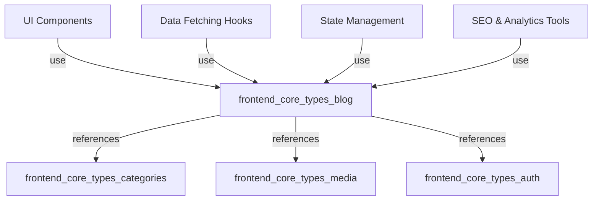
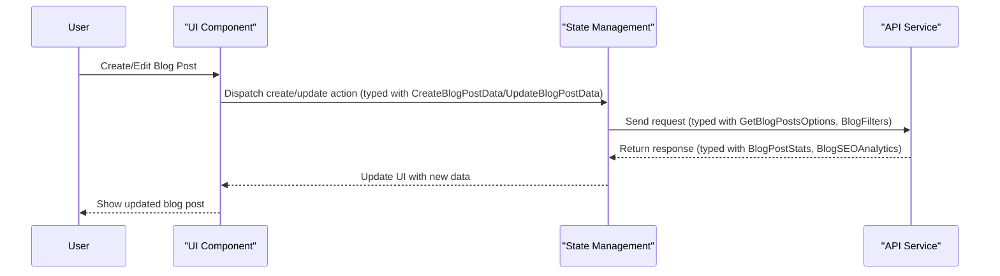
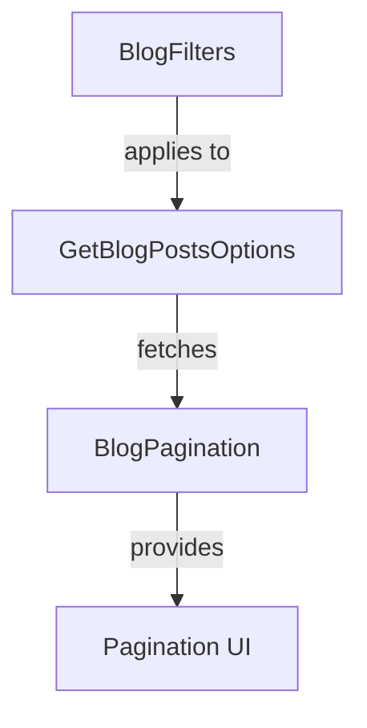

# frontend_core_types_blog Module Documentation

## Introduction

The `frontend_core_types_blog` module defines the core TypeScript types and interfaces used to represent, filter, and manage blog-related data in the frontend application. It provides a strongly-typed foundation for blog post creation, editing, filtering, SEO analytics, category management, and pagination. This module is essential for ensuring type safety and consistency across all blog-related features in the frontend codebase.

This module is typically consumed by UI components, data-fetching hooks, and state management logic that deal with blog posts, categories, and related analytics. It is designed to be interoperable with other frontend type modules such as [`frontend_core_types_categories.md`](frontend_core_types_categories.md), [`frontend_core_types_auth.md`](frontend_core_types_auth.md), and [`frontend_core_types_media.md`](frontend_core_types_media.md).

---

## Core Components

### 1. Blog Post Data Types

- **CreateBlogPostData**: Structure for creating a new blog post (title, content, categories, tags, etc.).
- **UpdateBlogPostData**: Structure for updating an existing blog post.
- **BlogPostStats**: Statistical data about a blog post (views, likes, shares, etc.).
- **BlogSEOAnalytics**: SEO analysis results for a blog post.
- **SEOAnalysisResult**: Detailed SEO analysis output.
- **SEOAnalysisOptions**: Options for running SEO analysis.

### 2. Blog Filtering and Search

- **BlogFilters**: Criteria for filtering blog posts (categories, tags, date range, etc.).
- **BlogFilterSidebarProps**: Props for the blog filter sidebar UI component.
- **BlogSearchParams**: URL/search parameters for blog post queries.
- **GetBlogPostsOptions**: Options for fetching blog posts (pagination, filters, etc.).
- **BlogPagination**: Pagination information for blog post lists.

### 3. Blog Categories

- **BlogCategoryType**: Type definition for a blog category.
- **BlogCategoryForSidebar**: Category data for sidebar display.

### 4. Platform Configuration

- **PlatformConfig**: Configuration for platform-specific blog features (may be shared with other modules, e.g., announcements).

---

## Architecture Overview

The `frontend_core_types_blog` module is a pure type definition module. It does not contain business logic or state, but it is foundational for the following frontend layers:

- **UI Components**: Components for displaying, filtering, and editing blog posts rely on these types for props and state.
- **Data Fetching**: Hooks and services that fetch blog data from APIs use these types for request/response typing.
- **State Management**: Redux or context state slices for blog data are typed using these interfaces.
- **SEO and Analytics**: Types for SEO analysis and blog statistics are used in analytics dashboards and SEO tools.

### Component Relationships

---

## Data Flow and Usage

### Blog Post Lifecycle

---

## Dependencies and Integration

- **Categories**: Blog post types reference category types from [`frontend_core_types_categories.md`](frontend_core_types_categories.md) and [`frontend_core_types_category.md`](frontend_core_types_category.md).
- **Media**: Blog posts may include media, referencing types from [`frontend_core_types_media.md`](frontend_core_types_media.md).
- **Auth**: Some blog operations may require authentication, using types from [`frontend_core_types_auth.md`](frontend_core_types_auth.md).
- **PlatformConfig**: Shared with other modules such as announcements ([`frontend_core_types_announcement.md`](frontend_core_types_announcement.md)).

---

## Example: Blog Filtering and Pagination

---

## Related Modules

- [frontend_core_types_categories.md](frontend_core_types_categories.md)
- [frontend_core_types_category.md](frontend_core_types_category.md)
- [frontend_core_types_media.md](frontend_core_types_media.md)
- [frontend_core_types_auth.md](frontend_core_types_auth.md)
- [frontend_core_types_announcement.md](frontend_core_types_announcement.md)

---

## Summary

The `frontend_core_types_blog` module is a foundational type definition library for all blog-related features in the frontend. It ensures type safety, consistency, and maintainability for blog post management, filtering, analytics, and integration with categories, media, and authentication systems. For implementation details and business logic, refer to the relevant UI component and service modules.