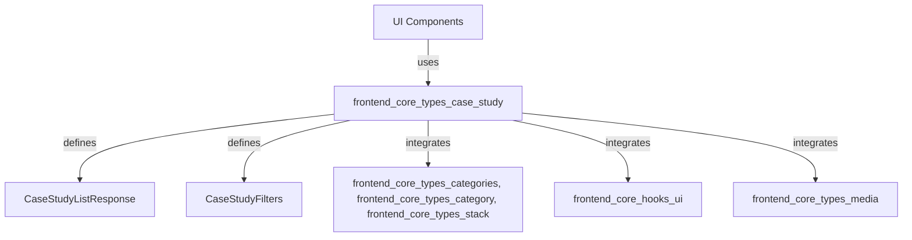
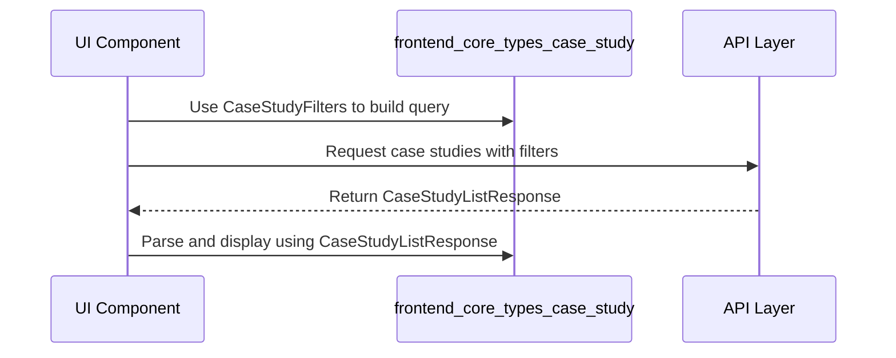
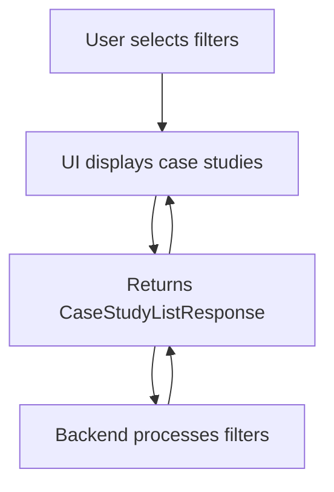

# frontend_core_types_case_study Module Documentation

## Introduction

The `frontend_core_types_case_study` module defines the core type interfaces and data structures for handling case study data within the frontend application. It provides a standardized way to represent, filter, and manage lists of case studies, supporting features such as filtering, pagination, and integration with other frontend modules. This module is essential for any UI or logic that displays or manipulates case study information, ensuring consistency and type safety across the codebase.

## Core Components

- **CaseStudyListResponse**: Represents the response structure for a paginated list of case studies, typically including metadata such as total count and the list of case study items.
- **CaseStudyFilters**: Defines the available filtering options for querying case studies, such as by category, tags, or other attributes.

## Module Architecture and Relationships

The `frontend_core_types_case_study` module is part of a broader ecosystem of frontend type modules, each responsible for a specific domain (e.g., blog, announcement, stack, team). It interacts with other modules to provide a seamless experience for filtering, displaying, and managing case studies in the frontend.

### High-Level Architecture



- **UI Components**: Consume the types defined in this module to render case study lists, filter UIs, and detail pages.
- **Filters Integration**: Filtering options may leverage types from `frontend_core_types_categories`, `frontend_core_types_category`, and `frontend_core_types_stack` for category and stack-based filtering.
- **Pagination**: Pagination configuration and response types are shared with `frontend_core_hooks_ui` and other list-based modules.
- **Media Integration**: Case studies may include media assets, referencing types from `frontend_core_types_media`.

### Data Flow



## Component Details

### CaseStudyListResponse
- **Purpose**: Encapsulates the result of a case study list query, including the list of case studies and pagination metadata.
- **Typical Fields**:
  - `items`: Array of case study objects
  - `totalCount`: Total number of case studies matching the filter
  - `page`: Current page number
  - `pageSize`: Number of items per page

### CaseStudyFilters
- **Purpose**: Defines the structure for filtering case studies in the UI or API requests.
- **Typical Fields**:
  - `category`: Category or categories to filter by (see [frontend_core_types_categories.md])
  - `tags`: Tags to filter by
  - `search`: Free-text search query
  - `stack`: Stack or technology filter (see [frontend_core_types_stack.md])

## Integration with Other Modules

- **Categories**: Filtering by category uses types from [frontend_core_types_categories.md] and [frontend_core_types_category.md].
- **Stack**: Stack-based filtering and display use [frontend_core_types_stack.md].
- **Media**: Case studies may reference media types from [frontend_core_types_media.md].
- **Pagination**: Pagination configuration and hooks are shared with [frontend_core_hooks_ui.md].

## Example Usage

```typescript
import { CaseStudyFilters, CaseStudyListResponse } from './frontend_core_types_case_study';

const filters: CaseStudyFilters = {
  category: 'AI',
  tags: ['machine learning', 'NLP'],
  search: 'automation',
  stack: 'React',
};

// Fetch case studies using filters (pseudo-code)
const response: CaseStudyListResponse = await fetchCaseStudies(filters);
console.log(response.items);
```

## Process Flow: Filtering and Displaying Case Studies



## See Also

- [frontend_core_types_categories.md] - Category types and filtering
- [frontend_core_types_stack.md] - Stack/technology types
- [frontend_core_types_media.md] - Media asset types
- [frontend_core_hooks_ui.md] - Pagination and UI hooks

## Summary

The `frontend_core_types_case_study` module is a foundational part of the frontend type system, enabling robust, type-safe handling of case study data. By integrating with category, stack, media, and pagination modules, it supports flexible and powerful case study features in the frontend application.
