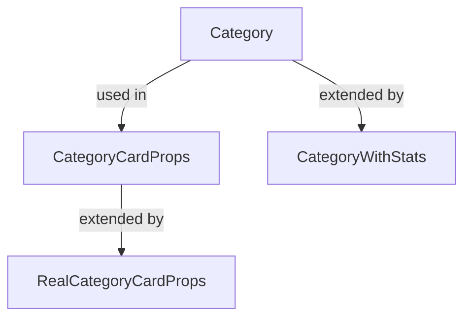
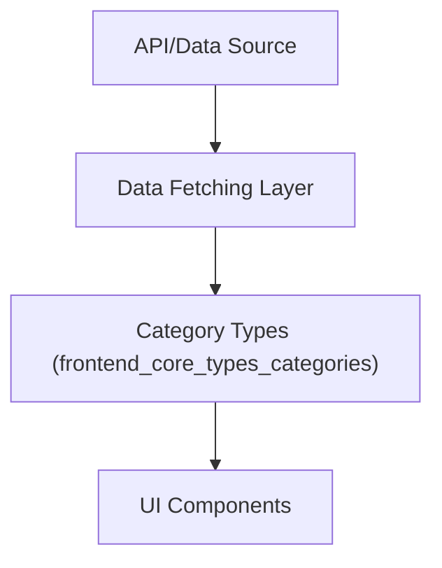

# frontend_core_types_categories Module Documentation

## Introduction

The `frontend_core_types_categories` module defines the core type structures and props related to categories within the frontend application. These types are foundational for representing, displaying, and managing category data, especially in UI components such as category cards, category lists, and analytics dashboards. The module is designed to ensure type safety and consistency across the application when dealing with category-related data.

This module is closely related to, and sometimes overlaps with, the [`frontend_core_types_category`](frontend_core_types_category.md) module, which provides more granular category data types. For a complete understanding of category data handling, refer to both modules.

---

## Core Components

### 1. `CategoryCardProps`
Defines the properties required by a category card UI component. This type ensures that all necessary data for rendering a category card is available and correctly typed.

### 2. `Category`
Represents the main data structure for a category. This type typically includes fields such as `id`, `name`, `description`, and possibly metadata or statistics relevant to the category.

### 3. `RealCategoryCardProps`
A specialized or extended version of `CategoryCardProps`, possibly used for more detailed or interactive category card components. This type may include additional fields for advanced UI features.

### 4. `CategoryWithStats`
Extends the basic `Category` type to include statistical information, such as the number of items in the category, usage metrics, or other analytics data. This is useful for dashboards or analytics views.

---

## Architecture and Relationships

The `frontend_core_types_categories` module is primarily a type definition module. It does not contain business logic or state management, but its types are widely used across the frontend codebase, especially in UI components and data-fetching hooks.

### Component Relationships



- **Category**: The base data structure.
- **CategoryCardProps**: Uses `Category` to define the props for category card components.
- **RealCategoryCardProps**: Extends `CategoryCardProps` for more advanced use cases.
- **CategoryWithStats**: Extends `Category` to include analytics/statistics.

### Module Dependencies

- **UI Components**: Types from this module are consumed by components in [`frontend_core_components_features`](frontend_core_components_features.md) and [`frontend_core_components_ui`](frontend_core_components_ui.md), especially those rendering category cards, lists, or analytics.
- **Category Data Types**: For more detailed or alternative category data structures, see [`frontend_core_types_category`](frontend_core_types_category.md).
- **Stack and Blog Types**: Categories are often used in conjunction with stack and blog features, referencing types from [`frontend_core_types_stack`](frontend_core_types_stack.md) and [`frontend_core_types_blog`](frontend_core_types_blog.md).

---

## Data Flow and Usage

The typical data flow involving this module is as follows:



- **A. API/Data Source**: Category data is fetched from backend APIs or static sources.
- **B. Data Fetching Layer**: Data is retrieved and mapped to the types defined in this module.
- **C. Category Types**: Types from this module ensure type safety and consistency.
- **D. UI Components**: Components consume these types to render category-related UI.

---

## Example Usage

```typescript
import { CategoryCardProps, CategoryWithStats } from 'frontend_core_types_categories';

const categoryCard: CategoryCardProps = {
  id: 'marketing',
  name: 'Marketing',
  description: 'All marketing related tools and resources',
  // ...other props
};

const categoryStats: CategoryWithStats = {
  id: 'engineering',
  name: 'Engineering',
  description: 'Engineering tools',
  itemCount: 42,
  // ...other stats
};
```

---

## Related Modules

- [`frontend_core_types_category`](frontend_core_types_category.md): For additional and more granular category data types.
- [`frontend_core_components_features`](frontend_core_components_features.md): UI components that consume these types.
- [`frontend_core_types_stack`](frontend_core_types_stack.md): Stack-related types that often reference categories.
- [`frontend_core_types_blog`](frontend_core_types_blog.md): Blog and content types that may use categories for organization.

---

## Summary

The `frontend_core_types_categories` module is a foundational part of the frontend type system, providing robust and reusable types for category data. Its types are essential for building consistent, type-safe UI components and for integrating category data across the application. For implementation details and advanced category data handling, refer to the related modules listed above.
