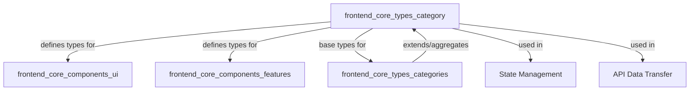
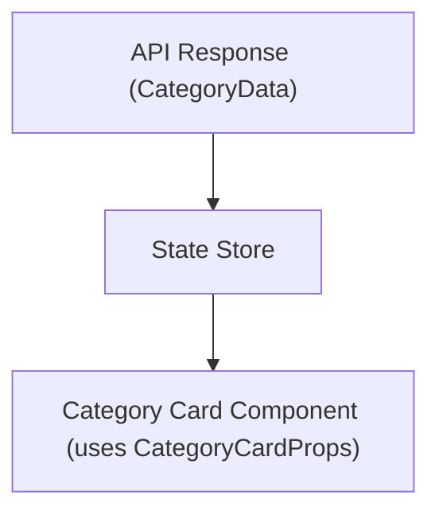

# frontend_core_types_category Module Documentation

## Introduction

The `frontend_core_types_category` module defines the core TypeScript types and interfaces related to categories within the frontend application. These types are foundational for representing, displaying, and manipulating category data in UI components, filtering logic, and API interactions. The module is designed to ensure type safety and consistency across the application wherever category-related data is handled.

This module is closely related to, but distinct from, [`frontend_core_types_categories`](frontend_core_types_categories.md), which provides additional types and props for category cards and statistics. For broader context on category usage in the frontend, refer to that module as well.

## Core Components

### 1. `CategoryCardProps`
Defines the properties required by a UI component that renders a category card. This type ensures that all necessary data for displaying a category in card format is available and correctly typed.

**Typical fields include:**
- `id`: Unique identifier for the category
- `name`: Display name of the category
- `description`: Short description or summary
- `icon`: Icon or image representing the category
- `stats`: (Optional) Statistical data related to the category

This type is used by category card components in the UI, ensuring a consistent interface for rendering category information.

### 2. `CategoryData`
Represents the core data structure for a category entity. This type is used throughout the frontend for storing, transferring, and manipulating category data.

**Typical fields include:**
- `id`: Unique identifier
- `name`: Name of the category
- `description`: Description or summary
- `icon`: Icon or image reference
- `createdAt`: Timestamp of creation
- `updatedAt`: Timestamp of last update
- `stats`: (Optional) Associated statistics

This type is often used in API responses, state management, and as a base for more complex category-related types.

## Architecture and Relationships

The `frontend_core_types_category` module is part of the broader type system for the frontend. It interacts with several other modules:

- **UI Components:** Types like `CategoryCardProps` are consumed by UI modules such as [`frontend_core_components_ui`](frontend_core_components_ui.md) and [`frontend_core_components_features`](frontend_core_components_features.md) for rendering category cards and related UI elements.
- **Category Collections:** For handling lists, statistics, and advanced category card props, see [`frontend_core_types_categories`](frontend_core_types_categories.md).
- **State Management & API:** `CategoryData` is used in state stores and in API data transfer, ensuring consistency between backend and frontend representations.

### Module Dependency Diagram

### Data Flow Example

## Usage in the System

- **UI Rendering:** Category data is passed as `CategoryCardProps` to UI components for display.
- **Data Consistency:** `CategoryData` ensures that category information remains consistent across API, state, and UI layers.
- **Extensibility:** Other modules, such as [`frontend_core_types_categories`](frontend_core_types_categories.md), build on these base types to provide richer category-related functionality.

## Related Modules

- [`frontend_core_types_categories`](frontend_core_types_categories.md): Advanced types and props for category collections and statistics.
- [`frontend_core_components_ui`](frontend_core_components_ui.md): UI components that consume category types.
- [`frontend_core_components_features`](frontend_core_components_features.md): Feature components that may display or interact with categories.

## Summary

The `frontend_core_types_category` module provides the essential type definitions for category data in the frontend. It serves as the foundation for category-related UI components, state management, and API interactions, and is extended by other modules for more advanced use cases.
