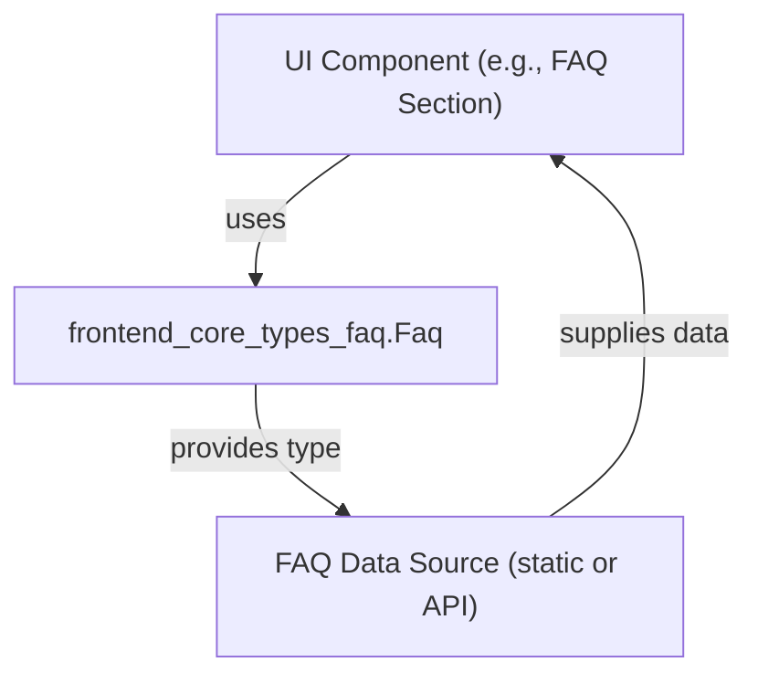
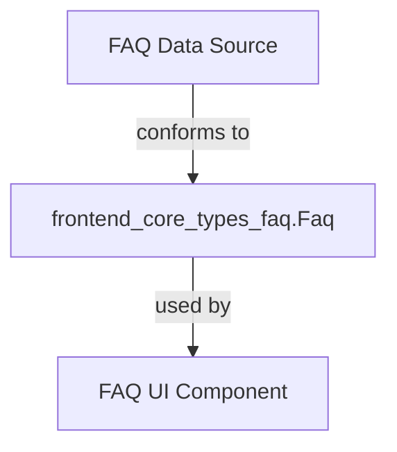

# frontend_core_types_faq Module Documentation

## Introduction

The `frontend_core_types_faq` module defines the core data structure for representing Frequently Asked Questions (FAQs) within the frontend application. This module provides a type-safe way to manage FAQ items, which are commonly used to display help, onboarding, or informational content to end users. It is designed to be easily integrated with UI components and other frontend modules that require FAQ data.

## Core Functionality

At its core, the module introduces the `Faq` type, which encapsulates the essential properties of an FAQ item. This type is intended to be used throughout the frontend codebase wherever FAQ data is needed, such as in FAQ sections, help dialogs, onboarding flows, or support pages.

### Key Features
- **Type Safety:** Ensures FAQ data is consistently structured across the application.
- **Reusability:** The `Faq` type can be imported and used by various UI components and feature modules.
- **Extensibility:** Designed to be extended or composed with additional properties if needed for more complex FAQ scenarios.

## Component Overview

### Faq (Core Component)

The `Faq` type typically includes the following fields:
- `question` (string): The FAQ question text.
- `answer` (string): The answer or explanation for the question.
- (Optional) Additional metadata such as `id`, `category`, or `tags` may be included depending on implementation needs.

> **Note:** For the exact type definition, refer to the source code or type declaration in the module.

## Architecture and Integration

The `frontend_core_types_faq` module is a foundational type module and does not contain business logic or UI components. Instead, it serves as a building block for other modules and components that require FAQ data.

### Typical Usage Flow

- **UI Components:** Components such as FAQ lists, onboarding walkthroughs, or help dialogs import the `Faq` type to ensure type safety.
- **Data Sources:** FAQ data can be hardcoded, fetched from an API, or loaded from a CMS, but is always structured according to the `Faq` type.

### Example Integration

The `Faq` type is often used in conjunction with UI components from the [`frontend_core_components`](frontend_core_components.md) module, such as `FaqItem` or FAQ list renderers. This ensures that FAQ data is displayed consistently and can be easily maintained.

## Dependencies and Relationships

- **Upstream:**
  - No direct dependencies; this module is self-contained and only provides a type definition.
- **Downstream:**
  - Consumed by UI and feature modules such as [`frontend_core_components`](frontend_core_components.md), [`frontend_core_components_shared_onboarding`](frontend_core_components_shared_onboarding.md), and others that display or manipulate FAQ data.

## Data Flow Diagram

## Extending FAQ Functionality

If your application requires more advanced FAQ features (e.g., categorization, search, analytics), consider extending the `Faq` type or composing it with additional types from related modules such as [`frontend_core_types_categories`](frontend_core_types_categories.md) or [`frontend_core_types_logs_types`](frontend_core_types_logs_types.md) for logging FAQ interactions.

## References
- [frontend_core_components](frontend_core_components.md)
- [frontend_core_components_shared_onboarding](frontend_core_components_shared_onboarding.md)
- [frontend_core_types_categories](frontend_core_types_categories.md)
- [frontend_core_types_logs_types](frontend_core_types_logs_types.md)

## Summary

The `frontend_core_types_faq` module provides a simple yet essential type definition for FAQ items, enabling consistent and type-safe handling of FAQ data across the frontend application. It is a foundational building block for any feature or component that needs to display or process FAQ content.
