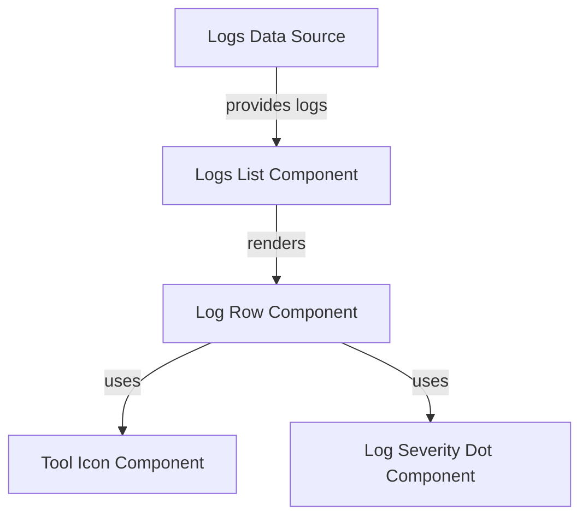

# frontend_core_types_logs_types Module Documentation

## Introduction

The `frontend_core_types_logs_types` module defines core type interfaces and props used for log-related UI components in the frontend application. These types are essential for ensuring type safety and consistency across log display, filtering, and visualization components. The module is primarily used by UI components that render logs, log severity indicators, and tool icons associated with log entries.

## Core Components

### 1. ToolIconProps
Defines the properties required to render an icon representing a tool in the context of a log entry. This type is typically used by UI components that display which tool generated or is associated with a particular log event.

**Usage Example:**
```typescript
import { ToolIconProps } from 'frontend_core_types_logs_types';

const iconProps: ToolIconProps = {
  toolName: 'FleetMDM',
  iconUrl: 'https://cdn.example.com/icons/fleetmdm.svg',
  size: 24,
};
```

### 2. LogsListProps
Defines the properties for a component that renders a list of log entries. This type ensures that the log list component receives all necessary data and configuration for displaying logs, handling pagination, and supporting filtering or sorting.

**Usage Example:**
```typescript
import { LogsListProps } from 'frontend_core_types_logs_types';

const logsListProps: LogsListProps = {
  logs: [/* array of log objects */],
  onLogClick: (log) => { /* handle log click */ },
  pagination: { page: 1, pageSize: 20, total: 100 },
  filters: {/* filter options */},
};
```

### 3. LogSeverityDotProps
Defines the properties for a component that visually indicates the severity of a log entry (e.g., info, warning, error) using a colored dot or similar marker. This type is used by UI elements that provide quick visual cues about log importance or urgency.

**Usage Example:**
```typescript
import { LogSeverityDotProps } from 'frontend_core_types_logs_types';

const severityDotProps: LogSeverityDotProps = {
  severity: 'error',
  size: 12,
};
```

## Architecture and Component Relationships

The types in this module are designed to be used by UI components, primarily from the following modules:
- [frontend_core_components_ui](frontend_core_components_ui.md): Components such as `LogTableRowProps` and `TableProps` utilize these types to render log data and severity indicators.
- [frontend_core_components_features](frontend_core_components_features.md): May use `ToolIconProps` for displaying tool associations in log-related features.

### Data Flow and Interaction



- **Logs Data Source**: Could be an API or state management store providing log data.
- **Logs List Component**: Receives `LogsListProps` and renders a list of log rows.
- **Log Row Component**: For each log, renders details and uses `ToolIconProps` and `LogSeverityDotProps` for tool and severity visualization.

## Dependencies and Integration

- **Log Data**: The types expect log data structures that may be defined elsewhere (e.g., in backend DTOs or shared frontend types).
- **UI Components**: These types are consumed by UI components for rendering and interaction logic.
- **Filtering and Pagination**: Integration with filtering and pagination types (see [frontend_core_hooks_ui](frontend_core_hooks_ui.md)) is common for log list components.

## How It Fits Into the System

The `frontend_core_types_logs_types` module acts as a contract between log data sources and UI components, ensuring that log-related data is passed and rendered consistently. It enables:
- Type-safe log rendering in tables and lists
- Consistent severity indication across the UI
- Clear association of logs with tools via icons

## References
- [frontend_core_components_ui.md](frontend_core_components_ui.md)
- [frontend_core_components_features.md](frontend_core_components_features.md)
- [frontend_core_hooks_ui.md](frontend_core_hooks_ui.md)

---
*For details on log data structures and filtering options, see the relevant backend DTO modules or shared frontend types.*
