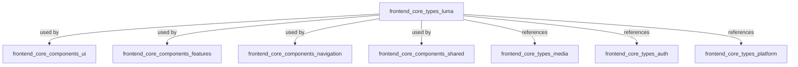
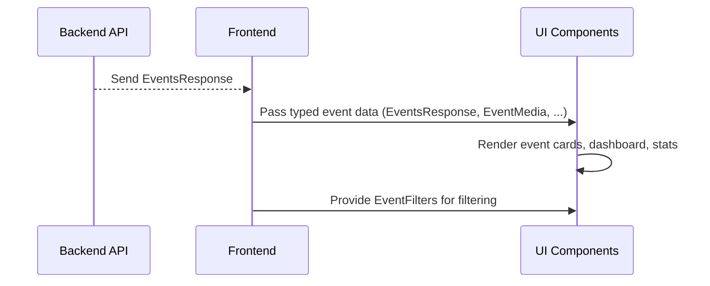

# frontend_core_types_luma Module Documentation

## Introduction

The `frontend_core_types_luma` module defines the core TypeScript types and interfaces used for representing Luma event data, event participants, event statistics, and related UI properties in the frontend application. This module is essential for ensuring type safety and consistency when building features related to Luma events, such as event dashboards, event cards, and event filtering mechanisms.

This module is primarily consumed by frontend components and hooks that display, filter, and interact with Luma event data. It also serves as a contract for data exchanged between the frontend and backend APIs regarding Luma events.

## Core Functionality

The module provides type definitions for:
- **Event data structures** (e.g., `EventMedia`, `EventsResponse`, `EventStatsResponse`)
- **Event participants** (e.g., `LumaEventGuest`, `LumaEventHost`)
- **Event location and time information** (`EventLocationInfo`, `EventTimeInfo`)
- **Event filtering and dashboard UI** (`EventFilters`, `EventCardProps`, `EventsDashboardProps`)

These types are used throughout the frontend to:
- Render event lists, cards, and dashboards
- Display event details, media, and statistics
- Filter and search for events
- Represent event hosts and guests

## Component Overview

| Type / Interface         | Description                                                      |
|-------------------------|------------------------------------------------------------------|
| `EventMedia`            | Represents media (images, videos) associated with an event        |
| `EventsResponse`        | API response structure for a list of events                       |
| `LumaEventGuest`        | Represents a guest attending a Luma event                         |
| `EventStatsResponse`    | Statistics related to events (e.g., attendance, engagement)       |
| `LumaEventHost`         | Represents the host of a Luma event                               |
| `EventLocationInfo`     | Information about the event's location                            |
| `EventFilters`          | Filtering options for querying events                             |
| `EventCardProps`        | Props for rendering an event card in the UI                       |
| `EventTimeInfo`         | Information about the event's timing                              |
| `EventsDashboardProps`  | Props for rendering the events dashboard UI                       |

## Architecture & Relationships

The `frontend_core_types_luma` module is a **pure type definition module**. It does not contain business logic or state, but its types are foundational for many frontend features. The relationships between its types and other modules can be visualized as follows:



### Data Flow Example

1. **API Response**: The frontend receives an `EventsResponse` from the backend API.
2. **Type Mapping**: The response is typed using `EventsResponse` and its nested types (`EventMedia`, `LumaEventHost`, etc.).
3. **UI Rendering**: Components such as event cards and dashboards use these types to render event information, media, and statistics.
4. **Filtering**: The `EventFilters` type is used to construct queries and filter the displayed events.



## Dependencies

- **[frontend_core_types_media](frontend_core_types_media.md)**: For media objects associated with events.
- **[frontend_core_types_auth](frontend_core_types_auth.md)**: For user authentication and context types (e.g., hosts, guests).
- **[frontend_core_types_platform](frontend_core_types_platform.md)**: For platform-specific statistics or event data.

## Usage in the System

The types defined in this module are used by:
- Event-related UI components (cards, dashboards, lists)
- Event filtering and search features
- Data mapping from API responses to frontend state
- Displaying event hosts, guests, media, and statistics

## Example: Event Card Rendering

A typical usage pattern involves receiving an `EventsResponse` from the API, mapping it to a list of event cards, and rendering each card using `EventCardProps`:

```typescript
import { EventsResponse, EventCardProps } from './frontend_core_types_luma';

function renderEventCards(eventsResponse: EventsResponse) {
  return eventsResponse.events.map(event => (
    <EventCard {...(event as EventCardProps)} />
  ));
}
```

## Related Documentation

- [frontend_core_types_media.md](frontend_core_types_media.md)
- [frontend_core_types_auth.md](frontend_core_types_auth.md)
- [frontend_core_types_platform.md](frontend_core_types_platform.md)
- [frontend_core_components_ui.md](frontend_core_components_ui.md)
- [frontend_core_components_features.md](frontend_core_components_features.md)

## Summary

The `frontend_core_types_luma` module is a foundational type definition module for Luma event features in the frontend. It enables type-safe, consistent, and maintainable development of event-related UI and logic, and integrates with other core type and component modules in the system.
