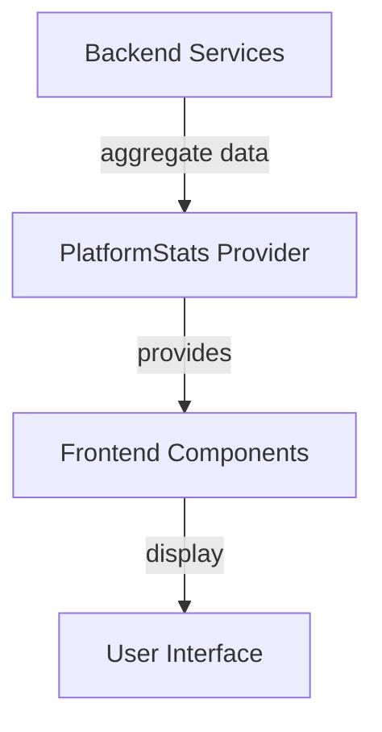
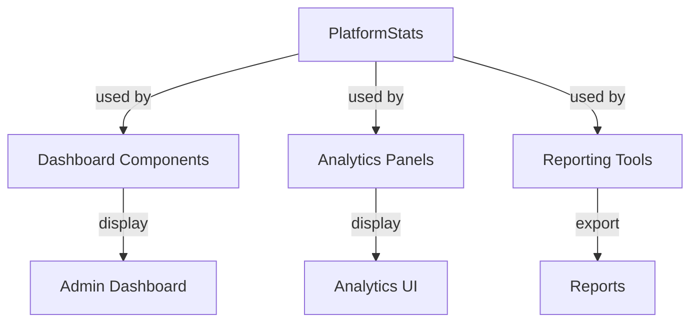

# frontend_core_types_platform Module Documentation

## Introduction

The `frontend_core_types_platform` module provides type definitions and data structures related to platform-level statistics and analytics for the frontend application. It is designed to standardize the representation of platform-wide metrics, enabling consistent data handling and display across various frontend features such as dashboards, analytics panels, and reporting tools.

This module is typically used in conjunction with other frontend type modules (e.g., [frontend_core_types_stack.md], [frontend_core_types_team.md], [frontend_core_types_announcement.md]) to provide a comprehensive view of platform activity, user engagement, and system health.

## Core Component: PlatformStats

### Purpose

The `PlatformStats` type encapsulates aggregated statistics about the platform. This may include metrics such as user counts, active sessions, integrations, tool usage, and other KPIs relevant to platform administrators and stakeholders.

### Example Structure

```typescript
export interface PlatformStats {
    totalUsers: number;
    activeUsers: number;
    totalOrganizations: number;
    activeOrganizations: number;
    totalIntegrations: number;
    activeIntegrations: number;
    totalTools: number;
    activeTools: number;
    // ...additional fields as required by the platform
}
```

*Note: The actual fields may vary based on implementation. Refer to the source code for the most up-to-date structure.*

### Usage

- **Dashboard Analytics:** Displaying high-level metrics on admin or analytics dashboards.
- **Reporting:** Feeding data into reports or exports for business intelligence.
- **Health Monitoring:** Tracking platform growth, engagement, and integration health.

## Architecture and Data Flow

The `PlatformStats` type is typically populated by aggregating data from various backend services and APIs. The data flow can be visualized as follows:



- **Backend Services:** Source of raw data (users, organizations, integrations, tools, etc.)
- **PlatformStats Provider:** Aggregates and formats data into the `PlatformStats` structure
- **Frontend Components:** Consume `PlatformStats` for display and analytics
- **User Interface:** Final presentation to end-users or administrators

## Dependencies and Integration

The `frontend_core_types_platform` module is designed to be interoperable with other frontend type modules, such as:

- [frontend_core_types_stack.md]: For stack-related statistics and analytics
- [frontend_core_types_team.md]: For team/user-related metrics
- [frontend_core_types_announcement.md]: For platform-wide announcements and engagement tracking

It may also rely on backend API responses that aggregate data from modules such as `api_service_core_dto`, `api_service_core_service`, and others responsible for providing organization, user, and integration data.

## Component Interaction Diagram



## Extending PlatformStats

To extend the `PlatformStats` type with additional metrics, coordinate with backend teams to ensure new fields are supported in API responses. Update the type definition and ensure all consuming components are aware of the changes.

## Related Documentation

- [frontend_core_types_stack.md]: Stack analytics and statistics
- [frontend_core_types_team.md]: Team and user metrics
- [frontend_core_types_announcement.md]: Announcements and engagement
- [api_service_core_dto.md]: Backend DTOs for platform data

## Summary

The `frontend_core_types_platform` module provides a unified structure for platform-level statistics, enabling consistent analytics and reporting across the frontend application. It acts as a bridge between backend data aggregation and frontend visualization, supporting a wide range of administrative and analytical use cases.
