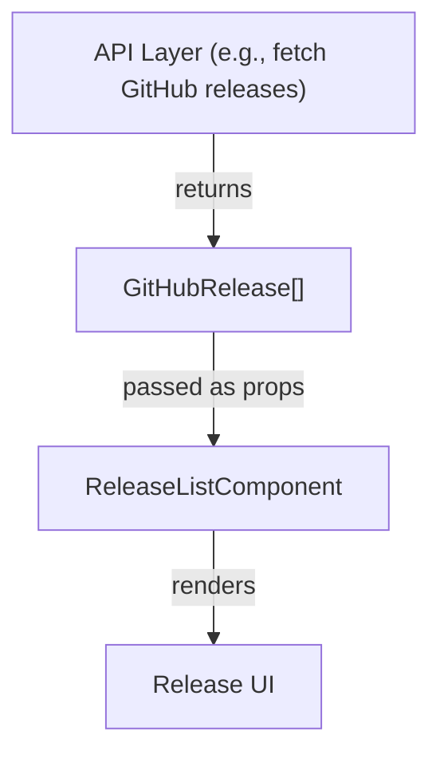
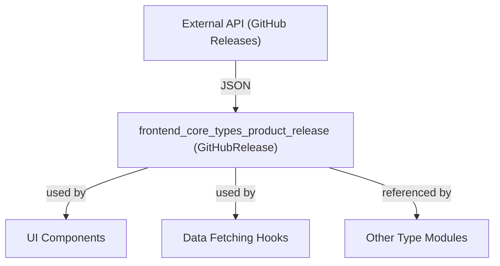

# frontend_core_types_product_release

## Introduction

The `frontend_core_types_product_release` module defines the core type(s) related to product releases for the frontend application. Its primary purpose is to provide a strongly-typed representation of product release data, typically sourced from external systems such as GitHub, and to facilitate consistent handling of release information across the frontend codebase.

This module is designed to be lightweight and focused, serving as a foundational building block for features that display, filter, or interact with product release data. It is commonly used in conjunction with UI components, API data fetching hooks, and other type modules within the frontend architecture.

---

## Core Components

### GitHubRelease

The main type exported by this module is `GitHubRelease`. This type models the structure of a product release as published on GitHub, including metadata such as version, release notes, publication date, and associated assets.

**Typical fields in `GitHubRelease` include:**
- `id`: Unique identifier for the release
- `tagName`: The Git tag or version string (e.g., `v1.2.3`)
- `name`: Human-readable release name
- `body`: Release notes or changelog (may contain markdown)
- `publishedAt`: ISO timestamp of when the release was published
- `assets`: List of downloadable files (binaries, installers, etc.)
- `prerelease`: Boolean indicating if this is a pre-release
- `draft`: Boolean indicating if this is a draft release

> **Note:** The exact field names and types may vary depending on the implementation. Refer to the actual type definition in the codebase for authoritative details.

---

## Architecture & Data Flow

The `frontend_core_types_product_release` module is a **pure type definition module**. It does not contain logic, state, or side effects. Instead, it acts as a contract for how product release data should be structured and consumed throughout the frontend application.

### Typical Usage
- **API Integration:** Used as the expected shape for data returned from product release endpoints (e.g., GitHub API, internal release services).
- **UI Components:** Passed as props to components that render release information, such as release notes, changelogs, or download sections.
- **Data Validation:** Ensures that data consumed from APIs or other sources conforms to the expected structure, improving type safety and reducing runtime errors.

### Example Data Flow

---

## Dependencies & Relationships

- **Upstream Data:** The `GitHubRelease` type is typically mapped from the GitHub REST API's release objects, or from similar internal APIs.
- **Downstream Consumers:**
    - UI components in modules such as [`frontend_core_components`](frontend_core_components.md) and [`frontend_core_components_features`](frontend_core_components_features.md)
    - Data fetching hooks and utilities in [`frontend_core_hooks_ui`](frontend_core_hooks_ui.md)
    - Other type modules that may compose or extend release data

---

## Integration in the System

The `frontend_core_types_product_release` module fits into the overall frontend architecture as a foundational type definition. It enables:
- Consistent handling of product release data across the application
- Type-safe integration with external APIs (e.g., GitHub)
- Reusability in UI components and data processing utilities

### System Context Diagram

---

## Related Modules

- [frontend_core_components](frontend_core_components.md): UI components that may consume `GitHubRelease` data.
- [frontend_core_hooks_ui](frontend_core_hooks_ui.md): Hooks and utilities for data fetching and pagination.
- [frontend_core_types](frontend_core_types.md): Other type definitions used throughout the frontend.

---

## Summary

The `frontend_core_types_product_release` module is a simple but essential part of the frontend codebase, providing a clear and type-safe definition for product release data. It enables robust integration with external release sources and consistent usage across UI and data layers.
