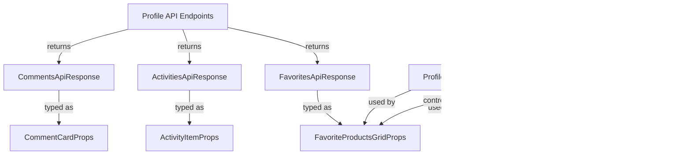

# frontend_core_types_profile Module Documentation

## Introduction

The `frontend_core_types_profile` module defines the core TypeScript types and interfaces used for user profile-related features in the frontend application. These types are foundational for representing user profile data, activities, comments, favorites, and UI component props associated with profile pages. The module enables type-safe development of profile views, activity feeds, comment sections, and favorite product displays, ensuring consistency and maintainability across the frontend codebase.

This module is typically consumed by React components and hooks in the `frontend_core_components`, `frontend_core_components_chat`, and related UI modules. It also interacts with API response types and data models from backend DTO modules, such as user activity and favorites endpoints.

## Core Components

The following are the primary types and interfaces defined in this module:

- **ActivitiesApiResponse**: Represents the API response structure for fetching user activities.
- **ProfileData**: The main data structure for a user's profile, including personal details, statistics, and related metadata.
- **ProfileLoadingState**: Enum or type representing the loading state of the profile (e.g., loading, loaded, error).
- **CommentsSectionProps**: Props for the comments section UI component on a profile page.
- **ProfileHeaderProps**: Props for the profile header UI component, typically displaying user info and actions.
- **FavoriteProductsGridProps**: Props for rendering a grid of the user's favorite products.
- **FavoritesApiResponse**: API response structure for fetching a user's favorite products.
- **ActivityItemProps**: Props for rendering a single activity item in the activity feed.
- **CommentsApiResponse**: API response structure for fetching comments related to a profile.
- **CommentCardProps**: Props for rendering an individual comment card in the comments section.

## Architecture and Component Relationships

The `frontend_core_types_profile` module acts as a type definition layer, connecting API data models with frontend UI components. It does not contain business logic or data fetching code, but its types are used throughout the profile feature stack.

### High-Level Architecture

### Component Interaction

### Data Flow

## Dependencies and Integration

- **API DTOs**: The types in this module are closely aligned with backend API response types, such as those defined in `api_service_core_dto_user`, `api_service_core_dto`, and related modules. See [api_service_core_dto_user.md] and [api_service_core_dto.md] for details on user and generic API response structures.
- **Frontend Components**: These types are consumed by UI components in modules like [frontend_core_components.md], [frontend_core_components_chat.md], and [frontend_core_components_ui.md].
- **Other Type Modules**: For related types (e.g., team, announcement, stack), see [frontend_core_types_team.md], [frontend_core_types_announcement.md], and [frontend_core_types_stack.md].

## How It Fits Into the Overall System

The `frontend_core_types_profile` module is a foundational part of the frontend type system, enabling:

- Type-safe API integration for profile-related endpoints
- Consistent prop definitions for profile UI components
- Maintainable and scalable development of user profile features
- Easy extension for new profile-related features (e.g., badges, social links)

It serves as a contract between the backend API and the frontend UI, ensuring that data structures remain consistent as the system evolves.

## References

- [api_service_core_dto_user.md] - User API response types
- [frontend_core_components.md] - Core frontend UI components
- [frontend_core_types_team.md] - Team-related types
- [frontend_core_types_announcement.md] - Announcement types
- [frontend_core_types_stack.md] - Stack and vendor types

---

*For details on the implementation of each type/interface, refer to the source code or the respective component documentation.*
