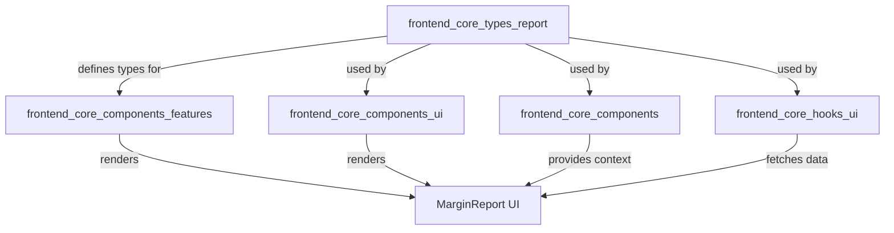
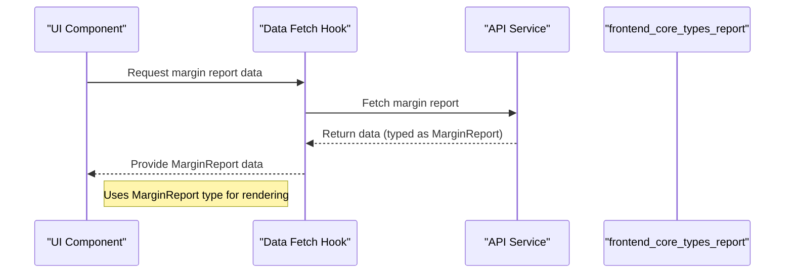
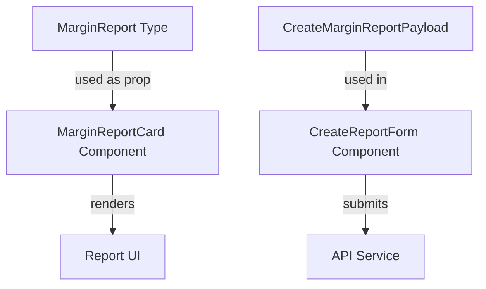

# frontend_core_types_report Module Documentation

## Introduction

The `frontend_core_types_report` module defines the core type structures for handling margin report data and related payloads within the frontend application. These types are essential for representing, creating, and manipulating margin report information, which is likely used in analytics, reporting dashboards, or financial overviews in the system.

This module is designed to be consumed by frontend components and services that require a standardized way to interact with margin report data, ensuring type safety and consistency across the application.

## Core Components

- **MarginReport**: Represents the structure of a margin report, including all relevant fields such as identifiers, metrics, and possibly metadata.
- **CreateMarginReportPayload**: Defines the payload structure required when creating a new margin report, ensuring that all necessary data is provided in a consistent format.

## Architecture and Relationships

The `frontend_core_types_report` module is a foundational type definition module. It does not implement business logic or data fetching, but instead provides the type contracts that other modules and components rely on. It is typically used by:

- UI components that display or edit margin reports
- API service layers that fetch or submit margin report data
- State management logic that stores or updates report information

### Module Dependency Overview



- **frontend_core_components_features**: May use `MarginReport` types to render analytics or reporting features.
- **frontend_core_components_ui**: UI elements that display or interact with margin reports.
- **frontend_core_components**: Shared components that may use these types for context or props.
- **frontend_core_hooks_ui**: Hooks that fetch or manage margin report data, using these types for type safety.

### Data Flow Example



## Integration with Other Modules

The `frontend_core_types_report` module is designed to be interoperable with other type modules, such as:

- [frontend_core_types_stack.md](frontend_core_types_stack.md): For stack-related analytics or reporting
- [frontend_core_types_team.md](frontend_core_types_team.md): For team-based report filtering or aggregation
- [frontend_core_types_vendor.md](frontend_core_types_vendor.md): For vendor-specific margin analysis

By referencing these modules, the system can build complex reporting features that combine margin data with stack, team, or vendor information.

## Example Usage

```typescript
import { MarginReport, CreateMarginReportPayload } from 'frontend_core_types_report';

// Creating a new margin report payload
const payload: CreateMarginReportPayload = {
    // ...fields required for report creation
};

// Using MarginReport in a component
function MarginReportCard({ report }: { report: MarginReport }) {
    return <div>{report.title} - {report.margin}%</div>;
}
```

## Component Interaction Diagram



## Summary

The `frontend_core_types_report` module is a key part of the frontend type system, providing the contracts for margin report data throughout the application. By centralizing these type definitions, the system ensures consistency, maintainability, and type safety for all features that interact with margin reports.

For more details on related types, see:
- [frontend_core_types_stack.md](frontend_core_types_stack.md)
- [frontend_core_types_team.md](frontend_core_types_team.md)
- [frontend_core_types_vendor.md](frontend_core_types_vendor.md)
