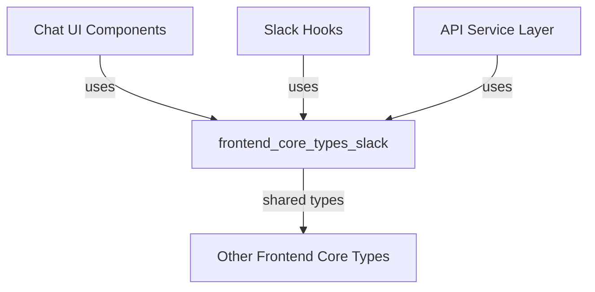
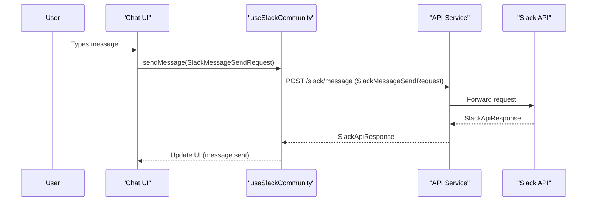

# frontend_core_types_slack Module Documentation

## Introduction

The `frontend_core_types_slack` module provides type definitions and interfaces for integrating Slack-related features into the frontend application. It standardizes the data structures and expected return types for Slack API responses, message sending, reactions, and typing indicators, enabling seamless communication with Slack and consistent handling of Slack community interactions within the frontend codebase.

This module is essential for any frontend features that interact with Slack, such as sending messages, displaying Slack reactions, or showing typing indicators in real-time. It is designed to be used in conjunction with other frontend modules and hooks, and may interact with backend services that proxy or process Slack API requests.

---

## Core Components

### 1. `SlackApiResponse`
Defines the structure of a typical response from the Slack API. This type ensures that all Slack API responses handled in the frontend conform to a predictable format, simplifying error handling and data extraction.

### 2. `UseSlackCommunityReturn`
Specifies the return type for custom React hooks or functions that manage Slack community interactions. This may include properties such as the current Slack channel, list of members, connection status, and methods for sending messages or reacting to events.

### 3. `SlackMessageSendRequest`
Describes the payload required to send a message to Slack. This type is used when constructing requests to post messages, ensuring that all necessary fields (such as channel, text, attachments, etc.) are present and correctly typed.

### 4. `SlackReaction`
Represents a reaction (such as an emoji) added to a Slack message. This type is used to display reactions in the UI and to handle user interactions related to message reactions.

### 5. `SlackTypingIndicator`
Defines the structure for representing typing indicators in Slack channels. This is used to show when a user is actively typing a message, enhancing the real-time chat experience.

---

## Architecture and Component Relationships

The `frontend_core_types_slack` module is a **pure type definition module**. It does not contain business logic or UI components, but instead provides foundational types that are consumed by other frontend modules, such as chat components, hooks, and API service layers.

### High-Level Architecture

- **Chat UI Components**: Use Slack types to render messages, reactions, and typing indicators.
- **Slack Hooks**: Use and return these types for managing Slack state and actions.
- **API Service Layer**: Uses these types to validate and structure requests/responses to/from backend Slack integrations.
- **Other Frontend Core Types**: Types from this module may be composed with or referenced by types in other frontend type modules (e.g., `frontend_core_types_team`, `frontend_core_types_auth`).

### Data Flow Example

---

## Integration with Other Modules

- **Chat Components** ([frontend_core_components_chat.md]): Use Slack types for message props, typing indicators, and reactions.
- **Hooks** ([frontend_core_hooks_ui.md]): Custom hooks like `useSlackCommunity` return or consume these types.
- **Team and Auth Types** ([frontend_core_types_team.md], [frontend_core_types_auth.md]): May reference Slack user or channel information for permissions or team management.
- **API Layer**: Consumes and produces these types when interacting with backend Slack proxy endpoints.

For more details on related types, see:
- [frontend_core_types_team.md]
- [frontend_core_types_auth.md]
- [frontend_core_components_chat.md]
- [frontend_core_hooks_ui.md]

---

## Summary

The `frontend_core_types_slack` module is a foundational part of the frontend type system, enabling robust, type-safe integration with Slack. By centralizing Slack-related type definitions, it ensures consistency and maintainability across all frontend features that interact with Slack.
