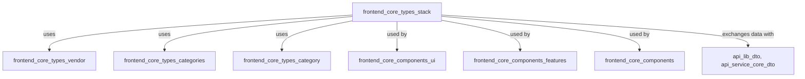
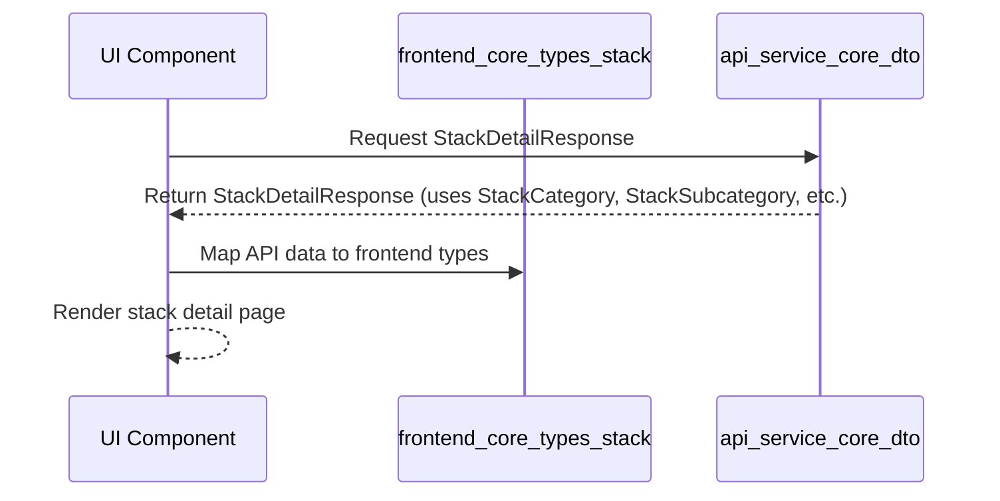
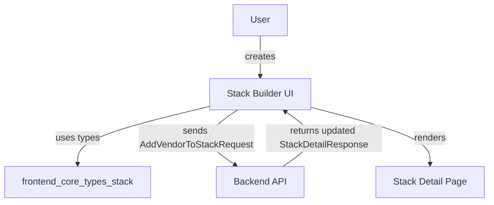

# frontend_core_types_stack Module Documentation

## Introduction

The `frontend_core_types_stack` module defines the core type definitions and interfaces for managing and representing technology stacks, vendors, categories, and related stack operations in the frontend application. It provides the foundational data structures for stack management features, such as stack creation, vendor association, cost calculation, sharing, and statistics. This module is essential for enabling type-safe development and consistent data handling across stack-related UI components and business logic.

## Core Functionality

- **Stack Representation**: Defines the structure of a technology stack, including its categories, subcategories, vendors, and associated metadata.
- **Vendor Management**: Provides types for adding, updating, and filtering vendors within stacks.
- **Cost Calculation**: Supplies options and interfaces for calculating stack costs based on selected vendors and configurations.
- **Stack Sharing and Templates**: Supports sharing stacks and using stack templates for streamlined stack creation.
- **Statistics and Analytics**: Includes types for stack statistics, enabling analytics and reporting features.

## Key Components

- `StackCategory`: Represents a high-level category within a stack (e.g., Infrastructure, Productivity).
- `StackSubcategory`: Represents a more granular subcategory under a stack category.
- `StackListResponse`, `StackDetailResponse`: Structures for API responses containing stack lists or detailed stack information.
- `StackShare`, `StackTemplate`: Types for sharing stacks and using stack templates.
- `AddVendorToStackRequest`, `UpdateStackVendorRequest`: Payloads for modifying stack-vendor relationships.
- `StackVendorFilterOptions`, `CategoryVendorSelectorProps`, `SubcategoryVendorSectionProps`: Types for filtering and selecting vendors within categories and subcategories.
- `CostCalculationOptions`: Options for calculating the cost of a stack.
- `StackStats`: Statistical data about stacks (e.g., number of vendors, cost savings).
- `MarginIncreaseComponentProps`, `StackBuilderProps`: Props for UI components related to stack building and margin analysis.

## Architecture and Component Relationships

The `frontend_core_types_stack` module is designed to be consumed by various frontend modules, especially UI components and features related to stack management. It interacts closely with:

- **UI Components**: Such as those in `frontend_core_components_ui`, `frontend_core_components_features`, and `frontend_core_components` for rendering stack lists, detail pages, and builder interfaces.
- **Vendor and Category Types**: Types from `frontend_core_types_vendor`, `frontend_core_types_categories`, and `frontend_core_types_category` are often referenced for detailed vendor and category information.
- **API DTOs**: Works in conjunction with API response types (e.g., from `api_lib_dto`, `api_service_core_dto`) for data exchange between frontend and backend.

### High-Level Architecture



### Data Flow Example: Stack Detail Retrieval



## Component Interaction

- **Stack Builder UI**: Uses `StackBuilderProps`, `StackCategory`, `StackSubcategory`, and vendor-related types to allow users to construct and modify technology stacks interactively.
- **Vendor Filtering**: Utilizes `StackVendorFilterOptions` and selector props to filter and select vendors for inclusion in stacks.
- **Cost Analysis**: Employs `CostCalculationOptions` and `StackStats` for cost breakdowns and margin analysis.
- **Stack Sharing**: Leverages `StackShare` and `StackTemplate` for sharing stacks with others or using predefined templates.

## Integration with Other Modules

- **Vendor Details**: For detailed vendor information, see [frontend_core_types_vendor.md](frontend_core_types_vendor.md).
- **Category Management**: For category and subcategory types, see [frontend_core_types_categories.md](frontend_core_types_categories.md) and [frontend_core_types_category.md](frontend_core_types_category.md).
- **UI Components**: For UI components that consume these types, see [frontend_core_components_ui.md](frontend_core_components_ui.md) and [frontend_core_components_features.md](frontend_core_components_features.md).
- **API Data Contracts**: For backend data contracts, see [api_lib_dto.md](api_lib_dto.md) and [api_service_core_dto.md](api_service_core_dto.md).

## Example Usage

```typescript
import { StackCategory, StackDetailResponse, AddVendorToStackRequest } from 'frontend_core_types_stack';

// Example: Adding a vendor to a stack
const addVendorRequest: AddVendorToStackRequest = {
  stackId: 'stack-123',
  vendorId: 'vendor-456',
  subcategoryId: 'subcat-789',
};

// Example: Using stack detail response
function renderStackDetail(stack: StackDetailResponse) {
  // Render stack name, categories, vendors, etc.
}
```

## Process Flow: Stack Creation and Vendor Addition



## Summary

The `frontend_core_types_stack` module is a foundational part of the frontend type system, enabling robust, type-safe stack management features. It is designed for seamless integration with vendor, category, and UI modules, and is essential for any features involving technology stack construction, analysis, and sharing.
