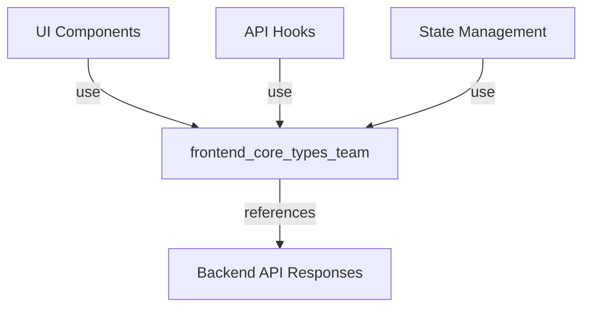
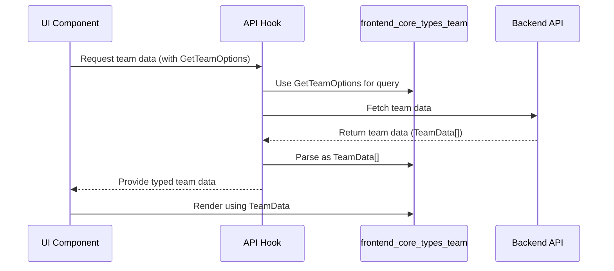

# frontend_core_types_team Module Documentation

## Introduction

The `frontend_core_types_team` module defines the core TypeScript types and interfaces related to team data and team-related operations within the frontend application. It provides a standardized structure for representing team entities and the options for querying or manipulating team data. This module is essential for ensuring type safety and consistency across components, hooks, and services that interact with team-related data.

## Core Components

- **GetTeamOptions**: Defines the parameters/options for fetching or querying team data.
- **TeamData**: Represents the structure of a team entity, including its properties and relationships.

## Purpose and Core Functionality

The primary purpose of this module is to:

- Provide type definitions for team-related data structures.
- Enable type-safe operations when fetching, displaying, or manipulating team data in the frontend.
- Serve as a contract between frontend components and backend APIs/services that deal with teams.

## Architecture and Component Relationships

The `frontend_core_types_team` module is part of a broader type system in the frontend, where each domain (e.g., team, user, organization) has its own type definitions. These types are used throughout the application in:

- UI components (for rendering team data)
- API hooks (for fetching and mutating team data)
- State management (for storing and updating team-related state)

### High-Level Architecture



### Component Interaction

- **UI Components**: Use `TeamData` to render team information (e.g., team lists, team details).
- **API Hooks**: Use `GetTeamOptions` to define query parameters when fetching teams from the backend.
- **State Management**: Stores arrays or objects of `TeamData` for use across the application.

## Data Flow

The typical data flow involving this module is as follows:



## Dependencies and Integration

The `frontend_core_types_team` module is designed to be used in conjunction with other type modules, such as:

- [frontend_core_types_employee.md](frontend_core_types_employee.md): For representing team members as employees.
- [frontend_core_types_profile.md](frontend_core_types_profile.md): For linking team data to user profiles.
- [frontend_core_types_organization.md](frontend_core_types_organization.md): For associating teams with organizations.

It does **not** directly depend on these modules, but is often used alongside them in higher-level features.

## Example Usage

```typescript
import { GetTeamOptions, TeamData } from 'frontend_core_types_team';

// Example: Fetching teams with options
type FetchTeamsParams = GetTeamOptions;

function renderTeam(team: TeamData) {
  return <div>{team.name}</div>;
}
```

## How It Fits Into the Overall System

The `frontend_core_types_team` module is a foundational part of the frontend type system. It ensures that all team-related data is handled in a consistent, type-safe manner across the application. By providing clear contracts for team data, it reduces bugs, improves maintainability, and enables seamless integration with other modules and backend APIs.

## References

- [frontend_core_types_employee.md](frontend_core_types_employee.md)
- [frontend_core_types_profile.md](frontend_core_types_profile.md)
- [frontend_core_types_organization.md](frontend_core_types_organization.md)

---
*For details on related types and their usage, refer to the referenced module documentation above.*
