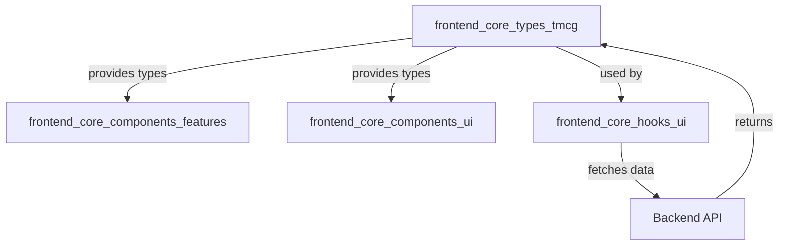
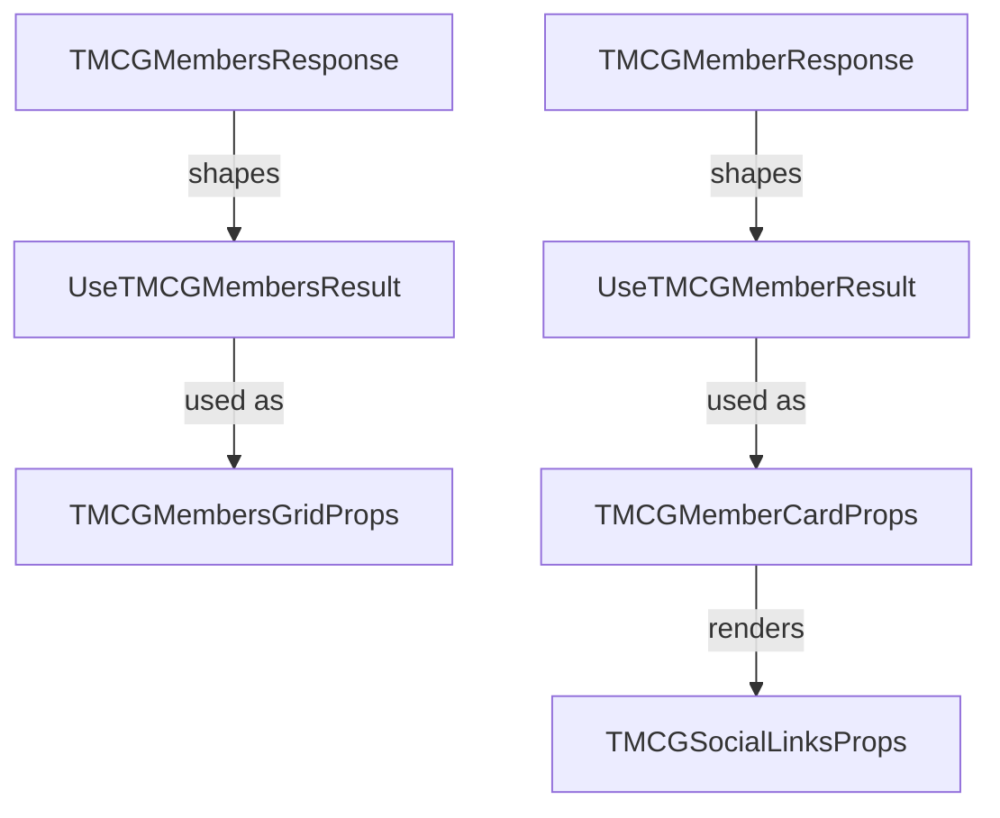
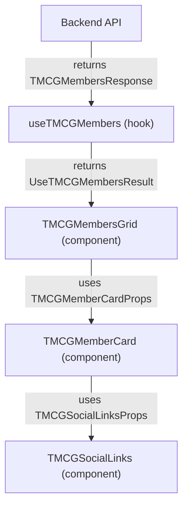

# frontend_core_types_tmcg Module Documentation

## Introduction

The `frontend_core_types_tmcg` module defines the core TypeScript types and interfaces used for representing and managing TMCG (The Modern Consulting Group) members, their social links, and related UI component props within the frontend application. This module is essential for ensuring type safety and consistency across components that display, fetch, or interact with TMCG member data, such as member cards, grids, and social link sections.

This module is typically used in conjunction with frontend UI components (see [frontend_core_components_features.md](frontend_core_components_features.md), [frontend_core_components_ui.md](frontend_core_components_ui.md)), hooks, and API data-fetching logic. It provides the foundational types for TMCG-specific features and member management in the frontend codebase.

---

## Core Components

The following are the primary types and interfaces defined in this module:

- **TMCGSocialLinksProps**: Props for rendering a member's social links (e.g., LinkedIn, Twitter, GitHub).
- **TMCGMembersResponse**: The API response shape for fetching a list of TMCG members.
- **TMCGMemberResponse**: The API response shape for a single TMCG member.
- **UseTMCGMembersResult**: The return type for a hook or function fetching multiple TMCG members.
- **UseTMCGMemberResult**: The return type for a hook or function fetching a single TMCG member.
- **TMCGMemberCardProps**: Props for the UI component displaying a single member's card.
- **TMCGMembersGridProps**: Props for the UI component displaying a grid of member cards.

These types are designed to be used by both data-fetching hooks and UI components, ensuring a consistent contract between the data layer and the presentation layer.

---

## Architecture and Component Relationships

The `frontend_core_types_tmcg` module is part of the broader frontend type system. It interacts closely with:

- **UI Components**: Such as member cards and grids ([frontend_core_components_features.md](frontend_core_components_features.md), [frontend_core_components_ui.md](frontend_core_components_ui.md)).
- **Data Fetching Hooks**: Custom React hooks that fetch TMCG member data from backend APIs.
- **API Response Types**: Ensures that frontend types match the backend API contract.

### High-Level Architecture



### Component Interaction



---

## Data Flow

The typical data flow for TMCG member information in the frontend is as follows:

1. **Data Fetching**: A hook (e.g., `useTMCGMembers`) fetches member data from the backend API, returning a result shaped by `UseTMCGMembersResult`.
2. **Data Mapping**: The fetched data (matching `TMCGMembersResponse`) is mapped to UI component props (`TMCGMembersGridProps`).
3. **Rendering**: The grid component renders individual member cards using `TMCGMemberCardProps`, which in turn may render social links using `TMCGSocialLinksProps`.



---

## Integration with Other Modules

- **UI Components**: See [frontend_core_components_features.md](frontend_core_components_features.md) and [frontend_core_components_ui.md](frontend_core_components_ui.md) for the components that consume these types.
- **Hooks**: See [frontend_core_hooks_ui.md](frontend_core_hooks_ui.md) for pagination and data-fetching hooks that may use these types.
- **API Contracts**: Ensure that the backend API responses match the shapes defined in `TMCGMembersResponse` and `TMCGMemberResponse`.

---

## Example Usage

```typescript
import { UseTMCGMembersResult, TMCGMembersGridProps } from 'frontend_core_types_tmcg';

// Example: Using the hook and passing data to the grid component
const { members, isLoading }: UseTMCGMembersResult = useTMCGMembers();

const gridProps: TMCGMembersGridProps = {
  members,
  isLoading,
};

<TMCGMembersGrid {...gridProps} />;
```

---

## Summary

The `frontend_core_types_tmcg` module is a foundational part of the frontend type system for TMCG member management. It ensures type safety and consistency across data fetching, UI rendering, and API integration for TMCG-related features. For more details on related UI components and hooks, refer to the documentation for [frontend_core_components_features.md](frontend_core_components_features.md), [frontend_core_components_ui.md](frontend_core_components_ui.md), and [frontend_core_hooks_ui.md](frontend_core_hooks_ui.md).
