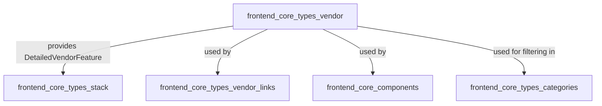
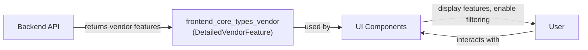
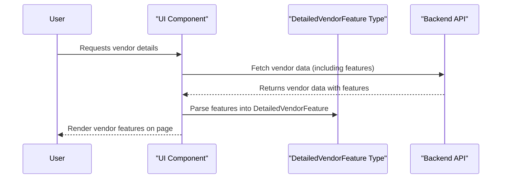

# frontend_core_types_vendor Module Documentation

## Introduction

The `frontend_core_types_vendor` module defines core type(s) related to vendor features within the frontend application. Its primary role is to provide a structured type for representing detailed vendor features, which are used throughout the frontend for rendering, filtering, and interacting with vendor-related data. This module is foundational for any UI or logic that needs to display or process detailed information about vendors and their capabilities.

## Core Component(s)

- **DetailedVendorFeature**

## Purpose and Core Functionality

The `frontend_core_types_vendor` module encapsulates the type definition for a detailed vendor feature. This type is typically used to:

- Represent the capabilities, integrations, or unique selling points of a vendor.
- Enable consistent rendering of vendor features in UI components (e.g., vendor profile pages, feature comparison tables).
- Support filtering, searching, and categorization of vendors based on their features.
- Serve as a contract for data exchanged between the frontend and backend regarding vendor features.

## Architecture and Relationships

The `frontend_core_types_vendor` module is part of a broader type system in the frontend, and interacts with several other modules:

- **frontend_core_types_stack**: Uses vendor feature types for stack building, vendor filtering, and stack detail views. See [frontend_core_types_stack.md](frontend_core_types_stack.md).
- **frontend_core_types_vendor_links**: Associates vendor features with external or internal links. See [frontend_core_types_vendor_links.md](frontend_core_types_vendor_links.md).
- **frontend_core_components**: UI components such as `VendorTagProps` and `VendorIconProps` consume `DetailedVendorFeature` for rendering vendor information. See [frontend_core_components.md](frontend_core_components.md).
- **frontend_core_types_categories**: Vendor features may be grouped or filtered by category. See [frontend_core_types_categories.md](frontend_core_types_categories.md).

### High-Level Module Relationship Diagram

## Data Flow and Usage

The typical data flow involving `DetailedVendorFeature` is as follows:

1. **Backend API** provides a list of vendor features as part of vendor data.
2. **Frontend data models** (using `DetailedVendorFeature`) parse and store this information.
3. **UI components** consume these types to render vendor details, feature lists, and enable feature-based filtering.
4. **User interactions** (e.g., filtering by feature) update the UI and may trigger new data fetches or re-rendering.

### Data Flow Diagram

## Component Interaction Example

Suppose a user is viewing a vendor profile page. The process might look like this:

## Integration in the Overall System

The `frontend_core_types_vendor` module is a foundational type definition that supports vendor-related features across the frontend. It is not responsible for business logic or API communication, but rather provides the structure for other modules and components to build upon. Its integration ensures that vendor features are consistently represented and easily consumed throughout the application.

## References

- [frontend_core_types_stack.md](frontend_core_types_stack.md)
- [frontend_core_types_vendor_links.md](frontend_core_types_vendor_links.md)
- [frontend_core_components.md](frontend_core_components.md)
- [frontend_core_types_categories.md](frontend_core_types_categories.md)

---
*For details on the structure of `DetailedVendorFeature`, refer to the type definition in the codebase or related API documentation.*
