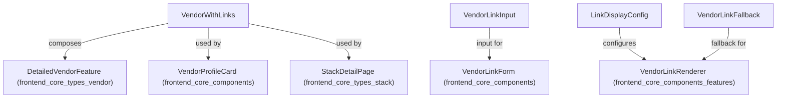
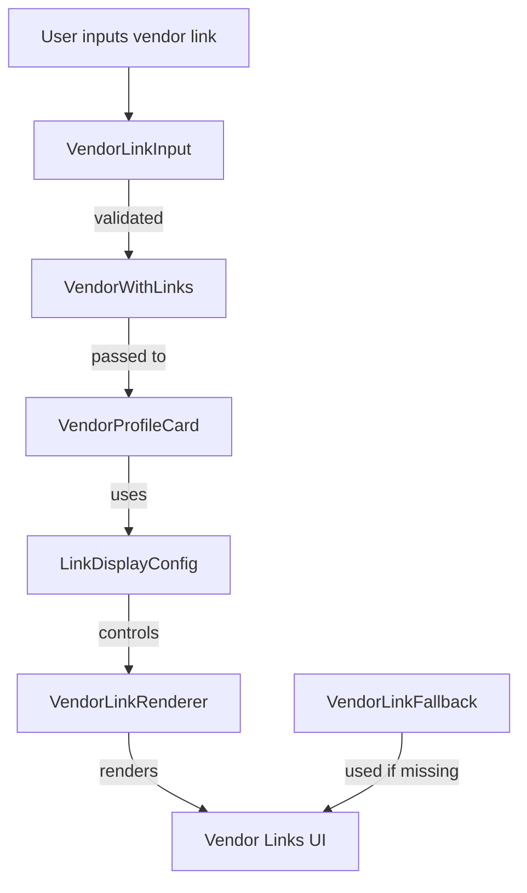

# frontend_core_types_vendor_links Module Documentation

## Introduction

The `frontend_core_types_vendor_links` module defines the core data types and configuration structures for representing, managing, and displaying vendor-related links within the frontend application. These types are essential for enabling rich vendor profiles, supporting link input and validation, and configuring how vendor links are rendered in the UI. This module is foundational for features that display vendor information, social links, and integrations across the frontend.

## Core Components

- **VendorLinkFallback**: Provides fallback logic or data for vendor links when primary information is unavailable.
- **VendorLinkInput**: Defines the structure for user or system input of vendor links, including validation and supported link types.
- **VendorWithLinks**: Represents a vendor entity along with its associated links, supporting aggregation and display.
- **LinkDisplayConfig**: Configuration object for controlling how vendor links are rendered, including iconography, labels, and display rules.

## Module Architecture and Relationships

The `frontend_core_types_vendor_links` module is designed to be interoperable with other frontend and shared types modules, especially those related to vendors, stacks, and UI components. It provides the type foundation for components that display vendor information, such as profile cards, stack listings, and vendor detail pages.

### Key Relationships

- **[frontend_core_types_vendor.md]**: The `VendorWithLinks` type often extends or composes with types from this module, such as `DetailedVendorFeature`, to provide a complete vendor profile with links.
- **[frontend_core_components.md]**: UI components like `VendorIconProps` and `VendorTagProps` consume types from this module to render vendor links and icons.
- **[frontend_core_types_stack.md]**: Stack-related types may reference `VendorWithLinks` to display vendors within technology stacks, including their associated links.
- **[frontend_core_components_features.md]**: Social and platform link display features use `LinkDisplayConfig` for consistent rendering.

## Data Flow and Component Interaction

The following diagram illustrates how the types in this module interact with other modules and frontend components:



## Example Usage

### Defining a Vendor with Links

```typescript
import { VendorWithLinks } from './frontend_core_types_vendor_links';

const vendor: VendorWithLinks = {
  id: 'vendor-123',
  name: 'Acme Corp',
  links: [
    { type: 'website', url: 'https://acme.com' },
    { type: 'twitter', url: 'https://twitter.com/acmecorp' }
  ]
};
```

### Configuring Link Display

```typescript
import { LinkDisplayConfig } from './frontend_core_types_vendor_links';

const linkConfig: LinkDisplayConfig = {
  showIcons: true,
  openInNewTab: true,
  supportedTypes: ['website', 'twitter', 'linkedin']
};
```

## Process Flow: Vendor Link Rendering

The following diagram shows the process of rendering vendor links in a frontend component:



## Integration with Other Modules

- For detailed vendor feature types, see [frontend_core_types_vendor.md].
- For stack and vendor aggregation, see [frontend_core_types_stack.md].
- For UI components rendering vendor links, see [frontend_core_components.md] and [frontend_core_components_features.md].

## Summary

The `frontend_core_types_vendor_links` module provides the essential type definitions and configuration objects for managing vendor links in the frontend. It acts as a bridge between vendor data, user input, and UI rendering, ensuring a consistent and extensible approach to displaying vendor-related links throughout the application.
