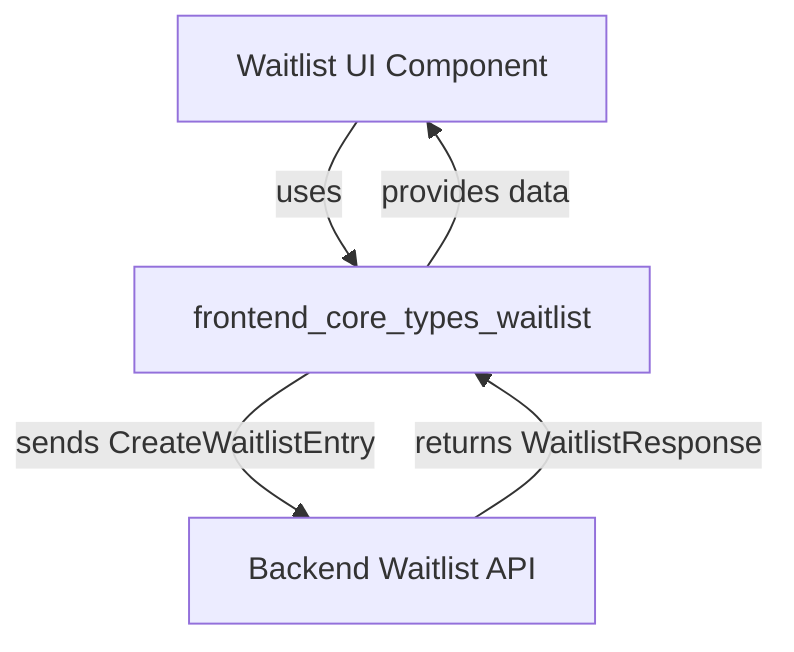

# frontend_core_types_waitlist Module Documentation

## Introduction

The `frontend_core_types_waitlist` module provides type definitions and data structures for managing waitlist functionality in the frontend application. This module is designed to standardize the way waitlist entries are created, stored, and retrieved, ensuring consistency across the application and facilitating integration with backend APIs.

This module is typically used in scenarios where users can join a waitlist for early access, beta features, or product launches. It defines the core types required for creating a waitlist entry and for representing the response received after a waitlist operation.

## Core Components

- **CreateWaitlistEntry**: Represents the data required to create a new waitlist entry (e.g., user email, name, and optional metadata).
- **WaitlistResponse**: Represents the response structure returned after a waitlist entry is created or queried (e.g., confirmation status, entry details).

## Architecture and Data Flow

The `frontend_core_types_waitlist` module is a foundational part of the waitlist feature in the frontend. It interacts with UI components (such as a "Join Waitlist" button or form) and communicates with backend API endpoints that manage waitlist data.



- **UI Components**: Use the types from this module to validate and structure user input before sending it to the backend.
- **API Integration**: The types ensure that requests and responses to/from the backend are type-safe and consistent.

## Component Relationships

- The `CreateWaitlistEntry` type is used as the payload when a user submits a waitlist form.
- The `WaitlistResponse` type is used to handle the response from the backend, which may include confirmation, error messages, or additional data.

## Example Usage

```typescript
import { CreateWaitlistEntry, WaitlistResponse } from './frontend_core_types_waitlist';

const entry: CreateWaitlistEntry = {
  email: 'user@example.com',
  name: 'Jane Doe',
  // ...other fields
};

// Send to backend API and receive response
const response: WaitlistResponse = await api.joinWaitlist(entry);
if (response.success) {
  // Show confirmation to user
}
```

## Dependencies and Integration

- **UI Components**: See [frontend_core_components_features.md] for components like `JoinWaitlistButtonProps` that utilize these types.
- **Backend API**: The types are designed to match the expected payloads and responses from backend waitlist endpoints.
- **Shared Types**: For pagination or additional metadata, see [api_lib_dto_shared.md] and related modules.

## Related Modules

- [frontend_core_components_features.md]: UI components for waitlist interaction
- [api_lib_dto_shared.md]: Shared DTOs for pagination and metadata

## Summary

The `frontend_core_types_waitlist` module is essential for implementing waitlist features in the frontend, providing clear and consistent type definitions for both creating entries and handling responses. It ensures smooth integration between UI components and backend services, and promotes maintainability and type safety across the codebase.
