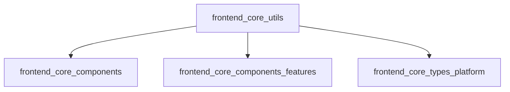

# frontend_core_utils Module Documentation

## Introduction

The `frontend_core_utils` module provides utility types and constants that are shared across the frontend codebase. These utilities are designed to standardize and simplify the handling of platform options and announcement storage mechanisms, ensuring consistency and maintainability throughout the frontend application. The module is lightweight and acts as a foundational building block for other frontend modules, such as components, hooks, and types.

## Core Components

- **AnnouncementStorageOptions**: Defines the available storage mechanisms for announcements within the frontend application.
- **OSPlatformOption**: Enumerates supported operating system platforms, enabling platform-specific logic and UI rendering.

## Module Purpose and Functionality

The primary purpose of `frontend_core_utils` is to:

- Provide a centralized location for utility types and constants that are used across multiple frontend modules.
- Promote code reuse and reduce duplication by standardizing common options and enumerations.
- Serve as a dependency for other frontend modules that require platform or storage option awareness.

## Architecture and Component Relationships

The `frontend_core_utils` module is architected as a simple utility layer. It does not contain business logic or stateful components, but rather exposes static types and constants. Its components are imported by other frontend modules, such as:

- [frontend_core_components](frontend_core_components.md)
- [frontend_core_components_features](frontend_core_components_features.md)
- [frontend_core_types_platform](frontend_core_types_platform.md)

This ensures that platform and storage options remain consistent wherever they are referenced in the application.

### Module Dependency Diagram



### Data Flow and Usage

- **OSPlatformOption** is used by UI components and feature modules to determine which platform-specific assets or logic to render.
- **AnnouncementStorageOptions** is referenced by announcement-related features to select the appropriate storage backend (e.g., local storage, session storage, or remote storage).

## Component Details

### AnnouncementStorageOptions

Defines the available storage mechanisms for announcements. This is typically an enumeration or a set of string constants, such as:

```typescript
export type AnnouncementStorageOptions = 'local' | 'session' | 'remote';
```

**Usage Example:**
- Used by announcement features to determine where to persist user announcement dismissals or preferences.

### OSPlatformOption

Enumerates the supported operating system platforms. This enables platform-specific UI rendering and logic branching.

```typescript
export type OSPlatformOption = 'windows' | 'macos' | 'linux' | 'web';
```

**Usage Example:**
- Used by platform selectors, download buttons, or feature toggles that depend on the user's operating system.

## Integration with Other Modules

The `frontend_core_utils` module is designed to be imported by any frontend module that requires awareness of platform or storage options. For example:

- [frontend_core_components_features](frontend_core_components_features.md) uses `OSPlatformOption` for platform selectors and feature gating.
- [frontend_core_types_platform](frontend_core_types_platform.md) references `OSPlatformOption` for platform statistics and analytics.
- [frontend_core_components](frontend_core_components.md) may use `AnnouncementStorageOptions` for announcement-related UI components.

## Example Usage

```typescript
import { OSPlatformOption, AnnouncementStorageOptions } from 'frontend_core_utils';

const platform: OSPlatformOption = 'windows';
const storage: AnnouncementStorageOptions = 'local';
```

## Summary

The `frontend_core_utils` module is a foundational utility layer for the frontend codebase, providing standardized types and constants for platform and storage options. Its simplicity and centralization promote consistency and maintainability across the application. For more details on how these utilities are used, refer to the documentation of the dependent modules:

- [frontend_core_components_features](frontend_core_components_features.md)
- [frontend_core_types_platform](frontend_core_types_platform.md)
- [frontend_core_components](frontend_core_components.md)
