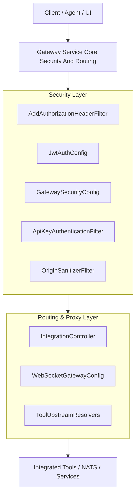
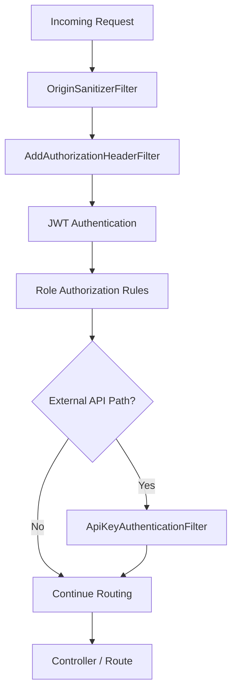
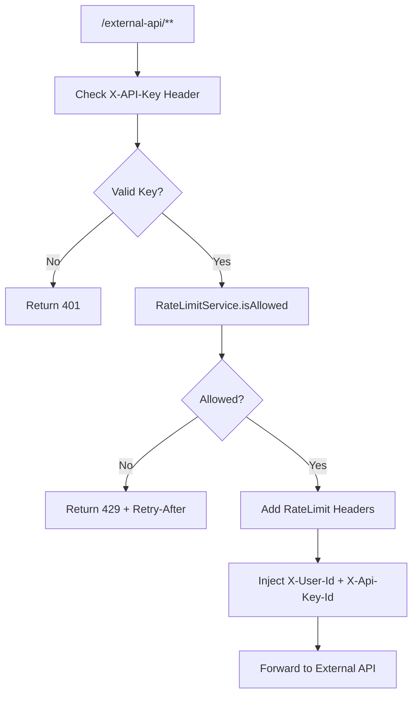
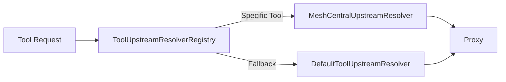
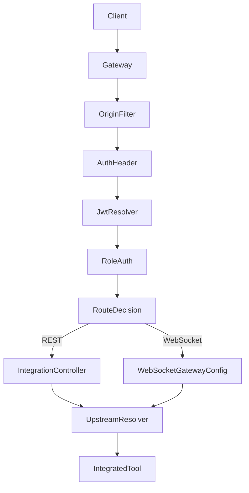

# Gateway Service Core Security And Routing

## Overview

The **Gateway Service Core Security And Routing** module is the reactive edge layer of the OpenFrame platform. It is responsible for:

- Acting as the **entry point** for REST and WebSocket traffic
- Enforcing **JWT-based authentication and role-based authorization**
- Providing **API key authentication and rate limiting** for external APIs
- Dynamically resolving **multi-tenant issuers**
- Routing and proxying requests to integrated tools (e.g., MeshCentral)
- Handling WebSocket proxying and session decoration

Built on **Spring Cloud Gateway + WebFlux + Netty**, it provides a fully reactive, non-blocking gateway optimized for high concurrency and real-time integrations.

---

## High-Level Architecture



The module is divided into four major concerns:

1. **Reactive Server & Client Configuration (Netty + WebClient)**
2. **Security (JWT, API Keys, Roles, CORS, Origin)**
3. **WebSocket Routing & Decoration**
4. **Tool Upstream Resolution & Proxying**

---

## Reactive Infrastructure Configuration

### NettySocketConfig

Configures low-level TCP behavior for both:

- Embedded Netty web server
- Gateway outbound HTTP client
- Reactor Netty WebSocket client

Key socket options:

- `SO_LINGER = 0` (fast connection teardown)
- `TCP_NODELAY = true` (low-latency communication)

This ensures optimal performance for high-throughput proxy and WebSocket traffic.

---

### WebClientConfig

Provides a preconfigured `WebClient.Builder` with:

- 30s connection timeout
- 30s response timeout
- Read/write timeout handlers

Used internally for REST proxying to upstream tools.

---

## Security Architecture

Security is layered and reactive. It supports:

- Multi-tenant JWT validation
- Role-based access control
- API key authentication for external APIs
- Bearer token resolution from multiple sources
- CORS control
- Origin header sanitization

### Security Flow



---

## JWT Authentication & Multi-Tenant Support

### JwtAuthConfig

- Uses a **Caffeine cache** to store `ReactiveAuthenticationManager` instances per issuer
- Dynamically builds JWT decoders per tenant
- Supports:
  - Platform issuer (local public key)
  - External issuers via OIDC discovery

### IssuerUrlProvider

Resolves allowed issuers dynamically from tenant configuration.

- Reads tenants reactively
- Builds issuer URLs using:
  - `allowed-issuer-base`
  - Tenant ID
  - Optional super-tenant ID
- Caches issuer URLs

This enables strict issuer validation in multi-tenant deployments.

---

## GatewaySecurityConfig

Defines the reactive security filter chain.

Key behavior:

- Disables CSRF, HTTP Basic, form login
- Enables OAuth2 Resource Server
- Uses `ReactiveAuthenticationManagerResolver` for issuer-based validation
- Injects `AddAuthorizationHeaderFilter` before authentication

### Role Rules

- `/api/**` → ADMIN
- `/tools/agent/**` → AGENT
- `/ws/tools/agent/**` → AGENT
- `/ws/nats` → AGENT or ADMIN
- `/guide/**` → ADMIN
- `/clients/**` → AGENT

All other paths default to `permitAll()` unless matched earlier.

---

## AddAuthorizationHeaderFilter

Ensures a Bearer token exists by resolving it from:

1. Access token cookie
2. Custom header
3. Query parameter

If found, it injects:

```text
Authorization: Bearer <token>
```

This enables WebSocket and browser flows that cannot always set headers directly.

---

## API Key Authentication & Rate Limiting

### ApiKeyAuthenticationFilter

A `GlobalFilter` applied to `/external-api/**` endpoints.

Flow:



Capabilities:

- Validates API key
- Increments usage stats
- Enforces minute/hour/day limits
- Adds rate limit headers
- Injects user context headers

---

## WebSocket Gateway Configuration

### WebSocketGatewayConfig

Defines WebSocket routing using Spring Cloud Gateway.

Routes:

- `/ws/tools/agent/{toolId}/**`
- `/ws/tools/{toolId}/**`
- `/ws/nats`
- `/ws/nats-api`

It also decorates:

- `WebSocketClient` (optional proxy cleanup)
- `WebSocketService` (security + metrics decorator)

---

### WebSocket Proxy URL Filters

#### ToolAgentWebSocketProxyUrlFilter

- Extracts `toolId` from agent path
- Resolves upstream WebSocket URL

#### ToolApiWebSocketProxyUrlFilter

- Extracts `toolId` from API path
- Removes `Origin` header
- Injects tool-specific API key headers

These filters delegate actual resolution to the upstream resolver registry.

---

## Tool Upstream Resolution

The gateway uses a strategy pattern for resolving tool destinations.



### DefaultToolUpstreamResolver

- Reads tool URLs from MongoDB
- Uses `ToolUrlService`
- Resolves API and WS URLs

### MeshCentralUpstreamResolver

- Uses configuration properties
- Avoids DB lookup
- Supports path prefix injection

---

## CORS & Origin Handling

### CorsConfig

- Enabled unless explicitly disabled
- Uses Spring Cloud Gateway global CORS properties

### OriginSanitizerFilter

- Removes `Origin: null` headers
- Prevents invalid origin propagation to upstream services

---

## Internal Auth Probe

### InternalAuthProbeController

Conditional endpoint:

```
GET /internal/authz/probe
```

Used for health checks in internal deployments.

---

## Path Constants

`PathConstants` centralizes prefix definitions:

- `/clients`
- `/api`
- `/tools`
- `/ws/tools`
- `/chat`
- `/guide`

Ensures consistent routing and security matching.

---

## Request Lifecycle Summary



---

## Key Design Principles

- Fully reactive (WebFlux + Reactor)
- Strict multi-tenant issuer validation
- Pluggable upstream resolution per tool
- Centralized security enforcement at the edge
- API key rate limiting for external APIs
- Optimized Netty socket configuration
- Clean separation between security, routing, and proxy concerns

---

## Conclusion

The **Gateway Service Core Security And Routing** module is the secure, reactive edge of the OpenFrame platform. It combines:

- JWT-based multi-tenant authentication
- Role-based authorization
- API key validation and rate limiting
- WebSocket proxying and decoration
- Intelligent upstream resolution

It ensures that all traffic entering the platform is authenticated, authorized, rate-limited, and routed efficiently to the correct internal or integrated service.