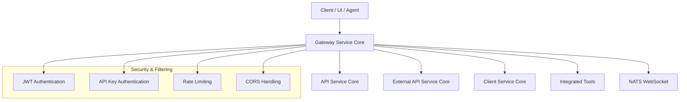
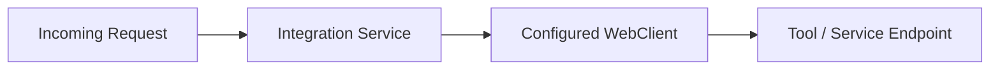
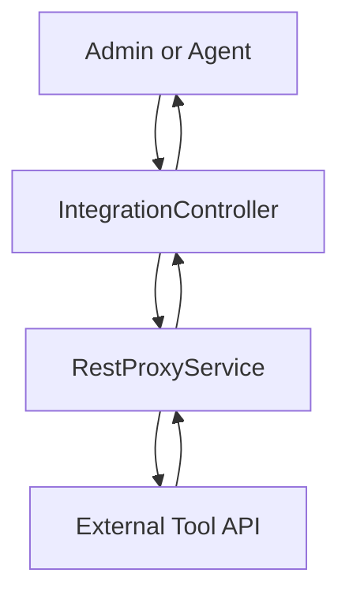
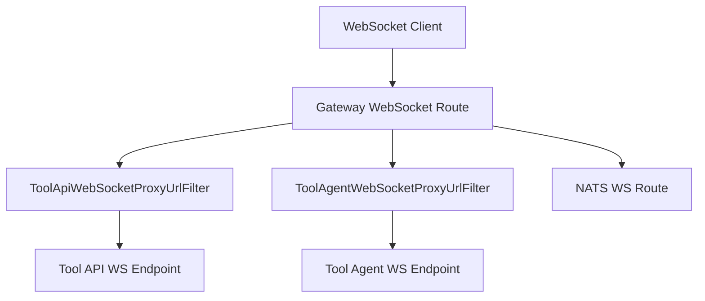
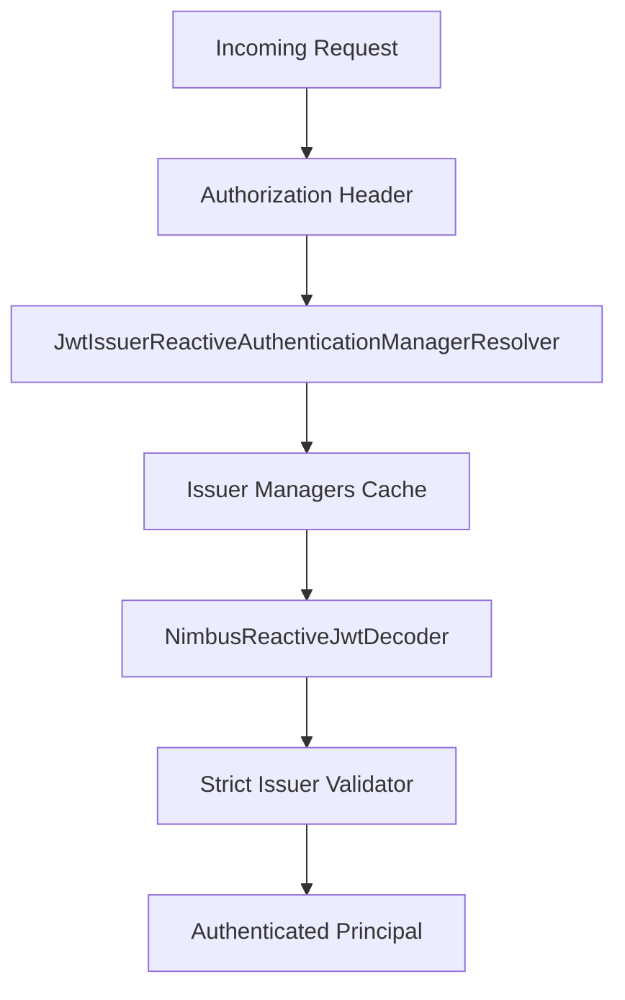
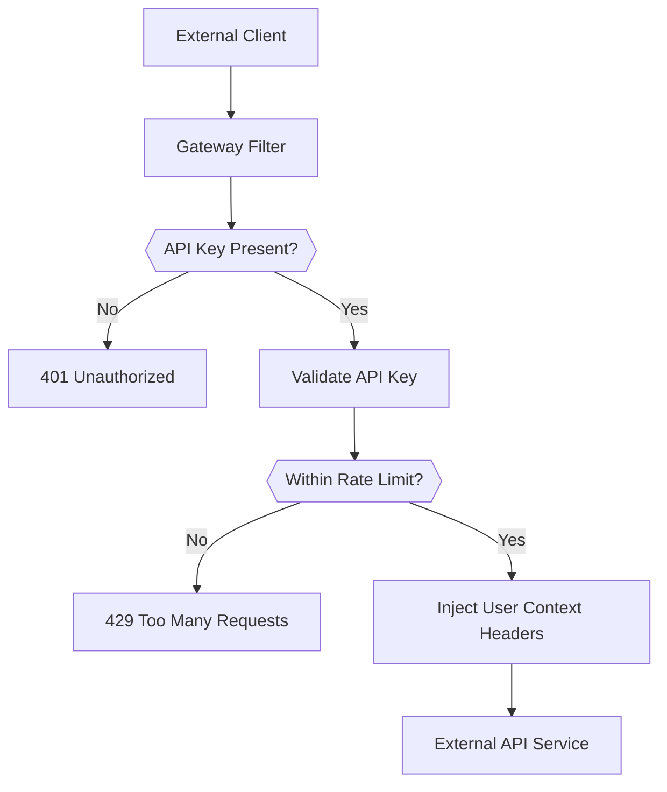
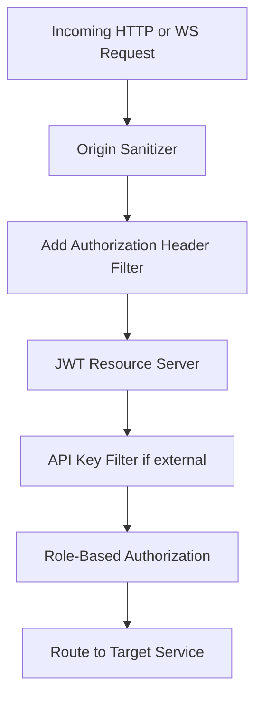

# Gateway Service Core

## Overview

The **Gateway Service Core** module is the reactive edge layer of the OpenFrame platform. It acts as:

- The primary **API Gateway** for internal and external clients
- A **security enforcement layer** (JWT, API keys, roles, multi-tenant issuer validation)
- A **WebSocket gateway** for tool agents, tool APIs, and NATS streams
- A **proxy layer** for tool integrations and external API routing

Built on **Spring WebFlux** and **Spring Cloud Gateway**, it provides a non-blocking, reactive foundation for high-throughput request processing across REST and WebSocket protocols.

---

## Architectural Role in the Platform

At a high level, the Gateway Service Core sits between:

- UI / Agents / External Clients
- Internal microservices (API Service Core, Client Service Core, External API Service Core)
- Tool integrations and WebSocket endpoints

### High-Level Architecture

The gateway is responsible for:

- Authenticating and authorizing requests
- Injecting security context headers
- Enforcing rate limits
- Proxying REST and WebSocket traffic
- Validating tenant-aware JWT issuers

---

# Core Functional Areas

## 1. Reactive HTTP Client Configuration

### `WebClientConfig`

Provides a centrally configured `WebClient.Builder` with:

- 30s connect timeout
- 30s read/write timeout
- Reactor Netty-based HTTP connector

This WebClient is used for:

- Proxying integration requests
- Calling downstream services
- Tool connectivity validation

### Outbound HTTP Configuration Flow

---

## 2. Tool REST Proxying

### `IntegrationController`

Handles tool-related HTTP endpoints under `/tools/**`.

Supported patterns:

- `GET /tools/{toolId}/health`
- `POST /tools/{toolId}/test`
- `/{toolId}/**` (generic proxy)
- `/agent/{toolId}/**` (agent proxy)

The controller delegates to:

- `IntegrationService` (connectivity tests)
- `RestProxyService` (full REST proxying)

### REST Proxy Flow

The gateway:

- Preserves request method and body
- Rewrites paths when needed
- Injects required headers
- Returns downstream responses transparently

---

## 3. WebSocket Gateway

The Gateway Service Core supports WebSocket routing for:

- Tool API connections
- Tool agent connections
- NATS WebSocket streaming

### `WebSocketGatewayConfig`

Defines route mappings using `RouteLocator`:

- `/ws/tools/{toolId}/**`
- `/ws/tools/agent/{toolId}/**`
- `/ws/nats`

It also decorates the `WebSocketService` to enforce JWT-based security during WebSocket handshake.

### Tool WebSocket URL Filters

- `ToolApiWebSocketProxyUrlFilter`
- `ToolAgentWebSocketProxyUrlFilter`

These:

- Extract `toolId` from the request path
- Resolve the correct target URL
- Dynamically route WebSocket traffic to the proper integration endpoint

### WebSocket Routing Flow

---

## 4. JWT Authentication and Multi-Tenant Issuer Resolution

### `GatewaySecurityConfig`

Configures:

- OAuth2 Resource Server
- JWT validation
- Role-based authorization
- Path-based access rules

Roles used:

- `ROLE_ADMIN`
- `ROLE_AGENT`

Authorization examples:

- `/api/**` → ADMIN only
- `/tools/agent/**` → AGENT only
- `/tools/**` → ADMIN only
- `/clients/**` → AGENT only

---

### `JwtAuthConfig`

Implements dynamic multi-issuer JWT validation:

- Uses `JwtIssuerReactiveAuthenticationManagerResolver`
- Caches per-issuer authentication managers (Caffeine)
- Validates strict issuer URLs

### `IssuerUrlProvider`

Resolves allowed issuer URLs from:

- `ReactiveTenantRepository`
- Configured issuer base
- Optional super-tenant

Issuer URLs are cached reactively and validated against incoming JWT `iss` claims.

### JWT Validation Flow

---

## 5. Authorization Header Injection

### `AddAuthorizationHeaderFilter`

A pre-auth WebFilter that ensures the `Authorization` header is present.

It resolves bearer tokens from:

- Secure cookies
- Custom access token header
- Authorization query parameter

If the standard header is missing, it injects:

- `Authorization: Bearer <token>`

This enables consistent resource server authentication regardless of token transport mechanism.

---

## 6. API Key Authentication & Rate Limiting

### `ApiKeyAuthenticationFilter`

A global filter that protects `/external-api/**` endpoints.

### Responsibilities

1. Detect `/external-api/**` paths
2. Require `X-API-Key`
3. Validate API key via `ApiKeyValidationService`
4. Enforce rate limits via `RateLimitService`
5. Inject user context headers
6. Record success/failure statistics

### Rate Limit Constants

`RateLimitConstants` defines structured logging keys for rate limiting operations.

### API Key Flow

### Rate Limit Headers

When enabled, the gateway adds headers such as:

- X-Rate-Limit-Limit-Minute
- X-Rate-Limit-Remaining-Minute
- X-Rate-Limit-Limit-Hour
- X-Rate-Limit-Remaining-Hour
- X-Rate-Limit-Limit-Day
- X-Rate-Limit-Remaining-Day

This follows standard HTTP rate limiting conventions.

---

## 7. CORS Handling

Two mutually exclusive configurations exist:

### `CorsConfig`

- Enabled by default
- Uses `spring.cloud.gateway.globalcors` configuration
- Applies standard origin restrictions

### `CorsDisableConfig`

Activated when:

- `openframe.gateway.disable-cors=true`

Creates a permissive configuration:

- Allows all origins
- Supports credentials
- Intended for SaaS deployments

---

## 8. Origin Sanitization

### `OriginSanitizerFilter`

Removes invalid `Origin: null` headers to prevent:

- CORS misinterpretation
- Browser-based security issues

Executed with highest precedence.

---

## 9. Internal Authorization Probe

### `InternalAuthProbeController`

Conditional endpoint:

- `/internal/authz/probe`

Enabled only when:

- `openframe.gateway.internal.enable=true`

Used for:

- Internal health checks
- Authz infrastructure verification

---

# Security Model Summary

The Gateway Service Core ensures:

- Token normalization
- Multi-tenant issuer enforcement
- Role-based access control
- API key enforcement for public endpoints
- Rate limiting
- Secure WebSocket handshakes

---

# Reactive & Non-Blocking Design

The entire module is built on:

- Spring WebFlux
- Reactor
- Reactive Security
- Reactive repositories (for tenant and tool resolution)

This ensures:

- High concurrency
- Low memory footprint
- Efficient streaming over WebSockets

---

# Key Design Principles

1. Edge-first security enforcement
2. Multi-tenant JWT validation
3. Transparent proxying for tools
4. Reactive, non-blocking I/O
5. Pluggable CORS strategy
6. External API isolation via API keys

---

# Conclusion

The **Gateway Service Core** module is the central ingress layer of OpenFrame. It combines:

- Reactive gateway routing
- Multi-tenant JWT authentication
- API key security and rate limiting
- Tool and WebSocket proxying
- Flexible CORS configuration

By consolidating these responsibilities at the edge, it ensures that downstream services remain focused on business logic while the gateway enforces consistent security, routing, and protocol handling across the platform.
